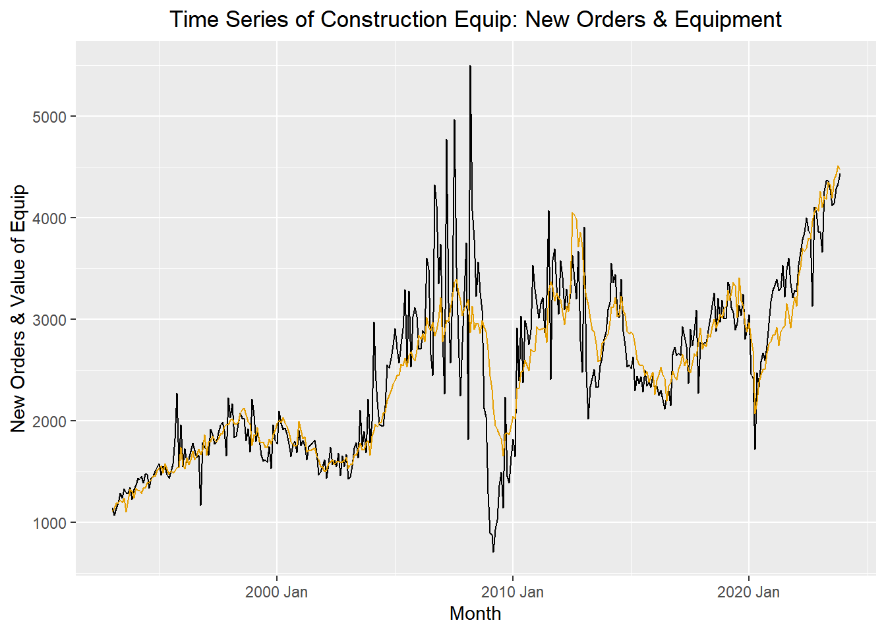

::: {.cell}

:::


This qmd is made to summarize chapter 3 and have models for the chapter to view.

-   I have a goal to make the code not be reliant on adjusting variable names and titles.

    -   This will require having an initial r chunk that assigns variable names and dataset.

    -   I will still have multiple df.

-   This will be a bit hard and the models will have to be pretty general because some data sets required different approaches

    -   I think maybe I can also assign if its yearmonth, yearquater etc, but that will require so many if statements.

        -   Idk how I'm going to approach this


::: {.cell}

```{.r .cell-code}
# Assign your column names to variables
df0 <- rio::import("https://byuistats.github.io/timeseries/data/constructionequip_manu_orders_shipments.csv")


dates <- "date"
x_col <- "constructionequip_ord"
y_col <- "constructionequip_ship"


# Assign plot labels
x_label <- "Month"
y_label <- "New Orders & Value of Equip"
plot_title <- "Time Series of Construction Equip: New Orders & Equipment"
```
:::

::: {.cell}

```{.r .cell-code}
df <- df0 |>
  mutate(
    date = lubridate::mdy(.data[[dates]]),
    x = as.numeric(.data[[x_col]]), # Convert and rename to x
    y = as.numeric(.data[[y_col]])  # Convert and rename to y
  ) |>
  select(date, x, y) 
```
:::

::: {.cell}

```{.r .cell-code}
df1 <- df |> # this makes a new df so either df before or this one is use. 
  mutate(obs = row_number()) |> # makes new column with periods
  select(date, obs, x, y)

dfx <- df |> # lone df for variable x = ord
  mutate(obs = row_number()) |> 
  select(date, x)

dfy <- df |> # lone df for y = ship
  mutate(obs = row_number()) |> 
  select(date, y)
```
:::


test


::: {.cell}

```{.r .cell-code}
# this is code for hw 3-1

# this code is same as the dfx2 & dfy2 code
df1 <- df1 |>
  mutate(index = tsibble::yearmonth(date)) |> # 3.1
  as_tsibble(index = index) |>
  select(index, date, x, y)


autoplot(df1, .vars = x) +
  geom_line(data = df1, aes(x = index, y = y), color = "#E69F00") +
  labs(
    x = x_label,
    y = y_label,
    title = plot_title
  ) +
  theme(plot.title = element_text(hjust = 0.5))
```

::: {.cell-output-display}
{width=672}
:::
:::
