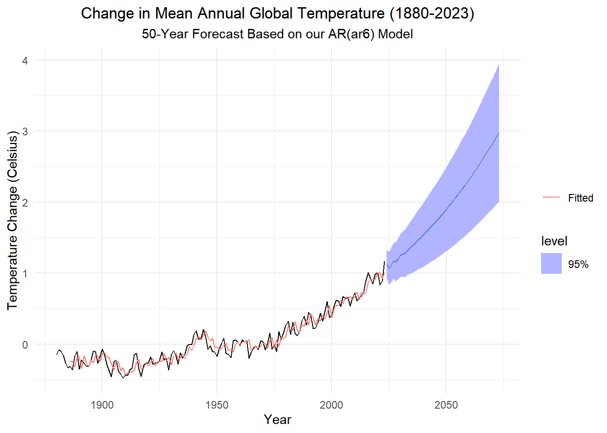

::: {.cell}

```{.r .cell-code}
# Loading R packages
if (!require("pacman")) install.packages("pacman")
pacman::p_load(tidyverse,
               tsibble, fable,
               feasts, tsibbledata,
               fable.prophet,
               patchwork,
               lubridate,
               rio,
               ggplot2, knitr,
               kableExtra
               )
```
:::


This is the overview of the chapter 4. I will add info from the index file here. I will filter from there to what will go here.
My goal is to first have the website have a map of the concepts in time series. I want to first avoid doing it by chapters since it seperates topics and limit my learning to that lesson. Bigger picture first.


Adding this from homework_4_0 chapter notes.qmd file in old repo. 
This are notes intended to connect time series concepts


::: {.cell}

```{.r .cell-code}
# Load necessary library

# Define the checklist table
checklist_data <- data.frame(
  Topic = c("Trend", "Seasonality", "Stationarity", "White Noise", "Serial Correlation", "Drift"),
  Description = c(
    "Presence of an upward or downward movement over time.",
    "Repeating patterns at regular intervals.",
    "Mean, variance, and autocorrelation are constant over time.",
    "Residuals are independent, identically distributed with mean zero.",
    "Past values are correlated with current values.",
    "Consistent positive or negative change over time."
  ),
  White_Noise = c("", "", "✔", "✔", "", ""),
  Random_Walk = c("", "", "", "", "✔", ""),
  RW_with_Drift = c("", "", "", "", "✔", "✔"),
  AR_p = c("✔", "", "✔", "", "✔", ""),
  ARIMA = c("", "", "✔", "", "✔", ""),
  Holt_Winters = c("✔", "✔", "✔", "", "✔", "")
)

# Render the table
kable(checklist_data, format = "html", escape = F) %>%
  kable_styling(full_width = FALSE, bootstrap_options = c("striped", "hover"))
```

::: {.cell-output-display}

`````{=html}
<table class="table table-striped table-hover" style="width: auto !important; margin-left: auto; margin-right: auto;">
 <thead>
  <tr>
   <th style="text-align:left;"> Topic </th>
   <th style="text-align:left;"> Description </th>
   <th style="text-align:left;"> White_Noise </th>
   <th style="text-align:left;"> Random_Walk </th>
   <th style="text-align:left;"> RW_with_Drift </th>
   <th style="text-align:left;"> AR_p </th>
   <th style="text-align:left;"> ARIMA </th>
   <th style="text-align:left;"> Holt_Winters </th>
  </tr>
 </thead>
<tbody>
  <tr>
   <td style="text-align:left;"> Trend </td>
   <td style="text-align:left;"> Presence of an upward or downward movement over time. </td>
   <td style="text-align:left;">  </td>
   <td style="text-align:left;">  </td>
   <td style="text-align:left;">  </td>
   <td style="text-align:left;"> ✔ </td>
   <td style="text-align:left;">  </td>
   <td style="text-align:left;"> ✔ </td>
  </tr>
  <tr>
   <td style="text-align:left;"> Seasonality </td>
   <td style="text-align:left;"> Repeating patterns at regular intervals. </td>
   <td style="text-align:left;">  </td>
   <td style="text-align:left;">  </td>
   <td style="text-align:left;">  </td>
   <td style="text-align:left;">  </td>
   <td style="text-align:left;">  </td>
   <td style="text-align:left;"> ✔ </td>
  </tr>
  <tr>
   <td style="text-align:left;"> Stationarity </td>
   <td style="text-align:left;"> Mean, variance, and autocorrelation are constant over time. </td>
   <td style="text-align:left;"> ✔ </td>
   <td style="text-align:left;">  </td>
   <td style="text-align:left;">  </td>
   <td style="text-align:left;"> ✔ </td>
   <td style="text-align:left;"> ✔ </td>
   <td style="text-align:left;"> ✔ </td>
  </tr>
  <tr>
   <td style="text-align:left;"> White Noise </td>
   <td style="text-align:left;"> Residuals are independent, identically distributed with mean zero. </td>
   <td style="text-align:left;"> ✔ </td>
   <td style="text-align:left;">  </td>
   <td style="text-align:left;">  </td>
   <td style="text-align:left;">  </td>
   <td style="text-align:left;">  </td>
   <td style="text-align:left;">  </td>
  </tr>
  <tr>
   <td style="text-align:left;"> Serial Correlation </td>
   <td style="text-align:left;"> Past values are correlated with current values. </td>
   <td style="text-align:left;">  </td>
   <td style="text-align:left;"> ✔ </td>
   <td style="text-align:left;"> ✔ </td>
   <td style="text-align:left;"> ✔ </td>
   <td style="text-align:left;"> ✔ </td>
   <td style="text-align:left;"> ✔ </td>
  </tr>
  <tr>
   <td style="text-align:left;"> Drift </td>
   <td style="text-align:left;"> Consistent positive or negative change over time. </td>
   <td style="text-align:left;">  </td>
   <td style="text-align:left;">  </td>
   <td style="text-align:left;"> ✔ </td>
   <td style="text-align:left;">  </td>
   <td style="text-align:left;">  </td>
   <td style="text-align:left;">  </td>
  </tr>
</tbody>
</table>

`````

:::
:::


# Time Series Model Checklist

| Topic | Description | White Noise | Random Walk | RW with Drift | AR(p) | ARIMA | Holt-Winters |
|--------------|-----------------------------|--------|--------|---------|--------|--------|--------|
| **Trend** | Presence of an upward or downward movement over time. |  |  |  | ✔ |  | ✔ |
| **Seasonality** | Repeating patterns at regular intervals. |  |  |  |  |  | ✔ |
| **Stationarity** | Mean, variance, and autocorrelation are constant over time. | ✔ |  |  | ✔ | ✔ | ✔ |
| **White Noise** | Residuals are independent, identically distributed with mean zero. | ✔ |  |  |  |  |  |
| **Serial Correlation** | Past values are correlated with current values. |  | ✔ | ✔ | ✔ | ✔ | ✔ |
| **Drift** | Consistent positive or negative change over time. |  |  | ✔ |  |  |  |

spacer


::: {.cell}

```{.r .cell-code}
temps_ts <- rio::import("https://byuistats.github.io/timeseries/data/global_temparature.csv") |>
  as_tsibble(index = year)

temps_ts |> autoplot(.vars = change) +
    labs(
      x = "Year",
      y = "Temperature Change (Celsius)",
      title = paste0("Change in Mean Annual Global Temperature (", min(temps_ts$year), "-", max(temps_ts$year), ")")
    ) +
    theme_minimal() +
    theme(
      plot.title = element_text(hjust = 0.5)
    )
```

::: {.cell-output-display}
{width=672}
:::

```{.r .cell-code}
# second r chunk
pacf(temps_ts$change)
```

::: {.cell-output-display}
{width=672}
:::

```{.r .cell-code}
# 3rd r chunk
global_ar <- temps_ts |>
    model(AR(change ~ order(1:9)))
tidy(global_ar)
```

::: {.cell-output .cell-output-stdout}

```
# A tibble: 7 × 6
  .model                  term     estimate std.error statistic  p.value
  <chr>                   <chr>       <dbl>     <dbl>     <dbl>    <dbl>
1 AR(change ~ order(1:9)) constant   0.0190   0.00881     2.15  3.30e- 2
2 AR(change ~ order(1:9)) ar1        0.656    0.0841      7.80  1.40e-12
3 AR(change ~ order(1:9)) ar2       -0.0662   0.100      -0.659 5.11e- 1
4 AR(change ~ order(1:9)) ar3        0.140    0.0988      1.42  1.58e- 1
5 AR(change ~ order(1:9)) ar4        0.265    0.0995      2.67  8.58e- 3
6 AR(change ~ order(1:9)) ar5       -0.163    0.102      -1.60  1.11e- 1
7 AR(change ~ order(1:9)) ar6        0.206    0.0863      2.38  1.85e- 2
```


:::

```{.r .cell-code}
# 4th r chunk
alphas <- global_ar |> coefficients() |> tail(-1) |> dplyr::select(estimate) |> pull()
cat(
  "0 = 1", 
        "- (", alphas[1], ") * x",
        "- (", alphas[2], ") * x^2",
        "- (", alphas[3], ") * x^3",
        "\n     ",
        "- (", alphas[4], ") * x^4",
        "- (", alphas[5], ") * x^5",
        "- (", alphas[6], ") * x^6"
)
```

::: {.cell-output .cell-output-stdout}

```
0 = 1 - ( 0.6559292 ) * x - ( -0.06617426 ) * x^2 - ( 0.140204 ) * x^3 
      - ( 0.2653744 ) * x^4 - ( -0.1627911 ) * x^5 - ( 0.2056924 ) * x^6
```


:::

```{.r .cell-code}
alphas
```

::: {.cell-output .cell-output-stdout}

```
[1]  0.65592918 -0.06617426  0.14020403  0.26537444 -0.16279106  0.20569242
```


:::

```{.r .cell-code}
# 5th r chunk

temps_forecast <- global_ar |> forecast(h = "50 years")
temps_forecast |>
  autoplot(temps_ts, level = 95) +
  geom_line(aes(y = .fitted, color = "Fitted"),
    data = augment(global_ar)) +
  scale_color_discrete(name = "") +
  labs(
    x = "Year",
    y = "Temperature Change (Celsius)",
    title = paste0("Change in Mean Annual Global Temperature (", min(temps_ts$year), "-", max(temps_ts$year), ")"),
    subtitle = paste0("50-Year Forecast Based on our AR(", tidy(global_ar) |> as_tibble() |> dplyr::select(term) |> tail(1) |> stringr::str_sub(1), ") Model")
  ) +
  theme_minimal() +
  theme(
    plot.title = element_text(hjust = 0.5),
    plot.subtitle = element_text(hjust = 0.5)
  )
```

::: {.cell-output-display}
{width=672}
:::
:::

::: {.cell}

```{.r .cell-code}
# Import and prepare the data
temps_ts <- rio::import("https://byuistats.github.io/timeseries/data/global_temparature.csv") |>
  as_tsibble(index = year)

# Fit an AR model to the 'change' variable
ar_fit <- ar(temps_ts$change, method = "mle", na.action = na.omit)

# Extract and display the order and coefficients
order <- ar_fit$order
coefficients <- ar_fit$ar

cat("Order of the fitted AR model: ", order, "\n")
```

::: {.cell-output .cell-output-stdout}

```
Order of the fitted AR model:  4 
```


:::

```{.r .cell-code}
cat("Coefficients of the AR model: ", coefficients, "\n")
```

::: {.cell-output .cell-output-stdout}

```
Coefficients of the AR model:  0.6770191 -0.03582926 0.1560533 0.1929323 
```


:::

```{.r .cell-code}
# Visualization of the original data
temps_ts |> autoplot(.vars = change) +
    labs(
      x = "Year",
      y = "Temperature Change (Celsius)",
      title = paste0("Change in Mean Annual Global Temperature (", min(temps_ts$year), "-", max(temps_ts$year), ")")
    ) +
    theme_minimal() +
    theme(
      plot.title = element_text(hjust = 0.5)
    )
```

::: {.cell-output-display}
{width=672}
:::
:::
