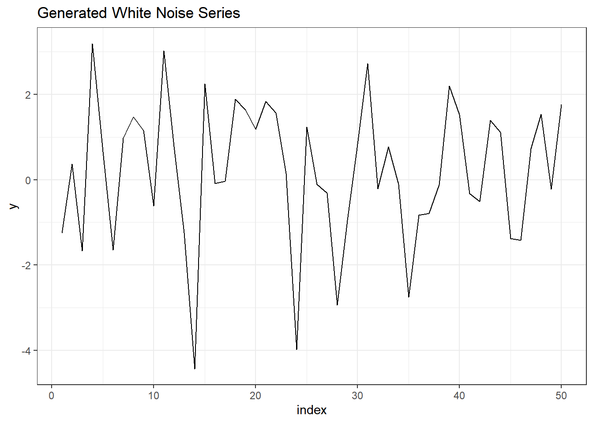
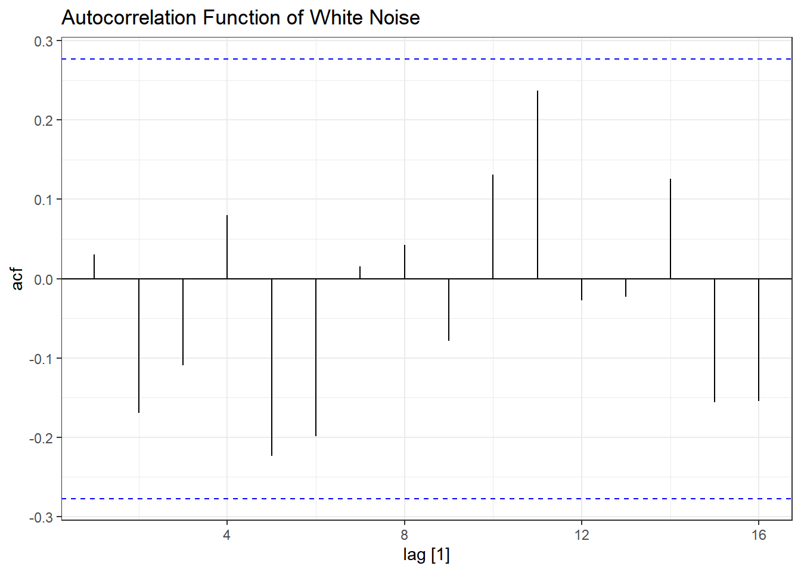
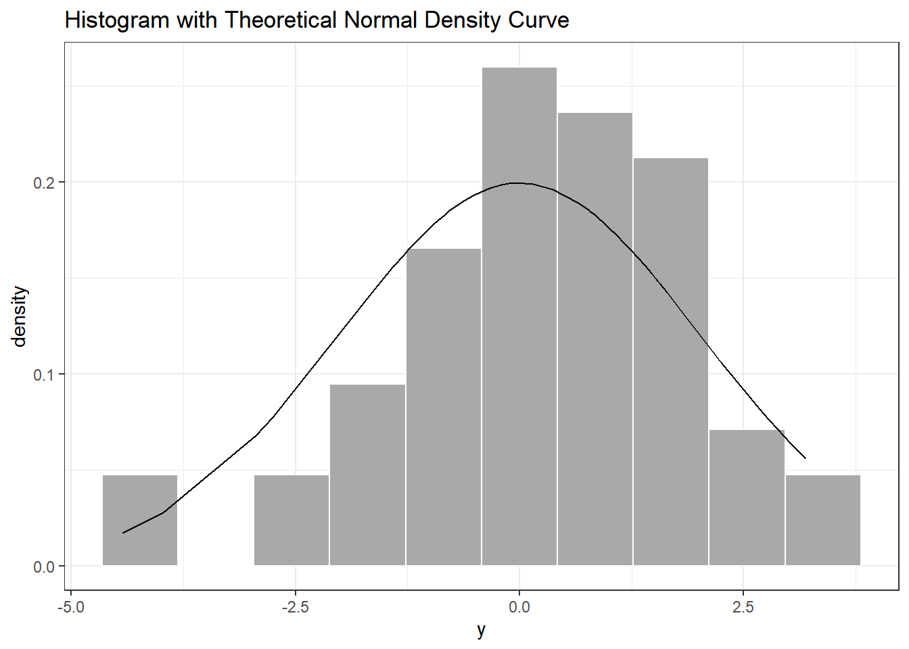
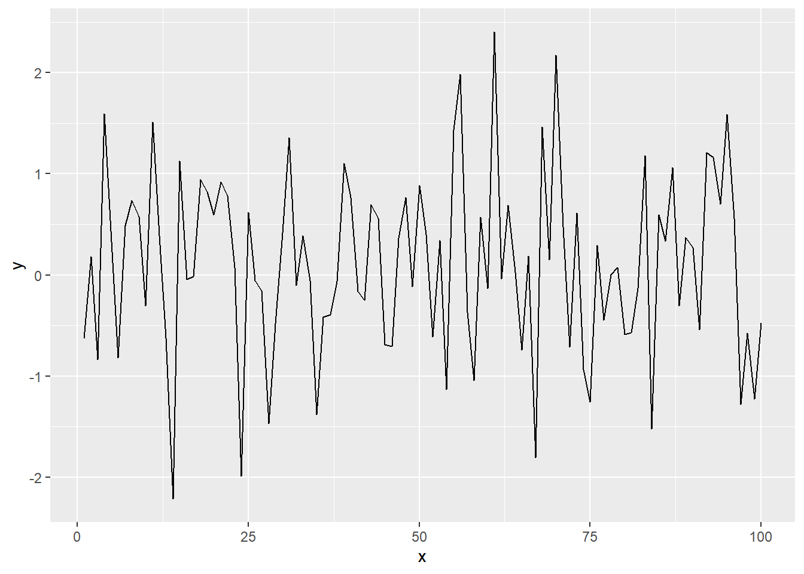
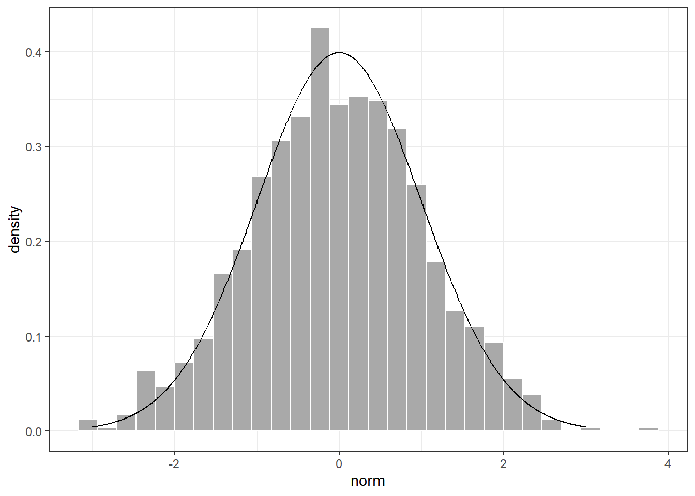
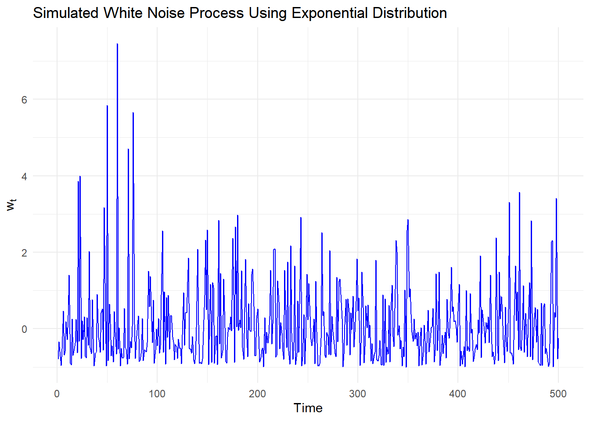
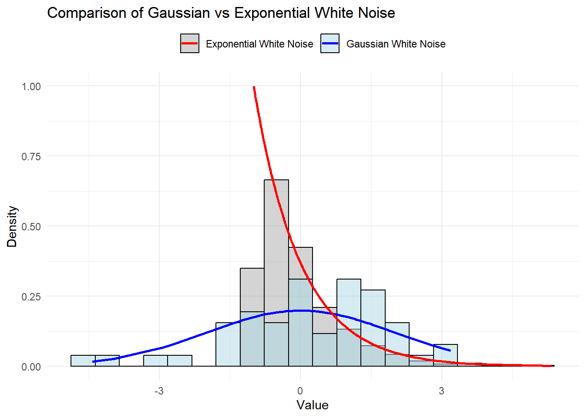
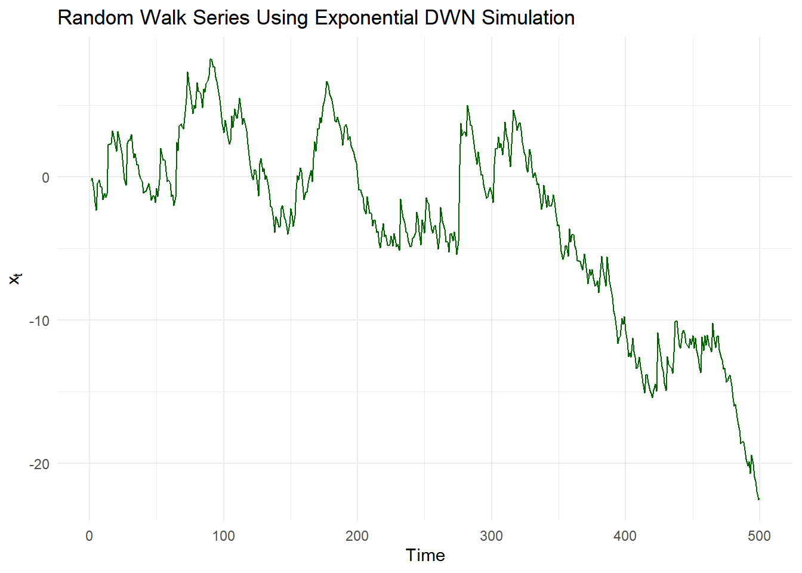
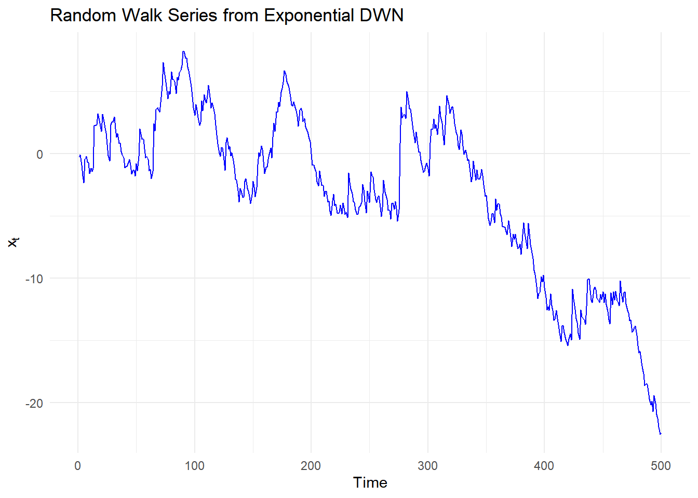

::: {.cell}

:::

::: {.cell}

```{.r .cell-code}
set.seed(1)
n_points <- 50  # Number of points to use in both parts
sigma <- 2 # Standard deviation for rnorm
aver <- 0

# Generate the tibble using n_points and sigma
wd_gaussian <- tibble(
    index = 1:n_points,
    y = rnorm(n_points, mean = aver, sd = sigma)
) |> 
  as_tsibble(index = index) |>
  mutate(
  density = dnorm(y, mean = aver, sd = sigma))


# Plot the first tibble
wd_gaussian |> 
    ggplot(aes(x = index, y = y)) + 
    geom_line() +
    theme_bw() +
    ggtitle("Generated White Noise Series")
```

::: {.cell-output-display}
{width=672}
:::

```{.r .cell-code}
# 2. Calculate and print the mean and variance
sample_mean <- mean(wd_gaussian$y)
sample_variance <- var(wd_gaussian$y)
cat("Estimated Mean:", sample_mean, "\n")
```

::: {.cell-output .cell-output-stdout}

```
Estimated Mean: 0.2008966 
```


:::

```{.r .cell-code}
cat("Estimated Variance:", sample_variance, "\n")
```

::: {.cell-output .cell-output-stdout}

```
Estimated Variance: 2.764863 
```


:::

```{.r .cell-code}
# 3. Plot the Autocorrelation Function (ACF)
acf_plot <- wd_gaussian |>
  ACF(y, type = "correlation") |>
  autoplot() +
  ggtitle("Autocorrelation Function of White Noise") +
  theme_bw()


# Plot the histogram using the data from wd_gaussian
hist_plot <- wd_gaussian |>
    ggplot(aes(x = y)) +
    geom_histogram(aes(y = after_stat(density)),
        color = "white", fill = "darkgrey", bins = 10) +
    geom_line(aes(x = y, y = density)) +
    theme_bw() +
  ggtitle("Histogram with Theoretical Normal Density Curve")


acf_plot
```

::: {.cell-output-display}
{width=672}
:::

```{.r .cell-code}
hist_plot
```

::: {.cell-output-display}
{width=672}
:::
:::


# resource coe 4.2.3 "Simulation in R" Modern look


::: {.cell}

```{.r .cell-code}
# Set seed for reproducibility of random numbers
set.seed(1)

# Generate a tibble with 100 random values from N(0, 1)
wd_gaussian <- tibble(
    x = 1:100,                      # Sequence from 1 to 100
    y = rnorm(100)                  # Generate 100 random values with mean 0, sd 1
)

# Plot the generated time series data as a line plot
wd_gaussian |> ggplot(aes(x = x, y = y)) + 
    geom_line()
```

::: {.cell-output-display}
{width=672}
:::

```{.r .cell-code}
# Create another tibble with data for histogram
xd <- tibble(
    x = seq(-3, 3, length = 1000),  # 1,000 evenly spaced numbers between -3 and 3
    norm = rnorm(1000),             # Generate 1,000 random values from N(0, 1)
    density = dnorm(x)              # Compute normal distribution density for x
)

# Plot histogram of random values with density curve
xd |>
    ggplot(aes(x = norm)) +
    geom_histogram(aes(y = after_stat(density)), # Histogram with density scaling
                   color = "white", fill = "darkgrey") +
    geom_line(aes(x = x, y = density)) +         # Overlay normal density curve
    theme_bw()                                   # Apply clean theme to plot
```

::: {.cell-output-display}
{width=672}
:::
:::


## homework 4 question 3.a

this is sample code given by ai that uses an rexp function which we dont use but it does appear once in the book for one of the practice problems. I decided not to use it and show more of the math being done on the code


::: {.cell}

```{.r .cell-code}
#| include: false
set.seed(42)

# Parameters
lambda <- 1
n <- 500

# Simulate white noise using the exponential distribution
s_t <- rexp(n, rate = lambda)
w_t <- s_t - lambda

# Plot the simulation
library(ggplot2)

df <- data.frame(Time = 1:n, White_Noise = w_t)
ggplot(df, aes(x = Time, y = White_Noise)) +
  geom_line(color = "blue") +
  theme_minimal() +
  labs(
    title = "Simulated White Noise Process Using Exponential Distribution",
    x = "Time",
    y = expression(w[t])
  )
```

::: {.cell-output-display}
{width=672}
:::
:::


# hw 3.b

this was the code that was giving me the high density error for exponential white noise, I swap the dexp with dnorm and it produce a plot similar to that of the class png sample. but I dont think it is right because the class pdf expo line expands out like a normal distribution and the one that produce a similar one has the expo line start near -0.8. 

swap this one
  mutate(density = dexp(w_t + lambda, rate = lambda))
  
  
with this one
mutate(density = dnorm(w_t, mean = aver, sd = sigma))


::: {.cell}

```{.r .cell-code}
# this was the code that was giving me the high density error for exponential white noise
# Set up the environment
set.seed(1)

# Step 1: Parameters for Gaussian White Noise (from Question 1)
n_points <- 50    # Number of points used previously for Gaussian white noise
sigma <- 2        # Standard deviation
aver <- 0         # Mean for Gaussian white noise

# Generate Gaussian white noise data
wd_gaussian <- tibble(
  index = 1:n_points,
  y = rnorm(n_points, mean = aver, sd = sigma)
) |>
  mutate(
  density = dnorm(y, mean = aver, sd = sigma))

# Step 2: Parameters for Exponential White Noise (from Question 3a)
set.seed(1)
n_exp_points <- 500  # Number of points for Exponential white noise
lambda <- 1          # The rate parameter

# Generate Exponential white noise data
s_t <- rexp(n_exp_points, rate = lambda)
wd_exp <- tibble(
  index = 1:n_exp_points,
  w_t = s_t - lambda
) |> 
  mutate(density = dexp(w_t + lambda, rate = lambda))
  

# Step 3: Convert to regular tibbles and prepare for merging
gaussian_df <- wd_gaussian |> 
  mutate(type = "Gaussian White Noise", value = y) |> 
  select(type, value, density)

exp_df <- wd_exp |> 
  mutate(type = "Exponential White Noise", value = w_t) |> 
  select(type, value, density)

# Step 4: Combine both datasets for plotting
combined_data <- bind_rows(gaussian_df, exp_df)

# Step 5: Plot superimposed histograms

ggplot(combined_data, aes(x = value, fill = type)) +
  # Plot histograms for both distributions
  geom_histogram(aes(y = after_stat(density)), alpha = 0.5, position = "identity", bins = 20, color = "black") +
  # Add density lines for each distribution
  geom_line(data = gaussian_df, aes(x = value, y = density, color = type), size = 1) +
  geom_line(data = exp_df, aes(x = value, y = density, color = type), size = 1) +
  theme_minimal() +
  labs(
    title = "Comparison of Gaussian vs Exponential White Noise",
    x = "Value",
    y = "Density"
  ) +
  scale_fill_manual(values = c("darkgray", "lightblue")) +
  scale_color_manual(values = c("Gaussian White Noise" = "blue", "Exponential White Noise" = "red")) +
  theme(
    legend.title = element_blank(),
    legend.position = "top"
  )
```

::: {.cell-output-display}
{width=672}
:::
:::


# hw 3.c

both of this code get the same done


::: {.cell}

```{.r .cell-code}
# Step 1: Generate the Exponential DWN simulation (from part a)
set.seed(1)
n_exp_points <- 500  # Length of the series
lambda <- 1          # Rate parameter

# Generate Exponential white noise
s_t <- rexp(n_exp_points, rate = lambda)
w_t <- s_t - lambda  # White noise series

# Step 2: Create the Random Walk Series
random_walk <- tibble(
    index = 1:n_exp_points,
    x_t = cumsum(w_t)  # Cumulative sum to create the random walk
) |> 
  as_tsibble(index = index)

# Step 3: Plot the Random Walk Series
random_walk |> 
    ggplot(aes(x = index, y = x_t)) +
    geom_line(color = "darkgreen") +
    theme_minimal() +
    ggtitle("Random Walk Series Using Exponential DWN Simulation") +
    labs(x = "Time", y = expression(x[t]))
```

::: {.cell-output-display}
{width=672}
:::
:::

::: {.cell}

```{.r .cell-code}
# Using the Exponential White Noise series from part a)

# Create the random walk series
wd_exp <- wd_exp |>
  mutate(
    x_t = cumsum(w_t)  # Cumulative sum to create the random walk series
  )

# Plot the random walk series
wd_exp |>
  ggplot(aes(x = index, y = x_t)) +
  geom_line(color = "blue") +
  theme_minimal() +
  ggtitle("Random Walk Series from Exponential DWN") +
  labs(x = "Time", y = expression(x[t]))
```

::: {.cell-output-display}
{width=672}
:::
:::


spacer
