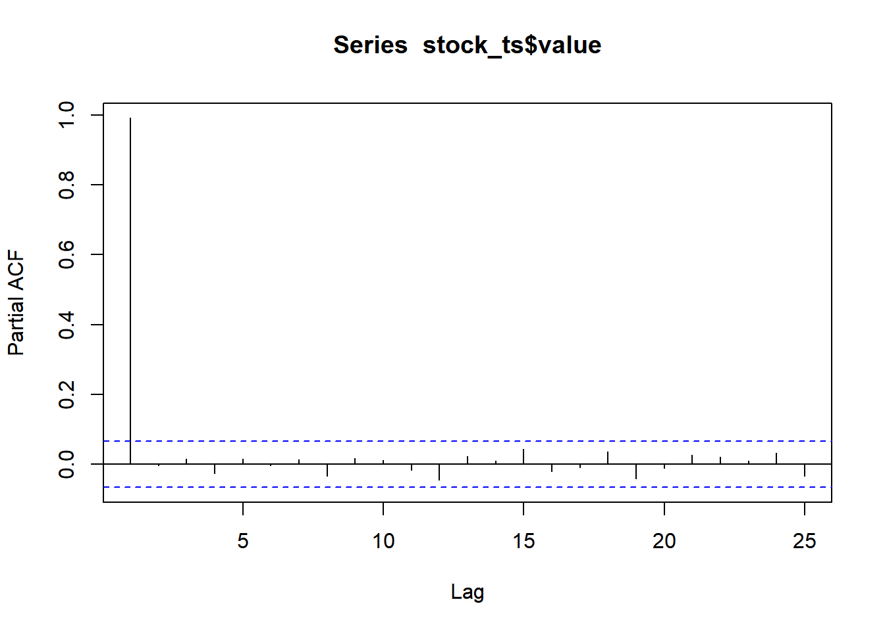

## Lesson 4.3 Autoregressive (AR) Models

### Properties of an AR(p) Stochastic Process


### Definition of Autoregressive (AR) Models

-  **Autoregressive (AR) Models Lesson 4.3**
    -   An AR is a linear regression model that uses lagged values of the time series to predict future values.
    -   An AR is a stochastic process that uses a linear combination of past values of the time series to predict future values.


::: {.callout-note icon="false" title="Definition of an Autoregressive (AR) Model"}
The time series $\{x_t\}$ is an **autoregressive process of order** $p$, denoted as $AR(p)$, if 
$$
  x_t = \alpha_1 x_{t-1} + \alpha_2 x_{t-2} + \alpha_3 x_{t-3} + \cdots + \alpha_{p-1} x_{t-(p-1)} + \alpha_p x_{t-p} + w_t ~~~~~~~~~~~~~~~~~~~~~~~ (4.15)
$$

where $\{w_t\}$ is white noise and the $\alpha_i$ are the model parameters with $\alpha_p \ne 0$.
:::

**Autoregressive Properties of an AR model**

-  The mean of an AR model is a constant.
-  The variance of an AR model is finite.
-  The covariance of an AR model is a function of the lag.
-  The autocorrelation of an AR model is a function of the lag.


### Exploring AR(1) Models

**Definitino**
Recall that an $AR(p)$ model is of the form $$
  x_t = \alpha_1 x_{t-1} + \alpha_2 x_{t-2} + \alpha_3 x_{t-3} + \cdots + \alpha_{p-1} x_{t-(p-1)} + \alpha_p x_{t-p} + w_t
$$ So, an $AR(1)$ model is expressed as $$
  x_t = \alpha x_{t-1} + w_t
$$ where $\{w_t\}$ is a white noise series with mean zero and variance $\sigma^2$.


### Second-Order Properties of an AR(1) Model

:::: {.callout-note icon="false" title="Second-Order Properties of an $AR(1)$ Model"}
If $\{x_t\}_{t=1}^n$ is an $AR(1)$ prcess, then its the first- and second-order properties are summarized below.

$$
\begin{align*}
  \mu_x &= 0 \\  
  \gamma_k = cov(x_t, x_{t+k}) &= \frac{\alpha^k \sigma^2}{1-\alpha^2}
\end{align*}
$$

::: {.callout-tip title="Click here for a proof of the equation for $cov(x_t,x_{t+k})$" collapse="true"}
Why is $cov(x_t, x_{t+k}) = \dfrac{\alpha^k \sigma^2}{1-\alpha^2}$?

If $\{x_t\}$ is a stable $AR(1)$ process (which means that \$\|\alpha\|\<1) can be written as:

\begin{align*}
  (1-\alpha \mathbf{B}) x_t &= w_t \\
  \implies x_t &= (1-\alpha \mathbf{B})^{-1} w_t \\
    &= w_t + \alpha w_{t-1} + \alpha^2 w_{t-2} + \alpha^3 w_{t-3} + \cdots \\
    &= \sum\limits_{i=0}^\infty \alpha^i w_{t-i}
\end{align*}

From this, we can deduce that the mean is

$$
  E(x_t) 
    = E\left( \sum\limits_{i=0}^\infty \alpha^i w_{t-i} \right)
    = \sum\limits_{i=0}^\infty \alpha^i E\left( w_{t-i} \right)
    = 0
$$

The autocovariance is computed similarly as:

\begin{align*}
  \gamma_k = cov(x_t, x_{t+k}) 
    &= cov \left( 
      \sum\limits_{i=0}^\infty \alpha^i w_{t-i}, \\
      \sum\limits_{j=0}^\infty \alpha^j w_{t+k-j} \right) \\
    &= \sum\limits_{j=k+i} \alpha^i \alpha^j cov ( w_{t-i}, w_{t+k-j} ) \\
    &= \alpha^k \sigma^2 \sum\limits_{i=0}^\infty \alpha^{2i} \\
    &= \frac{\alpha^k \sigma^2}{1-\alpha^2}
\end{align*}

See Equations (2.15) and (4.2).
:::
::::

### Correlogram of an AR(1) Model

-  The autocorrelation function of an $AR(1)$ model is a function of the lag.

::: {.callout-note icon="false" title="Correlogram of an AR(1) Process"}
The autocorrelation function for an AR(1) process is

$$
  \rho_k = \alpha^k ~~~~~~ (k \ge 0)
$$ where $|\alpha| < 1$.
:::


**Things to do** 
- DO group activity: Simulation of an AR(1) process


### Partial Autocorrelation

::: {.callout-note icon="false" title="Definition: Partial Autocorrleation"}
The **partial autocorrelation** at lag $k$ is defined as the portion of the correlation that is not explained by shorter lags.
:::

For example, the partial correlation for lag 4 is the correlation not explained by lags 1, 2, or 3.


::: {.callout-tip icon="false" title="Check Your Understanding"}
-   What is the value of the partial autocorrelation function for an $AR(2)$ process for all lags greater than 2? answer: 0
:::


### Example: McDonald's Stock Price

Here is a partial autocorrelation plot for the McDonald's stock price data:


::: {.cell}

```{.r .cell-code  code-fold="true"}
# Loading R packages
if (!require("pacman")) install.packages("pacman")
pacman::p_load(tidyverse,
               tsibble, fable,
               feasts, tsibbledata,
               fable.prophet,
               patchwork,
               lubridate,
               rio,
               ggplot2,
               kableExtra
               )

# Set symbol and date range
symbol <- "MCD"
company <- "McDonald's"

# Retrieve static file
stock_df <- rio::import("https://byuistats.github.io/timeseries/data/stock_price_mcd.parquet")

# Transform data into tibble
stock_ts <- stock_df %>%
  mutate(
    dates = date, 
    value = adjusted
  ) %>%
  select(dates, value) %>%
  as_tibble() %>% 
  arrange(dates) |>
  mutate(diff = value - lag(value)) |>
  as_tsibble(index = dates, key = NULL) 

pacf(stock_ts$value, plot=TRUE, lag.max = 25)
```

::: {.cell-output-display}
{width=672}
:::
:::


The only significant partial correlation is at lag $k=1$. This suggests that an $AR(1)$ process could be used to model the McDonald's stock prices.


### Partial Autocorrelation Plots of Various AR(p) Processes

**Look at lesson shinny code**


### Sationary and Non-Stationary AR Processes

::: {.callout-note icon="false" title="Definition of the Characteristic Equation"}
Treating the symbol $\mathbf{B}$ formally as a number (either real or complex), the polynomial

$$
  \theta_p(\mathbf{B}) x_t = \left( 1 - \alpha_1 \mathbf{B} - \alpha_2 \mathbf{B}^2 - \cdots - \alpha_p \mathbf{B}^p \right) x_t
$$

is called the **characteristic polynomial** of an AR process.

If we set the characteristic polynomial to zero, we get the **characteristic equation**:

$$
  \theta_p(\mathbf{B}) = \left( 1 - \alpha_1 \mathbf{B} - \alpha_2 \mathbf{B}^2 - \cdots - \alpha_p \mathbf{B}^p \right) = 0
$$
:::


::: {.callout-note icon="false" title="Identifying Stationary Processes"}
An AR process will be **stationary** if the absolute value of the solutions of the characteristic equation are all strictly greater than 1.
:::

First, we will find the roots of the characteristic polynomial (i.e. the solutions of the characteristic equation) and then we will determine if the absolute value of these solutions is greater than 1.

We can use the `polyroot` function to find the roots of polynomials in R. For example, to find the roots of the polynomial $x^2-x-6$, we apply the command


::: {.cell}

```{.r .cell-code}
polyroot(c(-6,-1,1))
```

::: {.cell-output .cell-output-stdout}

```
[1]  3+0i -2+0i
```


:::
:::


Note the order of the coefficients. They are given in increasing order of the power of $x$.

Of course, we could simply factor the polynomial: 
$$
  x^2-x-6 = (x-3)(x+2) \overset{set}{=} 0
$$ which implies that 
$$
  x = 3 ~~~ \text{or} ~~~ x = -2
$$


### Absolute Value in the Complex Plane


::: {.callout-note icon="false" title="Definition of the Absolute Value in the Complex Plane"}
Let $z = a+bi$ be any complex number. It can be represented by the point $(a,b)$ in the complex plane. We define the absolute value of $z$ as the distance from the origin to the point:

$$
  |z| = \sqrt{a^2 + b^2}
$$
:::


**This sections check for this**
- We will now practice assessing whether an AR process is stationary using the characteristic equation.


co-pilot notes

-  **Stationary and Non-Stationary AR Processes Lesson 4.3**
    -   An AR process will be stationary if the absolute value of the solutions of the characteristic equation are all strictly greater than 1.
    -   The characteristic equation of an AR process is the polynomial $\theta_p(\mathbf{B}) = 1 - \alpha_1 \mathbf{B} - \alpha_2 \mathbf{B}^2 - \cdots - \alpha_p \mathbf{B}^p$.
    -   The roots of the characteristic polynomial are the solutions of the characteristic equation.
    -   The absolute value of the roots of the characteristic polynomial must be greater than 1 for the AR process to be stationary.

co-pilot notes end


### Questions

* What is an exponential smoothing model?


### Search for words for lesson 4.3 

exponential smoothing model - polyroot function - 