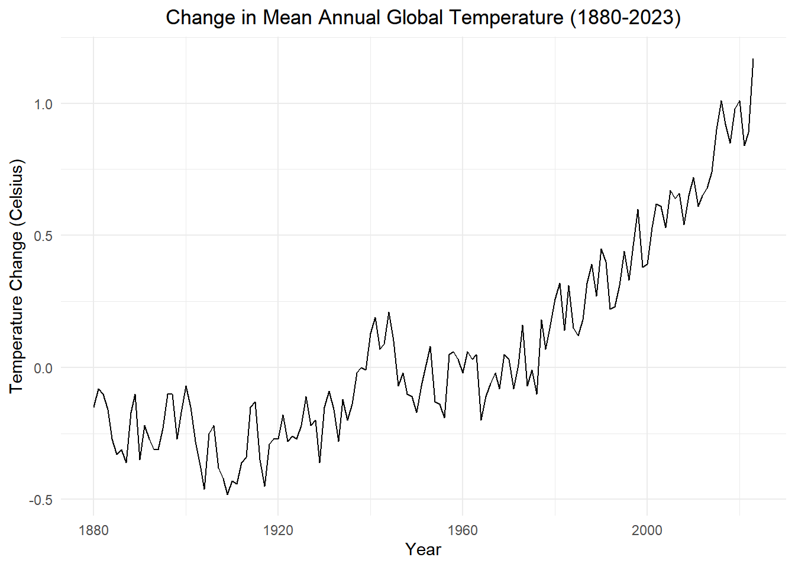
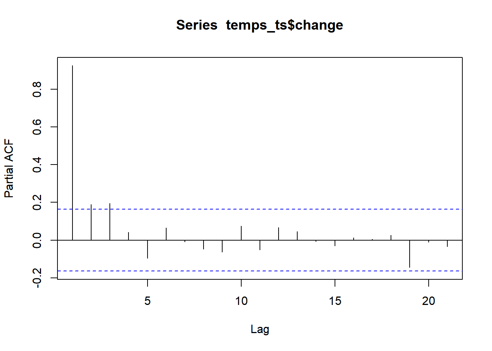

transfer from chapter_4_lesson_4_notes.qmd old repo


I belive this are notes taken from class.


::: {.cell}

```{.r .cell-code}
# Loading R packages
if (!require("pacman")) install.packages("pacman")
pacman::p_load(tidyverse,
               tsibble, fable,
               feasts, tsibbledata,
               fable.prophet,
               patchwork,
               lubridate,
               rio,
               ggplot2,
               kableExtra
               )
```
:::

::: {.cell}

```{.r .cell-code}
temps_ts <- rio::import("https://byuistats.github.io/timeseries/data/global_temparature.csv") |>
  as_tsibble(index = year)

temps_ts |> autoplot(.vars = change) +
    labs(
      x = "Year",
      y = "Temperature Change (Celsius)",
      title = paste0("Change in Mean Annual Global Temperature (", min(temps_ts$year), "-", max(temps_ts$year), ")")
    ) +
    theme_minimal() +
    theme(
      plot.title = element_text(hjust = 0.5)
    )
```

::: {.cell-output-display}
{width=672}
:::

```{.r .cell-code}
# chunk number 2
pacf(temps_ts$change)
```

::: {.cell-output-display}
{width=672}
:::

```{.r .cell-code}
global_ar <- temps_ts |>
    model(AR(change ~ order(1:9)))
tidy(global_ar)
```

::: {.cell-output .cell-output-stdout}

```
# A tibble: 7 × 6
  .model                  term     estimate std.error statistic  p.value
  <chr>                   <chr>       <dbl>     <dbl>     <dbl>    <dbl>
1 AR(change ~ order(1:9)) constant   0.0190   0.00881     2.15  3.30e- 2
2 AR(change ~ order(1:9)) ar1        0.656    0.0841      7.80  1.40e-12
3 AR(change ~ order(1:9)) ar2       -0.0662   0.100      -0.659 5.11e- 1
4 AR(change ~ order(1:9)) ar3        0.140    0.0988      1.42  1.58e- 1
5 AR(change ~ order(1:9)) ar4        0.265    0.0995      2.67  8.58e- 3
6 AR(change ~ order(1:9)) ar5       -0.163    0.102      -1.60  1.11e- 1
7 AR(change ~ order(1:9)) ar6        0.206    0.0863      2.38  1.85e- 2
```


:::
:::


To go over


go over the table fromt he **Fitting Models (Dynamic Number of Parameters)** exercise. 

write the ar model for this time series.
   * What does the table tell us. 
     * estimeate
     * estimate 
     * statistic
     * p.value
      
Know how to indentify if a model is stationary or not stationary. Moncayo's r 6 model is not stationary because the of the .98, but the book model, I think the ar 4 model shows it is stationary. ([1] 1.011 1.755 1.453 1.453). Moncayo's ar6 shows that it is not stationary. so the plot in the lesson, shows an increasing forecasted trend. Since the model says it is stationary, and the temps has been in an increasing trend since the 1980, the book model plot hasthe forecast coming back down to a mean of zero. This makes sense for a stiationary model because it has a mean of zero. 