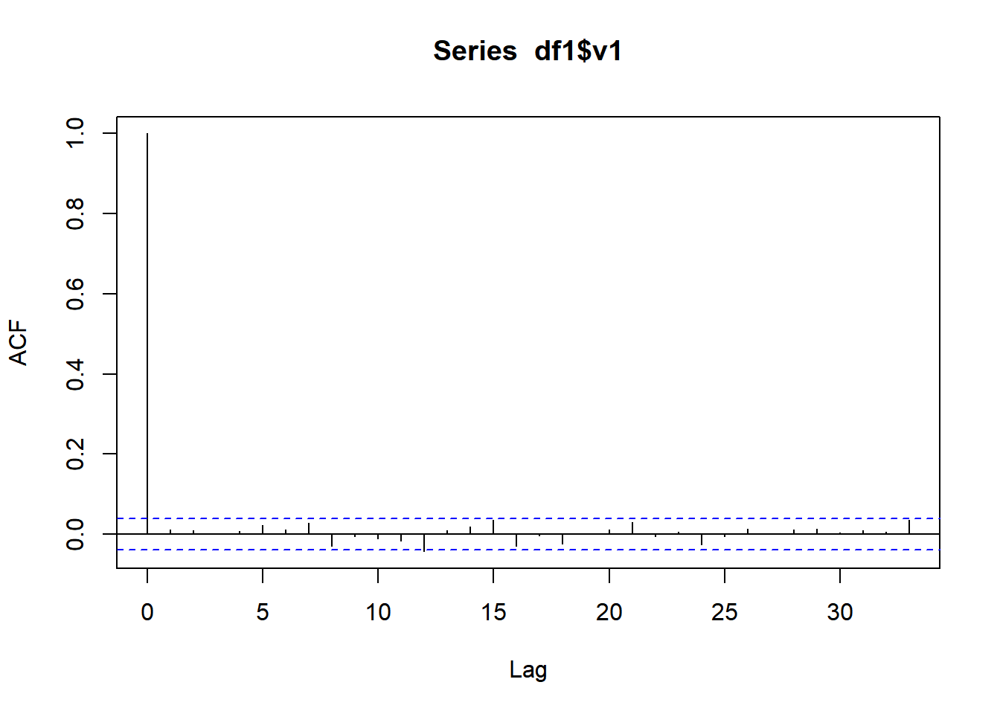
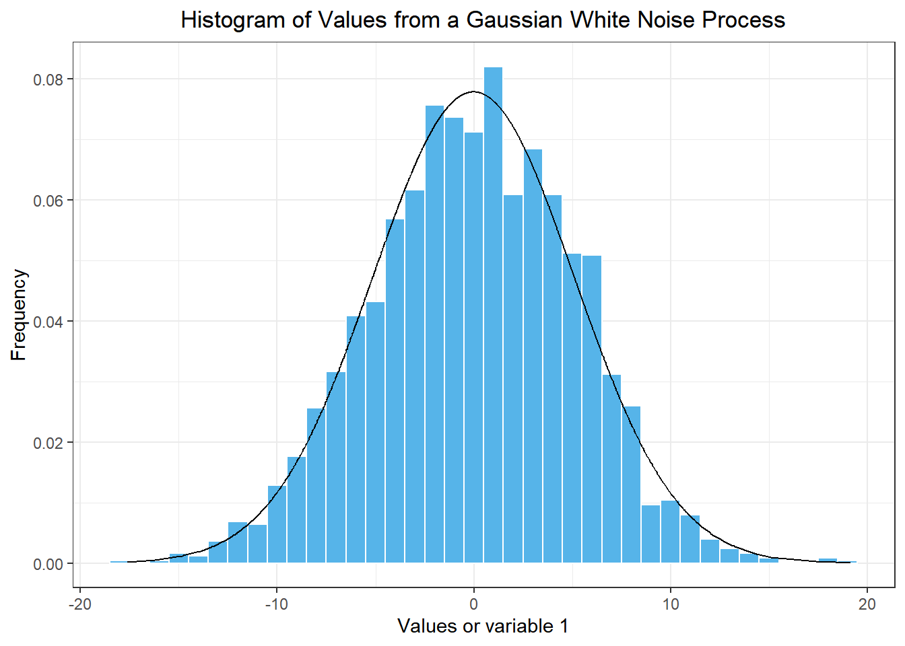
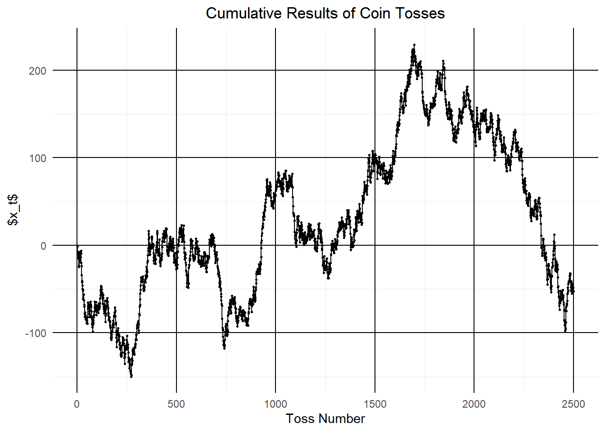

This chapter is not finished. 

# Lesson 4 - 1 code

## Visualizing White Noise


::: {.cell}

:::


spacer


::: {.cell}

```{.r .cell-code}
# 1


file_path <- "../data/white_noise.parquet"

# ../data goes back one level. ../../data goes back two folders
```
:::

::: {.cell}

```{.r .cell-code}
# straight from lesson code
# This code was used to create the white noise data file

# Set random seed
set.seed(10)

# Specify means and standard deviation
n <- 2500                           # number of points
white_noise_sigma <- rnorm(1, 5, 1) # choose a random standard deviation

# Simulate normal data
# data.frame(x = rnorm(n, 0, white_noise_sigma)) |>
#   rio::export("../data/white_noise.parquettest") # uncomment this two lines to run
```
:::

::: {.cell}

```{.r .cell-code}
# 2


# White noise data
df0 <- rio::import(file_path)
```
:::


**name changes**

chunk 3: white_noise_df = df0

chunk 4: x = v1


::: {.cell}

```{.r .cell-code}
# 3
# words b/ code: The first 250 points in this time....

df1 <- df0 |> # this code updates names, but now t = x. and x is y in latter codes so keep that in mind.
  mutate(t = 1:nrow(df0)) |>
  rename(x = t, v1 = x) # rename this, original code had those names for x and y. now just x and y

df1 |> # original, but this code does not rename or change df. 
  head(250) |>  
  ggplot(aes(x = x, y = v1)) + 
    geom_line() +
    theme_bw() +
    labs(
      x = "Time",
      y = "Values",
      title = "First 250 Values of a Gaussian White Noise Time Series"
    ) +
    theme(
      plot.title = element_text(hjust = 0.5)
    )
```

::: {.cell-output-display}
{width=672}
:::

```{.r .cell-code}
  acf(df1$v1, type = "covariance") # doing this in class to get to the density plot below
```

::: {.cell-output-display}
{width=672}
:::

```{.r .cell-code}
  acf(df1$v1, type = "correlation") # use this acf samples from previous lesson. 
```

::: {.cell-output-display}
{width=672}
:::
:::


spacer


::: {.cell}

```{.r .cell-code}
# 4.1 - 4
# words before code: Here is a histogram of the 2500 values from....

# this x is the variable, but not necessarily the x axis variable. x is y here 
df1 |>
  mutate(density = dnorm(v1, mean(df1$v1), sd(df1$v1))) |>
  ggplot(aes(x = v1)) +
    geom_histogram(aes(y = after_stat(density)),
        color = "white", fill = "#56B4E9", binwidth = 1) +
    geom_line(aes(x = v1, y = density)) +
    theme_bw() +
    labs(
      x = "Values or variable 1",
      y = "Frequency",
      title = "Histogram of Values from a Gaussian White Noise Process"
    ) +
    theme(
      plot.title = element_text(hjust = 0.5)
    )
```

::: {.cell-output-display}
{width=672}
:::

```{.r .cell-code}
# left off in this histogram code because the differences between the y and x names is confusing. I need to just hard edit the code to clearly define the variable and avoid the name changes. I just need to make sure I take note of it.
```
:::


**Random Walk Cumulative Sum**

name changes

y = v2

the x in this code refers to the x - axis values. This code is meant for when the x axis values are number of observations (eg. 1-60). Dates can maybe work, but anything else can cause troubles.


::: {.cell}

```{.r .cell-code}
# 4.1 - 5
# sample code to simulate a random walk
# words b/ code: Complete steps 2 and 3 a total of

# set.seed(7)

df2 <- df1 |>
  # mutate(w = ifelse(row_number() == 1, 0, sample(c(-1,1), size = 60, replace = TRUE))) |> # generates coin flips, but no longer needed for chapter model
  mutate(v2 = cumsum(v1)) # creates cumulitve v2 column

ggplot(data=df2, aes(x=x, y=v2)) +
  # geom_point(data = df2, aes(x=x, y=v2), size = 0.01) +
  geom_line() +
  geom_point(size = 0.5) +
  # scale_x_continuous(limits = c(0,60), # limits to only 60 obs
  #                    breaks = seq(0, 60, by = 5),
  #                    minor_breaks = seq(0, 60, 1)) +
  # scale_y_continuous(limits = c(-20,20),
  #                    breaks = seq(-20, 20, by = 5),
  #                    minor_breaks = seq(-20, 20, 1)) +
  labs(
      x = "Toss Number",
      y = expression(paste("$x_t$")),
      title = "Cumulative Results of Coin Tosses" # cum results (v2) of v1. 
  ) +
  theme_minimal() +
  theme(
    panel.grid.major = element_line(colour = "black")
  ) +
  theme(
    plot.title = element_text(hjust = 0.5)
  )
```

::: {.cell-output-display}
{width=672}
:::
:::


spacer


::: {.cell}

```{.r .cell-code}
# 4.1 - 6 
# words b/ code: be a time series with the following values.

set.seed(6)
n <- 8
d_operator <- data.frame(t = c(1:n), x = sample(1:15, n, replace = FALSE)) |>
  mutate(diff = t - n) # what is this code doing. right now is its doing t - n. n is always the set 8, and t is just the number of observations. so if n is 8, then the first t- n is -7, second is -6 and so on, but this is just using the number/date assigned to the actual variable. its like comparing hot days when only using the data, but not the temperature. so what is this code doing exactly????

#cat( paste( paste0("$x_{t", ifelse(d_operator$t==n,"",d_operator$t-n), "} = ", d_operator$x, "$"), collapse = ",$~$ " ) ) 

cat( paste( paste0("$x_{", d_operator$t, "} = ", d_operator$x, "$"), collapse = ",$~$ " ) ) 

# Computes the value of the "power_on_d"^th difference from x_n
d_value <- function(power_on_d = 0) {
  out <- d_operator |> #### Note the use of this global variable
    filter(diff == -power_on_d) |>
    dplyr::select(x) |>
    pull()
  
  return(out)
}


ts_val <- function(t_value) {
  out <- d_operator |> #### Note the use of this global variable
    filter(t == t_value) |>
    dplyr::select(x) |>
    pull()
  
  return(out)
}

# this code below was the last r chunk for lesson 4-1, but it is not needed since it is in this r chunk. This r chunk is set not to evaluate for class. 

#cat( paste( paste0("$x_{", d_operator$t, "} = ", d_operator$x, "$"), collapse = ",$~$ " ) )
```
:::


spacer

This is solution to backwards shift operator so formula for this code is done in a previous r chunk.

# Lesson 4 - 2 code


::: {.cell}

```{.r .cell-code}
# 4.2 - 1 

# Set symbol and date range
symbol <- "MCD"
company <- "McDonald's"
date_start <- "2020-07-01"
date_end <- "2024-01-01"

# Fetch stock prices (can be used to get new data)
stock_df <- tq_get(symbol, from = date_start, to = date_end, get = "stock.prices")

# Transform data into tsibble
stock_ts <- stock_df %>%
  mutate(
    dates = date, 
    value = adjusted
  ) %>%
  dplyr::select(dates, value) %>%
  as_tibble() %>% 
  arrange(dates) |>
  mutate(diff = value - lag(value)) |>
  as_tsibble(index = dates, key = NULL)
```
:::
