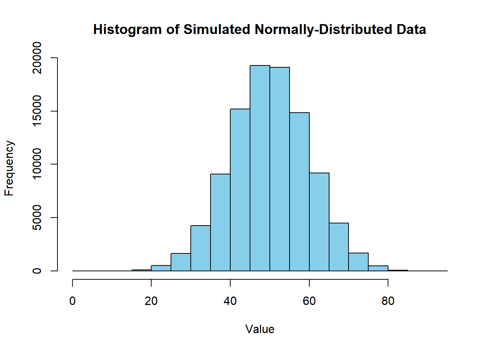

::: {.cell}

:::


## Questions

### Question 1 (5 points)

What is something unusual or unique about you?

::: {.callout-note icon="false" title="Answer"}
I have been coming to BYUI for almost four years, and therefore, I have been focusing on school for nearly four years, so I can't think of anything unique or unusual about me besides school, but I have some ideas. I have about 14 siblings, but I'm the only child between my mom and dad. Back in 2007, I was able to solve about 90% of a Rubik's cube without looking, which was impressive back then but not so much now. My ability to figure out and solve things like the Rubik's cube remains so I can solve many complex things that the average person will not think to even try. One unusual thing is that although I'm really smart in some scenarios like the Rubik's cube, I can also be really dumb in some basic university study habits, so yeah. 
:::

### Question 2 (5 points)

What do you hope to gain from this class?

::: {.callout-note icon="false" title="Answer"}
I'm looking to improve my ability to explain business and financial numbers using statistics. I hope this class gives me the skills and vocabulary to properly and correctly explain the statistical meanings behind business, financial, and/or economic data. I also hope that this course can help me use knowledge and skills related to my data science minor and apply them to my major. I'm also excited to expand my econometrics knowledge with this course. 
:::

<!-- The following tip can help you complete Exercise 3 -->

::: {.callout-tip title="Tip for Exercise 3"}
In a qmd file, you can do all sorts of fun things. If you type `<ctrl> <alt> i`, RStudio will insert an R code chunk, where you can run any R code. The code below generates 10 uniform random variables between 0 and 1.


::: {.cell}

```{.r .cell-code}
# Set the random number seed
set.seed(100)

# Define the number of values to simulate
reps <- 4

# Create a data frame with a counter variable, t, 
# and the simulated values, called x
df1 <- data.frame(t = 1:reps, x = runif(reps, min = 0, max = 1))
df1
```

::: {.cell-output .cell-output-stdout}

```
  t          x
1 1 0.30776611
2 2 0.25767250
3 3 0.55232243
4 4 0.05638315
```


:::
:::


You can use inline R code as well. For example, the mean of the n=4 simulated x values is: 0.293536.

If you do not know how to use any command such as `rnorm` in R, you can type the name of the command after a question mark (e.g. `?rnorm`) in the console area, and the help file will appear on the right.
:::

### Question 3 (10 points)

Use the `rnorm` command to simulate 100,000 normally-distributed random variables with a mean of 50 and a standard deviation of 10. Please do not list all the numbers. Instead, give a histogram of the data.\*

::: {.callout-note icon="false" title="Answer"}


::: {.cell}

```{.r .cell-code}
# load libraries
library(tidyverse)
library(lubridate)

# Set the random number seed
set.seed(100)

# Define the number of values to simulate
# Simulate 100,000 normally-distributed random variables with mean=50 and sd=10

simulated_data <- rnorm(100000, mean = 50, sd = 10)


# histogram

hist(simulated_data, 

     main = "Histogram of Simulated Normally-Distributed Data", 

     xlab = "Value", 

     ylab = "Frequency", 

     col = "skyblue", 

     border = "black")
```

::: {.cell-output-display}
{width=672}
:::
:::


:::

### Question 4 (10 points)

Suppose your pulse was measured at the start of every hour today and the values are given in the data frame `pulse_df`.


::: {.cell}

```{.r .cell-code}
set.seed(123)
pulse_df <- data.frame(
  times = paste0(as.Date(substr(now(),1,10)), " ", c(0:23), ":00"),
  value = sample(70:100, size = 24, replace = TRUE)
)
```
:::


We can convert a character representation of a date to a date-time object. The Lubridate package contains commands such as `mdy("12/31/2024")` which converts this value to: 2024-12-31. There are other variations of this command such as `dmy_hms("31/12/2024 15:16:47")` which gives us: 2024-12-31 15:16:47.

Use the command `ymd_hm()` to convert the `times` variable into a date-type variable. Then filter the four observations from noon to 3 PM (15:00). There are many ways to accomplish this but here is one simple example:


::: {.cell}

```{.r .cell-code}
pulse_df$times <- ymd_hm(pulse_df$times) # convert times to date-type data
pulse_df_filtered <- pulse_df %>% filter(hour(times) >= 12 & hour(times) <= 15) # using the hour() function from lubridate we look at just the hour section of the 'times' variable and then filter to values between 12 and 15
```
:::


Then, compute the mean of the observed value for these four times. Write your code in the R chunk below. Write an English sentence giving this mean and its interpretation in terms of your pulse rate.

::: {.callout-note icon="false" title="Answer"}


::: {.cell}

```{.r .cell-code}
# put your code  
# To avoid code clutter, and since I was just going to use the giving samples, I only included the code to compute the mean. So when a qmd file is rendered, the first two chunks of r code fit with this third r chunk and are not just extra chunks of code. 

# computing mean
mean_pulse <- mean(pulse_df_filtered$value)

# display
mean_pulse
```

::: {.cell-output .cell-output-stdout}

```
[1] 94
```


:::

```{.r .cell-code}
pulse_df_filtered
```

::: {.cell-output .cell-output-stdout}

```
                times value
1 2024-12-12 12:00:00    91
2 2024-12-12 13:00:00    94
3 2024-12-12 14:00:00    95
4 2024-12-12 15:00:00    96
```


:::
:::


The mean pulse rate observed from noon to 3 PM is 94 beats per minute. This value represents the average pulse rate during these four specific hours.
:::

### Question 5 (5 points)

Do you have any concerns about your ability to succeed in this class? If so, please share them.

::: {.callout-note icon="false" title="Answer"}
Yes, my main concern is getting lost in the math portion of the statistics. I fear I can get stuck in some parts, and will cause me to lose much time figuring out statistical math that should be done quickly. I also have a concern of understanding all the math symbols, I just don't want to spend an insane amount of time figuring out what symbols mean which it happen in ECON 381.
:::

### Rubric

+----------------------------------------+--------------------------------------------------------------------------------------------------------------------------------------------------------------------------------------------------------------------------------------------------------------------------------------------------------------------------------------------------------------------------+-----------------------------------------------------------------------------------------------------------------------------------------------------------------------------------------------------------------------------------------------------------------------------------------------------------------------+
| **Criteria**                           | **Mastery (5)**                                                                                                                                                                                                                                                                                                                                                          | **Incomplete (0)**                                                                                                                                                                                                                                                                                                    |
+----------------------------------------+--------------------------------------------------------------------------------------------------------------------------------------------------------------------------------------------------------------------------------------------------------------------------------------------------------------------------------------------------------------------------+-----------------------------------------------------------------------------------------------------------------------------------------------------------------------------------------------------------------------------------------------------------------------------------------------------------------------+
| #### **Question 1: Something Unusual** | Offers a solid and well-elaborated description of unique or unusual aspects, demonstrating a good level of self-awareness and the ability to express distinctive qualities effectively.                                                                                                                                                                                  | Gives a limited or unclear description of unique or unusual aspects, lacking essential details. Demonstrates a minimal level of self-awareness.                                                                                                                                                                       |
+----------------------------------------+--------------------------------------------------------------------------------------------------------------------------------------------------------------------------------------------------------------------------------------------------------------------------------------------------------------------------------------------------------------------------+-----------------------------------------------------------------------------------------------------------------------------------------------------------------------------------------------------------------------------------------------------------------------------------------------------------------------+
|                                        | **Mastery (5)**                                                                                                                                                                                                                                                                                                                                                          | **Incomplete (0)**                                                                                                                                                                                                                                                                                                    |
+----------------------------------------+--------------------------------------------------------------------------------------------------------------------------------------------------------------------------------------------------------------------------------------------------------------------------------------------------------------------------------------------------------------------------+-----------------------------------------------------------------------------------------------------------------------------------------------------------------------------------------------------------------------------------------------------------------------------------------------------------------------+
| #### **Question 2: Class Goals**       | States clear and specific goals for the class, demonstrating a good level of understanding of what the individual aims to gain.                                                                                                                                                                                                                                          | States goals with limited clarity or specificity, lacking detail and depth. The understanding of what is hoped to be gained is minimal.                                                                                                                                                                               |
+----------------------------------------+--------------------------------------------------------------------------------------------------------------------------------------------------------------------------------------------------------------------------------------------------------------------------------------------------------------------------------------------------------------------------+-----------------------------------------------------------------------------------------------------------------------------------------------------------------------------------------------------------------------------------------------------------------------------------------------------------------------+
|                                        | **Mastery (10)**                                                                                                                                                                                                                                                                                                                                                         | **Incomplete (0)**                                                                                                                                                                                                                                                                                                    |
+----------------------------------------+--------------------------------------------------------------------------------------------------------------------------------------------------------------------------------------------------------------------------------------------------------------------------------------------------------------------------------------------------------------------------+-----------------------------------------------------------------------------------------------------------------------------------------------------------------------------------------------------------------------------------------------------------------------------------------------------------------------+
| #### **Question 3: Data Generation**   | Utilizes the rnorm command accurately, generating 100,000 normally-distributed random variables with a mean of 50 and a standard deviation of 10. Demonstrates a precise understanding of the command and its parameters.                                                                                                                                                | Fails to use the rnorm command to generate normally-distributed random variables, leaving the question unanswered or without the required simulation.                                                                                                                                                                 |
+----------------------------------------+--------------------------------------------------------------------------------------------------------------------------------------------------------------------------------------------------------------------------------------------------------------------------------------------------------------------------------------------------------------------------+-----------------------------------------------------------------------------------------------------------------------------------------------------------------------------------------------------------------------------------------------------------------------------------------------------------------------+
|                                        | **Mastery (10)**                                                                                                                                                                                                                                                                                                                                                         | **Incomplete (0)**                                                                                                                                                                                                                                                                                                    |
+----------------------------------------+--------------------------------------------------------------------------------------------------------------------------------------------------------------------------------------------------------------------------------------------------------------------------------------------------------------------------------------------------------------------------+-----------------------------------------------------------------------------------------------------------------------------------------------------------------------------------------------------------------------------------------------------------------------------------------------------------------------+
| #### **Question 4: Pulse**             | Successfully applies the ymd_hm() command to convert the times variable into a date-type variable. Accurately filters the four observations from noon to 3 PM (15:00). Accurately computes the mean of the observed values for the specified times and provides a clear English sentence interpreting the mean in terms of pulse rate. The interpretation is insightful. | Fails to provide any code for applying the ymd_hm() command and filtering, leaving the R chunk incomplete or without the required transformation. Attempts to compute the mean and provide an interpretation but with significant inaccuracies or lack of clarity. The interpretation may be incorrect or incomplete. |
+----------------------------------------+--------------------------------------------------------------------------------------------------------------------------------------------------------------------------------------------------------------------------------------------------------------------------------------------------------------------------------------------------------------------------+-----------------------------------------------------------------------------------------------------------------------------------------------------------------------------------------------------------------------------------------------------------------------------------------------------------------------+
|                                        | **Mastery (5)**                                                                                                                                                                                                                                                                                                                                                          | **Incomplete (0)**                                                                                                                                                                                                                                                                                                    |
+----------------------------------------+--------------------------------------------------------------------------------------------------------------------------------------------------------------------------------------------------------------------------------------------------------------------------------------------------------------------------------------------------------------------------+-----------------------------------------------------------------------------------------------------------------------------------------------------------------------------------------------------------------------------------------------------------------------------------------------------------------------+
| #### **Question 5: Concern**           | States concerns with clarity and provides a good level of detail in explaining potential challenges to success in the class. The response is clear and relevant.                                                                                                                                                                                                         | States concerns with limited clarity or detail, lacking in-depth explanations. Demonstrates a minimal understanding of potential challenges to success.                                                                                                                                                               |
+----------------------------------------+--------------------------------------------------------------------------------------------------------------------------------------------------------------------------------------------------------------------------------------------------------------------------------------------------------------------------------------------------------------------------+-----------------------------------------------------------------------------------------------------------------------------------------------------------------------------------------------------------------------------------------------------------------------------------------------------------------------+
| **Total Points**                       | **35**                                                                                                                                                                                                                                                                                                                                                                   |                                                                                                                                                                                                                                                                                                                       |
+----------------------------------------+--------------------------------------------------------------------------------------------------------------------------------------------------------------------------------------------------------------------------------------------------------------------------------------------------------------------------------------------------------------------------+-----------------------------------------------------------------------------------------------------------------------------------------------------------------------------------------------------------------------------------------------------------------------------------------------------------------------+
