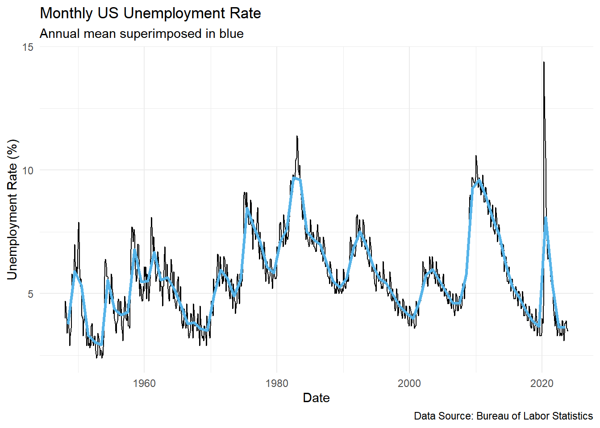

::: {.cell}

:::


## Data


::: {.cell}

```{.r .cell-code}
# Macroeconomic Data: unemployment rate
unemp_rate <- rio::import("https://byuistats.github.io/timeseries/data/unemp_rate.csv")
```
:::


## Questions

### Question 1 - Context and Measurement (10 points)

The first part of any time series analysis is context. You cannot properly analyze data without knowing what the data is measuring. Without context, the most simple features of data can be obscure and inscrutable. This homework assignment will center around the US unemployment series.

Please research the time series. The subheadings below has a link to a source to help you get started. In the spaces below, give the data collection process, unit of analysis, and meaning of each observation for the US unemployment time series.

#### a) US unemployment

<https://www.bls.gov/cps/cps_htgm.htm>

::: {.callout-note title="Answer" icon="false"}
**Data collection process:** The US unemployment rate is collected via the current population survey, conducted monthly by the census bureau. It involves interviewing around 60,000 households to gather dta on labor force activities during a specific week.

**Unit of analysis:** The unit of analysis is individuals aged 16 and over in the civilian population, excluding those in institutions or the military. Each observation represents whether a person is employed, unemployed, or not in the labor force.

**Meaning of Each Observation:** Each data point represents the percentage of the labor force that is unemployed. A person is classified as unemployed if they are not working, have actively sought work in the past four weeks, and are available to start work.
:::

### Question 2 - Estimating the Trend: Annual Aggregation (10 points)

Please plot the US Unemployment time series and superimpose the annual mean of the series in the same graph. Use the appropriate axis labels, units, and captions.

::: {.callout-note title="Answer" icon="false"}


::: {.cell}

```{.r .cell-code}
# load packages
pacman::p_load("tsibble", "fabletools", "feasts", "tidyverse", "lubridate", "rio")

# read in the data from a csv
unemp_rate <- rio::import("https://byuistats.github.io/timeseries/data/unemp_rate.csv")

# create a tsibble where the index variable is the year/month
unemp_rate_tsibble <- unemp_rate %>%
  mutate(date = ymd(date)) %>%
  as_tsibble(index = date)

# Aggregating data to annual level by computing mean
unemp_annual_mean_tsibble <- unemp_rate_tsibble %>%
  index_by(year = year(date)) %>%
  summarise(value = mean(value, na.rm = TRUE)) %>%
  mutate(date = ymd(paste0(year, "-07-01"))) %>%
  as_tsibble(index = date)

# combined plot
monthly_plot <- ggplot(unemp_rate_tsibble, aes(x = date, y = value)) +
  geom_line(color = "black") +
  labs(x = "Date", y = "Unemployment Rate (%)", title = "Monthly US Unemployment Rate") +
  theme_minimal()


final_plot <- monthly_plot +
  geom_line(data = unemp_annual_mean_tsibble, aes(x = date, y = value), color = "#56B4E9", size = 1.2) +
  labs(
    subtitle = "Annual mean superimposed in blue",
    caption = "Data Source: Bureau of Labor Statistics"
  )
```

::: {.cell-output .cell-output-stderr}

```
Warning: Using `size` aesthetic for lines was deprecated in ggplot2 3.4.0.
ℹ Please use `linewidth` instead.
```


:::

```{.r .cell-code}
final_plot
```

::: {.cell-output-display}
{width=672}
:::
:::


:::

### Question 3 - Trend Analysis (30 points)

##### a) Describe the US Unemployment time series and its trend. Comment on the series' sampling interval, time series trend characteristics, seasonal variation, and cycle.

::: {.callout-note title="Answer" icon="false"}
The data is sampled monthly; each month corresponds to a point on the black line in the plot. This interval provides a view of short-term fluctuations in unemployment. The trend of the unemployment rate has multiple fluctuations but shows peaks and lows corresponding to economic shocks/cycles. Recessions like in the early 1980s and early 2000’s and other economic shocks like the 2020 pandemic appear clear on the plot with noticeable spikes in unemployment. Seasonal variation is not apparent from this plot and or data alone, and further statistical research needs to be done to determine if there are seasonal patterns in unemployment. An example is how certain areas can see a rise in employment during Thanksgiving and Christmas and an increase in unemployment after New Year’s. The cycles in the unemployment rate are clearly evidenced by the rise and fall of the rate over time. Economic cycles can be seen where periods of economic expansion lead to lower unemployment rates, and economic downturns see a rise in unemployment rates.
:::

##### b) What does the trend represent? What do you suspect is causing the patterns in the trend? *Hint: Research the Natural Unemployment Rate*

::: {.callout-note title="Answer" icon="false"}
The trend in the unmeployment rate time series represents the general direction of unemployment changes over time, reflecting economic cycles and structural shifts in the economy. Factors such as economic recessions, technological advacements, and policy changes contribute to this trend. The natural rate of unemployment suggest that there is a baseline level of unemployemnt below which unemployemnt rate does not typically fall, influence by both frictional and structural unemployemnt. Te,porary deciations from the natural rate of unemployment may occur due to economic shocks or cyclical fluctuations.
:::

##### c) Please justify whether the trend is deterministic or stochastic.

::: {.callout-note title="Answer" icon="false"}
The trend in the unemployment rate time series is likely stochastic because it evolves due to unpredictable economic shocks and policy changes, making its exact path inherently uncertain and not precisely predictable by a fixed mathematical equation.
:::

<!-- Try not to touch the table markdown below -->

## Rubric

|                                                  |                                                                                                                                                                                                                                                                                   |                                                                                                                                                                                                         |
|---------------|----------------------------------|------------------------|
| **Criteria**                                     | **Mastery (10)**                                                                                                                                                                                                                                                                  | **Incomplete (0)**                                                                                                                                                                                      |
| **Question 1: Context and Measurement**          | The student demonstrates a clear understanding of the context for each data series (US unemployment, term premium, and Google Trends for "chocolate"). The explanation includes details about the data collection process, unit of analysis, and the meaning of each observation. | The student fails to provide a clear understanding of the context for one or more data series.                                                                                                          |
|                                                  | **Mastery (10)**                                                                                                                                                                                                                                                                  | **Incomplete (0)**                                                                                                                                                                                      |
| **Question 2: Data Visualization**               | The student creates clear and informative plots to visualize the time series and trend. The plot is professional and at a minimum includes the appropriate axis labels, units, and captions                                                                                       | The student does not include visualizations or the visualizations provided are unclear and do not effectively represent the data. The plot doesn't include one or more of the required components.      |
|                                                  | **Mastery (10)**                                                                                                                                                                                                                                                                  | **Incomplete (0)**                                                                                                                                                                                      |
| **Question 3a: Data description**                | The student uses appropriate technical language to describe the main features of time series data including sampling interval, time series trend, seasonal variation and cycle.                                                                                                   | The student does not use technical language to describe the main features of time series data or does not define one or more specified terms.                                                           |
|                                                  | **Mastery (10)**                                                                                                                                                                                                                                                                  | **Incomplete (0)**                                                                                                                                                                                      |
| **Question 3b: Causes of US Unemployment trend** | Demonstrates understanding of potential factors influencing the patterns in the trend. Their understanding of potential factors shows understanding of the underlying data, it's source, and required independent research.                                                       | Fails to demonstrate any understanding of potential factors influencing the patterns in the trend. Shows a lack of awareness of the underlying data, its source, and the need for independent research. |
|                                                  | **Mastery (10)**                                                                                                                                                                                                                                                                  | **Incomplete (0)**                                                                                                                                                                                      |
| **Question 3c: Trend Classification**            | Shows understanding of the relevant concepts. Accurately justifies the trend's classification. Shows a good understanding of the definitions deterministic and stochastic trends.                                                                                                 | Fails to demonstrate any understanding of the relevant concepts or provides no accurate justification for the trend's classification.                                                                   |
|                                                  | **Mastery (10)**                                                                                                                                                                                                                                                                  | **Incomplete (0)**                                                                                                                                                                                      |
| **General: R Programming Usage**                 | The student effectively utilizes R to complete the assignment. Code snippets or outputs are appropriately included to support the analysis. Code is annotated and commented enough for a third party to understand and evaluate easily.                                           | One or more code snippets or outputs are missing. Code is minimally annotated and commented, making it challenging for a third party to understand and evaluate. The code doesn't work or render.       |
| **Total Points**                                 | **60**                                                                                                                                                                                                                                                                            |                                                                                                                                                                                                         |
