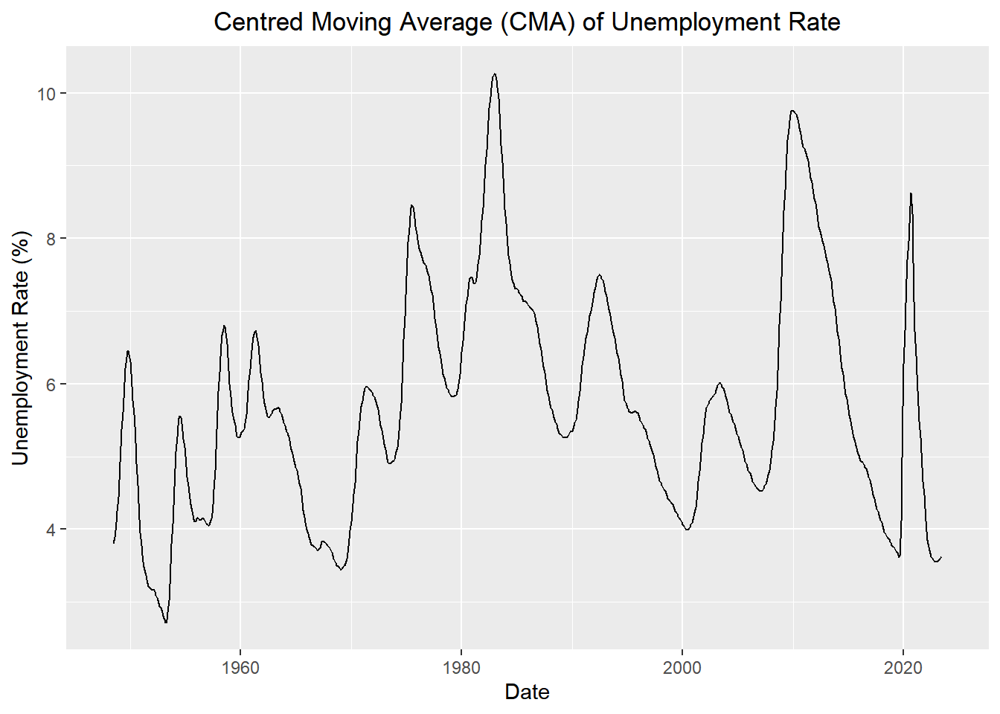

::: {.cell}

:::


## Data


::: {.cell}

```{.r .cell-code}
# Macroeconomic Data: unemployment rate
unemp_rate <- rio::import("https://byuistats.github.io/timeseries/data/unemp_rate.csv")
```
:::


## Questions

### Question 1 - Estimating the Trend: Centered Moving Average (10 points)

Please plot the US Unemployment time series and superimpose the centered moving average series $\hat{m}_{t}$ in the same graph. Don't use an R command; rather, do it by coding $\hat{m}_{t}$ like in Chapter 1: Lesson 3. Use the appropriate axis labels, units, and captions.

::: {.callout-note title="Answer" icon="false"}


::: {.cell}

```{.r .cell-code}
# Load packages
pacman::p_load("tsibble", "fable", "feasts", "tidyverse", "lubridate", "rio")


# Create a tsibble where the index variable is the year/month
unemp_rate_tsibble <- unemp_rate %>%
  mutate(date = ymd(date)) %>%
  as_tsibble(index = date)

# Calculate the Centred Moving Average (CMA)
unemp_rate_tsibble <- unemp_rate_tsibble %>%
  mutate(
    # Creating a new column 'm_hat', representing the centered moving average (CMA)
    m_hat = (
      # Math: (1/2) * x_{t-6}
      # Explanation: Fetches the value 6 time periods back and applies half-weight to it (beginning of the window)
      (1/2) * lag(value, 6) + 
      
      # Math: x_{t-5}
      # Explanation: Fetches the value 5 time periods back with full weight
      lag(value, 5) + 
      
      # Math: x_{t-4}
      lag(value, 4) + 
      
      # Math: x_{t-3}
      lag(value, 3) + 
      
      # Math: x_{t-2}
      lag(value, 2) + 
      
      # Math: x_{t-1}
      # Explanation: Fetches the value 1 time period back with full weight
      lag(value, 1) + 
      
      # Math: x_{t}
      # Explanation: Includes the value at the current time period
      value + 
      
      # Math: x_{t+1}
      # Explanation: Fetches the value 1 time period forward with full weight
      lead(value, 1) + 
      
      # Math: x_{t+2}
      lead(value, 2) + 
      
      # Math: x_{t+3}
      lead(value, 3) + 
      
      # Math: x_{t+4}
      lead(value, 4) + 
      
      # Math: x_{t+5}
      # Explanation: Fetches the value 5 time periods forward with full weight
      lead(value, 5) + 
      
      # Math: (1/2) * x_{t+6}
      # Explanation: Fetches the value 6 time periods forward and applies half-weight to it (end of the window)
      (1/2) * lead(value, 6)
      
    ) / 12  # Math: 1/12
            # Explanation: Divides the sum by 12 to compute the average over 12 time periods
  )


# Plot the CMA (centred moving average) and original data
plain_plot <- autoplot(unemp_rate_tsibble, .vars = m_hat) +
  labs(
    x = "Date",
    y = "Unemployment Rate (%)",
    title = "Centred Moving Average (CMA) of Unemployment Rate"
  ) +
  scale_y_continuous(limits = c(min(unemp_rate_tsibble$m_hat, na.rm = TRUE), max(unemp_rate_tsibble$m_hat, na.rm = TRUE))) +
  theme(plot.title = element_text(hjust = 0.5))

# Plot the original unemployment data with CMA overlay
fancy_plot <- autoplot(unemp_rate_tsibble, .vars = value) +
  labs(
    x = "Date",
    y = "Unemployment Rate (%)",
    title = "Monthly US Unemployment Rate with CMA"
  ) +
  geom_line(aes(x = date, y = m_hat), color = "#D55E00") +
  theme(plot.title = element_text(hjust = 0.5))

# Combine the two plots
plain_plot
```

::: {.cell-output .cell-output-stderr}

```
Warning: Removed 12 rows containing missing values or values outside the scale range
(`geom_line()`).
```


:::

::: {.cell-output-display}
{width=672}
:::

```{.r .cell-code}
fancy_plot
```

::: {.cell-output .cell-output-stderr}

```
Warning: Removed 12 rows containing missing values or values outside the scale range
(`geom_line()`).
```


:::

::: {.cell-output-display}
{width=672}
:::
:::


:::

### Question 2 - Seasonal Averages: Side-by-Side Box Plots by Month (10 points)

Please create a box plot to illustrate the monthly averages in the US Unemployment time series. Use the appropriate axis labels, units, and captions.

::: {.callout-note title="Answer" icon="false"}


::: {.cell}

```{.r .cell-code}
# Please provide your code here
# Box plot of monthly averages in the US Unemployment time series

# Prepare Data: Converts the date column to month names and categorizes them as factors.
unemp_rate_tsibble <- unemp_rate_tsibble %>%
  mutate(month = factor(format(date, "%m"), labels = month.name))

# Create Boxplot: Initializes a boxplot with months on the x-axis and unemployment rates on the y-axis, excluding individual data points.
# Adjust Layout: Adds a title and labels to the plot for clarity and presentation.
p <- plot_ly(unemp_rate_tsibble, x = ~month, y = ~value, type = 'box', boxpoints = FALSE) %>%
  layout(
    title = "Boxplots of US Unemployment Rate by Month",
    xaxis = list(title = "Month"),
    yaxis = list(title = "Unemployment Rate (%)")
  )

p
```

::: {.cell-output-display}


```{=html}
<div class="plotly html-widget html-fill-item" id="htmlwidget-72b231a03839029bb7de" style="width:100%;height:464px;"></div>
<script type="application/json" data-for="htmlwidget-72b231a03839029bb7de">{"x":{"visdat":{"e20354639c2":["function () ","plotlyVisDat"]},"cur_data":"e20354639c2","attrs":{"e20354639c2":{"x":{},"y":{},"boxpoints":false,"alpha_stroke":1,"sizes":[10,100],"spans":[1,20],"type":"box"}},"layout":{"margin":{"b":40,"l":60,"t":25,"r":10},"title":"Boxplots of US Unemployment Rate by Month","xaxis":{"domain":[0,1],"automargin":true,"title":"Month","type":"category","categoryorder":"array","categoryarray":["January","February","March","April","May","June","July","August","September","October","November","December"]},"yaxis":{"domain":[0,1],"automargin":true,"title":"Unemployment Rate (%)"},"hovermode":"closest","showlegend":false},"source":"A","config":{"modeBarButtonsToAdd":["hoverclosest","hovercompare"],"showSendToCloud":false},"data":[{"fillcolor":"rgba(31,119,180,0.5)","x":["January","February","March","April","May","June","July","August","September","October","November","December","January","February","March","April","May","June","July","August","September","October","November","December","January","February","March","April","May","June","July","August","September","October","November","December","January","February","March","April","May","June","July","August","September","October","November","December","January","February","March","April","May","June","July","August","September","October","November","December","January","February","March","April","May","June","July","August","September","October","November","December","January","February","March","April","May","June","July","August","September","October","November","December","January","February","March","April","May","June","July","August","September","October","November","December","January","February","March","April","May","June","July","August","September","October","November","December","January","February","March","April","May","June","July","August","September","October","November","December","January","February","March","April","May","June","July","August","September","October","November","December","January","February","March","April","May","June","July","August","September","October","November","December","January","February","March","April","May","June","July","August","September","October","November","December","January","February","March","April","May","June","July","August","September","October","November","December","January","February","March","April","May","June","July","August","September","October","November","December","January","February","March","April","May","June","July","August","September","October","November","December","January","February","March","April","May","June","July","August","September","October","November","December","January","February","March","April","May","June","July","August","September","October","November","December","January","February","March","April","May","June","July","August","September","October","November","December","January","February","March","April","May","June","July","August","September","October","November","December","January","February","March","April","May","June","July","August","September","October","November","December","January","February","March","April","May","June","July","August","September","October","November","December","January","February","March","April","May","June","July","August","September","October","November","December","January","February","March","April","May","June","July","August","September","October","November","December","January","February","March","April","May","June","July","August","September","October","November","December","January","February","March","April","May","June","July","August","September","October","November","December","January","February","March","April","May","June","July","August","September","October","November","December","January","February","March","April","May","June","July","August","September","October","November","December","January","February","March","April","May","June","July","August","September","October","November","December","January","February","March","April","May","June","July","August","September","October","November","December","January","February","March","April","May","June","July","August","September","October","November","December","January","February","March","April","May","June","July","August","September","October","November","December","January","February","March","April","May","June","July","August","September","October","November","December","January","February","March","April","May","June","July","August","September","October","November","December","January","February","March","April","May","June","July","August","September","October","November","December","January","February","March","April","May","June","July","August","September","October","November","December","January","February","March","April","May","June","July","August","September","October","November","December","January","February","March","April","May","June","July","August","September","October","November","December","January","February","March","April","May","June","July","August","September","October","November","December","January","February","March","April","May","June","July","August","September","October","November","December","January","February","March","April","May","June","July","August","September","October","November","December","January","February","March","April","May","June","July","August","September","October","November","December","January","February","March","April","May","June","July","August","September","October","November","December","January","February","March","April","May","June","July","August","September","October","November","December","January","February","March","April","May","June","July","August","September","October","November","December","January","February","March","April","May","June","July","August","September","October","November","December","January","February","March","April","May","June","July","August","September","October","November","December","January","February","March","April","May","June","July","August","September","October","November","December","January","February","March","April","May","June","July","August","September","October","November","December","January","February","March","April","May","June","July","August","September","October","November","December","January","February","March","April","May","June","July","August","September","October","November","December","January","February","March","April","May","June","July","August","September","October","November","December","January","February","March","April","May","June","July","August","September","October","November","December","January","February","March","April","May","June","July","August","September","October","November","December","January","February","March","April","May","June","July","August","September","October","November","December","January","February","March","April","May","June","July","August","September","October","November","December","January","February","March","April","May","June","July","August","September","October","November","December","January","February","March","April","May","June","July","August","September","October","November","December","January","February","March","April","May","June","July","August","September","October","November","December","January","February","March","April","May","June","July","August","September","October","November","December","January","February","March","April","May","June","July","August","September","October","November","December","January","February","March","April","May","June","July","August","September","October","November","December","January","February","March","April","May","June","July","August","September","October","November","December","January","February","March","April","May","June","July","August","September","October","November","December","January","February","March","April","May","June","July","August","September","October","November","December","January","February","March","April","May","June","July","August","September","October","November","December","January","February","March","April","May","June","July","August","September","October","November","December","January","February","March","April","May","June","July","August","September","October","November","December","January","February","March","April","May","June","July","August","September","October","November","December","January","February","March","April","May","June","July","August","September","October","November","December","January","February","March","April","May","June","July","August","September","October","November","December","January","February","March","April","May","June","July","August","September","October","November","December","January","February","March","April","May","June","July","August","September","October","November","December","January","February","March","April","May","June","July","August","September","October","November","December","January","February","March","April","May","June","July","August","September","October","November","December","January","February","March","April","May","June","July","August","September","October","November","December"],"y":[4,4.7000000000000002,4.5,4,3.3999999999999999,3.8999999999999999,3.8999999999999999,3.6000000000000001,3.3999999999999999,2.8999999999999999,3.2999999999999998,3.6000000000000001,5,5.7999999999999998,5.5999999999999996,5.4000000000000004,5.7000000000000002,6.4000000000000004,7,6.2999999999999998,5.9000000000000004,6.0999999999999996,5.7000000000000002,6,7.5999999999999996,7.9000000000000004,7.0999999999999996,6,5.2999999999999998,5.5999999999999996,5.2999999999999998,4.0999999999999996,4,3.2999999999999998,3.7999999999999998,3.8999999999999999,4.4000000000000004,4.2000000000000002,3.7999999999999998,3.2000000000000002,2.8999999999999999,3.3999999999999999,3.2999999999999998,2.8999999999999999,3,2.7999999999999998,3.2000000000000002,2.8999999999999999,3.7000000000000002,3.7999999999999998,3.2999999999999998,3,2.8999999999999999,3.2000000000000002,3.2999999999999998,3.1000000000000001,2.7000000000000002,2.3999999999999999,2.5,2.5,3.3999999999999999,3.2000000000000002,2.8999999999999999,2.7999999999999998,2.5,2.7000000000000002,2.7000000000000002,2.3999999999999999,2.6000000000000001,2.5,3.2000000000000002,4.2000000000000002,5.7000000000000002,6.2999999999999998,6.4000000000000004,6.0999999999999996,5.7000000000000002,5.7000000000000002,5.7000000000000002,5.4000000000000004,5.2999999999999998,4.5999999999999996,4.9000000000000004,4.7999999999999998,5.7999999999999998,5.7000000000000002,5.2000000000000002,4.9000000000000004,4.2000000000000002,4.4000000000000004,4,3.7999999999999998,3.5,3.3999999999999999,3.7999999999999998,3.8999999999999999,4.7000000000000002,4.7999999999999998,4.7000000000000002,4.0999999999999996,4.2000000000000002,4.7000000000000002,4.4000000000000004,3.7000000000000002,3.3999999999999999,3.1000000000000001,3.8999999999999999,4,4.9000000000000004,4.7000000000000002,4.2999999999999998,4,3.8999999999999999,4.5999999999999996,4.0999999999999996,3.7000000000000002,3.7000000000000002,3.6000000000000001,4.5999999999999996,5,6.7999999999999998,7.7000000000000002,7.7000000000000002,7.5,7.0999999999999996,7.5999999999999996,7.4000000000000004,6.7000000000000002,6,5.5,5.5999999999999996,6,7,7,6.4000000000000004,5.2000000000000002,4.9000000000000004,5.4000000000000004,5.2000000000000002,4.7999999999999998,4.7000000000000002,4.7000000000000002,5.2999999999999998,5.0999999999999996,6.0999999999999996,5.7000000000000002,6.0999999999999996,5.2000000000000002,4.7999999999999998,5.7999999999999998,5.5,5.2000000000000002,4.7000000000000002,5,5.5999999999999996,6.4000000000000004,7.7000000000000002,8.0999999999999996,7.7000000000000002,7,6.5999999999999996,7.2999999999999998,6.9000000000000004,6.2000000000000002,5.7999999999999998,5.5,5.5999999999999996,5.7999999999999998,6.7000000000000002,6.5,6.2000000000000002,5.5,5.0999999999999996,5.9000000000000004,5.2999999999999998,5.2999999999999998,4.9000000000000004,4.5,5.2999999999999998,5.2999999999999998,6.5999999999999996,6.9000000000000004,6.2999999999999998,5.5999999999999996,5.5,6.2000000000000002,5.5999999999999996,5.2000000000000002,4.7999999999999998,4.7000000000000002,5.2999999999999998,5.2999999999999998,6.4000000000000004,6.2000000000000002,5.9000000000000004,5.2999999999999998,4.7999999999999998,5.9000000000000004,4.9000000000000004,4.7999999999999998,4.5,4.4000000000000004,4.5,4.7000000000000002,5.5,5.7000000000000002,5.0999999999999996,4.7000000000000002,4.2999999999999998,5.2999999999999998,4.5,4.2000000000000002,3.7999999999999998,3.6000000000000001,3.8999999999999999,3.7000000000000002,4.4000000000000004,4.2000000000000002,4,3.6000000000000001,3.7000000000000002,4.5999999999999996,3.8999999999999999,3.6000000000000001,3.2999999999999998,3.2000000000000002,3.3999999999999999,3.5,4.2000000000000002,4.2000000000000002,3.8999999999999999,3.5,3.2000000000000002,4.5999999999999996,4.0999999999999996,3.7000000000000002,3.7000000000000002,3.7999999999999998,3.7000000000000002,3.5,4,4.2000000000000002,3.7999999999999998,3.2000000000000002,2.8999999999999999,4.5,4,3.5,3.2999999999999998,3.2000000000000002,3.2999999999999998,3.1000000000000001,3.7000000000000002,3.7000000000000002,3.5,3.2000000000000002,2.8999999999999999,4.0999999999999996,3.7999999999999998,3.5,3.7000000000000002,3.5,3.2999999999999998,3.2000000000000002,4.2000000000000002,4.7000000000000002,4.5999999999999996,4.2999999999999998,4.0999999999999996,5.5999999999999996,5.2999999999999998,5,5.2000000000000002,5.0999999999999996,5.5,5.5999999999999996,6.5999999999999996,6.5999999999999996,6.2999999999999998,5.7000000000000002,5.2999999999999998,6.5,6.2000000000000002,5.9000000000000004,5.7999999999999998,5.4000000000000004,5.7000000000000002,5.5,6.5,6.4000000000000004,6.0999999999999996,5.5,5.0999999999999996,6.2000000000000002,5.9000000000000004,5.5,5.4000000000000004,5.0999999999999996,4.9000000000000004,4.7999999999999998,5.5,5.5999999999999996,5.2000000000000002,4.7999999999999998,4.4000000000000004,5.4000000000000004,5,4.7000000000000002,4.7000000000000002,4.2000000000000002,4.5999999999999996,4.5999999999999996,5.7000000000000002,5.7999999999999998,5.2999999999999998,4.7999999999999998,4.5999999999999996,5.7999999999999998,5.7000000000000002,5.2999999999999998,5.7000000000000002,5.5,6.2000000000000002,6.7000000000000002,9,9.0999999999999996,9.0999999999999996,8.5999999999999996,8.3000000000000007,9.0999999999999996,8.6999999999999993,8.1999999999999993,8.0999999999999996,7.7999999999999998,7.7999999999999998,7.7999999999999998,8.8000000000000007,8.6999999999999993,8.0999999999999996,7.4000000000000004,6.7999999999999998,8,7.7999999999999998,7.5999999999999996,7.4000000000000004,7.2000000000000002,7.4000000000000004,7.4000000000000004,8.3000000000000007,8.5,7.9000000000000004,6.9000000000000004,6.4000000000000004,7.5,7,6.7999999999999998,6.5999999999999996,6.4000000000000004,6.5,6,7.0999999999999996,6.9000000000000004,6.5999999999999996,5.7999999999999998,5.5,6.2000000000000002,6.2999999999999998,5.9000000000000004,5.7999999999999998,5.4000000000000004,5.5999999999999996,5.7000000000000002,6.4000000000000004,6.4000000000000004,6.0999999999999996,5.5,5.2000000000000002,6,5.9000000000000004,5.9000000000000004,5.7000000000000002,5.5999999999999996,5.5999999999999996,5.7000000000000002,6.9000000000000004,6.7999999999999998,6.5999999999999996,6.7000000000000002,7.0999999999999996,7.7999999999999998,7.9000000000000004,7.5999999999999996,7.2000000000000002,7.0999999999999996,7.0999999999999996,6.9000000000000004,8.1999999999999993,8,7.7000000000000002,7,7.0999999999999996,7.7000000000000002,7.2999999999999998,7.2000000000000002,7.2999999999999998,7.5,7.9000000000000004,8.3000000000000007,9.4000000000000004,9.5999999999999996,9.5,9.1999999999999993,9.0999999999999996,9.8000000000000007,9.8000000000000007,9.5999999999999996,9.6999999999999993,9.9000000000000004,10.4,10.5,11.4,11.300000000000001,10.800000000000001,10,9.8000000000000007,10.199999999999999,9.4000000000000004,9.1999999999999993,8.8000000000000007,8.4000000000000004,8.0999999999999996,8,8.8000000000000007,8.4000000000000004,8.0999999999999996,7.5999999999999996,7.2000000000000002,7.4000000000000004,7.5,7.2999999999999998,7.0999999999999996,7,6.9000000000000004,7,8,7.7999999999999998,7.5,7.0999999999999996,7,7.5,7.4000000000000004,6.9000000000000004,6.9000000000000004,6.7999999999999998,6.7000000000000002,6.7000000000000002,7.2999999999999998,7.7999999999999998,7.5,7,7,7.2999999999999998,7,6.7000000000000002,6.7999999999999998,6.5999999999999996,6.5999999999999996,6.2999999999999998,7.2999999999999998,7.2000000000000002,6.9000000000000004,6.2000000000000002,6.0999999999999996,6.2999999999999998,6.0999999999999996,5.7999999999999998,5.7000000000000002,5.7000000000000002,5.5999999999999996,5.4000000000000004,6.2999999999999998,6.2000000000000002,5.9000000000000004,5.2999999999999998,5.4000000000000004,5.5,5.5,5.4000000000000004,5.2000000000000002,5,5.2000000000000002,5,6,5.5999999999999996,5.2000000000000002,5.0999999999999996,5,5.5,5.2999999999999998,5.0999999999999996,5.0999999999999996,5,5.2000000000000002,5.0999999999999996,6,5.9000000000000004,5.5,5.2999999999999998,5.2000000000000002,5.4000000000000004,5.5999999999999996,5.5,5.5999999999999996,5.5,5.9000000000000004,6,7.0999999999999996,7.2999999999999998,7.2000000000000002,6.5,6.7000000000000002,7,6.7999999999999998,6.5999999999999996,6.5,6.5,6.7000000000000002,6.9000000000000004,8.0999999999999996,8.1999999999999993,7.7999999999999998,7.2000000000000002,7.2999999999999998,8,7.7000000000000002,7.4000000000000004,7.2999999999999998,6.9000000000000004,7.0999999999999996,7.0999999999999996,8,7.7999999999999998,7.4000000000000004,6.9000000000000004,6.7999999999999998,7.2000000000000002,7,6.5999999999999996,6.4000000000000004,6.4000000000000004,6.2000000000000002,6.0999999999999996,7.2999999999999998,7.0999999999999996,6.7999999999999998,6.2000000000000002,5.9000000000000004,6.2000000000000002,6.2000000000000002,5.9000000000000004,5.5999999999999996,5.4000000000000004,5.2999999999999998,5.0999999999999996,6.2000000000000002,5.9000000000000004,5.7000000000000002,5.5999999999999996,5.5,5.7999999999999998,5.9000000000000004,5.5999999999999996,5.4000000000000004,5.2000000000000002,5.2999999999999998,5.2000000000000002,6.2999999999999998,6,5.7999999999999998,5.4000000000000004,5.4000000000000004,5.5,5.5999999999999996,5.0999999999999996,5,4.9000000000000004,5,5,5.9000000000000004,5.7000000000000002,5.5,4.7999999999999998,4.7000000000000002,5.2000000000000002,5,4.7999999999999998,4.7000000000000002,4.4000000000000004,4.2999999999999998,4.4000000000000004,5.2000000000000002,5,5,4.0999999999999996,4.2000000000000002,4.7000000000000002,4.7000000000000002,4.5,4.4000000000000004,4.2000000000000002,4.0999999999999996,4,4.7999999999999998,4.7000000000000002,4.4000000000000004,4.0999999999999996,4,4.5,4.5,4.2000000000000002,4.0999999999999996,3.7999999999999998,3.7999999999999998,3.7000000000000002,4.5,4.4000000000000004,4.2999999999999998,3.7000000000000002,3.7999999999999998,4.0999999999999996,4.2000000000000002,4.0999999999999996,3.7999999999999998,3.6000000000000001,3.7000000000000002,3.7000000000000002,4.7000000000000002,4.5999999999999996,4.5,4.2000000000000002,4.0999999999999996,4.7000000000000002,4.7000000000000002,4.9000000000000004,4.7000000000000002,5,5.2999999999999998,5.4000000000000004,6.2999999999999998,6.0999999999999996,6.0999999999999996,5.7000000000000002,5.5,6,5.9000000000000004,5.7000000000000002,5.4000000000000004,5.2999999999999998,5.5999999999999996,5.7000000000000002,6.5,6.4000000000000004,6.2000000000000002,5.7999999999999998,5.7999999999999998,6.5,6.2999999999999998,6,5.7999999999999998,5.5999999999999996,5.5999999999999996,5.4000000000000004,6.2999999999999998,6,6,5.4000000000000004,5.2999999999999998,5.7999999999999998,5.7000000000000002,5.4000000000000004,5.0999999999999996,5.0999999999999996,5.2000000000000002,5.0999999999999996,5.7000000000000002,5.7999999999999998,5.4000000000000004,4.9000000000000004,4.9000000000000004,5.2000000000000002,5.2000000000000002,4.9000000000000004,4.7999999999999998,4.5999999999999996,4.7999999999999998,4.5999999999999996,5.0999999999999996,5.0999999999999996,4.7999999999999998,4.5,4.4000000000000004,4.7999999999999998,5,4.5999999999999996,4.4000000000000004,4.0999999999999996,4.2999999999999998,4.2999999999999998,5,4.9000000000000004,4.5,4.2999999999999998,4.2999999999999998,4.7000000000000002,4.9000000000000004,4.5999999999999996,4.5,4.4000000000000004,4.5,4.7999999999999998,5.4000000000000004,5.2000000000000002,5.2000000000000002,4.7999999999999998,5.2000000000000002,5.7000000000000002,6,6.0999999999999996,6,6.0999999999999996,6.5,7.0999999999999996,8.5,8.9000000000000004,9,8.5999999999999996,9.0999999999999996,9.6999999999999993,9.6999999999999993,9.5999999999999996,9.5,9.5,9.4000000000000004,9.6999999999999993,10.6,10.4,10.199999999999999,9.5,9.3000000000000007,9.5999999999999996,9.6999999999999993,9.5,9.1999999999999993,9,9.3000000000000007,9.0999999999999996,9.8000000000000007,9.5,9.1999999999999993,8.6999999999999993,8.6999999999999993,9.3000000000000007,9.3000000000000007,9.0999999999999996,8.8000000000000007,8.5,8.1999999999999993,8.3000000000000007,8.8000000000000007,8.6999999999999993,8.4000000000000004,7.7000000000000002,7.9000000000000004,8.4000000000000004,8.5999999999999996,8.1999999999999993,7.5999999999999996,7.5,7.4000000000000004,7.5999999999999996,8.5,8.0999999999999996,7.5999999999999996,7.0999999999999996,7.2999999999999998,7.7999999999999998,7.7000000000000002,7.2999999999999998,7,7,6.5999999999999996,6.5,7,7,6.7999999999999998,5.9000000000000004,6.0999999999999996,6.2999999999999998,6.5,6.2999999999999998,5.7000000000000002,5.5,5.5,5.4000000000000004,6.0999999999999996,5.7999999999999998,5.5999999999999996,5.0999999999999996,5.2999999999999998,5.5,5.5999999999999996,5.2000000000000002,4.9000000000000004,4.7999999999999998,4.7999999999999998,4.7999999999999998,5.2999999999999998,5.2000000000000002,5.0999999999999996,4.7000000000000002,4.5,5.0999999999999996,5.0999999999999996,5,4.7999999999999998,4.7000000000000002,4.4000000000000004,4.5,5.0999999999999996,4.9000000000000004,4.5999999999999996,4.0999999999999996,4.0999999999999996,4.5,4.5999999999999996,4.5,4.0999999999999996,3.8999999999999999,3.8999999999999999,3.8999999999999999,4.5,4.4000000000000004,4.0999999999999996,3.7000000000000002,3.6000000000000001,4.2000000000000002,4.0999999999999996,3.8999999999999999,3.6000000000000001,3.5,3.5,3.7000000000000002,4.4000000000000004,4.0999999999999996,3.8999999999999999,3.2999999999999998,3.3999999999999999,3.7999999999999998,4,3.7999999999999998,3.2999999999999998,3.2999999999999998,3.2999999999999998,3.3999999999999999,4,3.7999999999999998,4.5,14.4,13,11.199999999999999,10.5,8.5,7.7000000000000002,6.5999999999999996,6.4000000000000004,6.5,6.7999999999999998,6.5999999999999996,6.2000000000000002,5.7000000000000002,5.5,6.0999999999999996,5.7000000000000002,5.2999999999999998,4.5999999999999996,4.2999999999999998,3.8999999999999999,3.7000000000000002,4.4000000000000004,4.0999999999999996,3.7999999999999998,3.2999999999999998,3.3999999999999999,3.7999999999999998,3.7999999999999998,3.7999999999999998,3.2999999999999998,3.3999999999999999,3.3999999999999999,3.2999999999999998,3.8999999999999999,3.8999999999999999,3.6000000000000001,3.1000000000000001,3.3999999999999999,3.7999999999999998,3.7999999999999998,3.8999999999999999,3.6000000000000001,3.6000000000000001,3.5,3.5],"boxpoints":false,"type":"box","marker":{"color":"rgba(31,119,180,1)","line":{"color":"rgba(31,119,180,1)"}},"line":{"color":"rgba(31,119,180,1)"},"xaxis":"x","yaxis":"y","frame":null}],"highlight":{"on":"plotly_click","persistent":false,"dynamic":false,"selectize":false,"opacityDim":0.20000000000000001,"selected":{"opacity":1},"debounce":0},"shinyEvents":["plotly_hover","plotly_click","plotly_selected","plotly_relayout","plotly_brushed","plotly_brushing","plotly_clickannotation","plotly_doubleclick","plotly_deselect","plotly_afterplot","plotly_sunburstclick"],"base_url":"https://plot.ly"},"evals":[],"jsHooks":[]}</script>
```


:::
:::


:::

### Question 3 - Seasonal Averages: Analysis (20 points)

##### a) Describe the seasonality of the US unemployment time series. Comment on the series' periods of highest and lowest unemployment. Are there any notable outliers?

::: {.callout-note title="Answer" icon="false"}
January, February, and June have the highest unemployment in general. January and February have high unemployment because it's after the holiday rush, so many employers let go of their seasonal help. I can see many retailers doing most of the layoffs, but also, many local economies slow down during winter. The spike in unemployment in June can be link to end of school year, so many high school and college graduates are looking for employment, which can lead to a rise in unemployment.

October and August had the lowest minimum unemployment rate of 2.4%. October had the lowest Q1 unemployment rate of 3.85%. January had the highest median unemployment rate of 6.25%. February had the highest Q3 unemployment rate of 7.5%. April had the highest maximum unemployment rate of all months, with an unemployment rate of 14.4%.

The highest outliers occurred during the years 1982-1983, 2009-2011, and 2020(14.4%). These years were marked by economic downturns, so it is obvious why they were the highest.
:::

##### b) Please explain the patterns you found. Include information from your prior research on the series.

::: {.callout-note title="Answer" icon="false"}
This research was great in introducing us to the CMA and its importance. Below is a screenshot with the annual mean superimposed on the left and the Monthly US unemployment Rate with CMA on the right. The line in the plot between 2000 and 2020 is for the year 2010. We can see that the annual mean hits its high right after 2010, but on the CMA orange line, that high happened during December 2009. When looking at average data over time using the normal mean, we would have assumed 2010 had high unemployment, which it did, but the peak happened at the end of 2009. We can also see how the spike in 2020 is lower on the annual mean. Although these patterns are from visuals, by doing further research into the numbers, we will find obvious differences in the data. This teaches me that simply doing averages can cause misunderstandings in data.
:::


### Rubric

|                                         |                                                                                                                                                                                                                                                                                                 |                                                                                                                                                                                                                                                                                                     |
|-----------------------------------------|-------------------------------------------------------------------------------------------------------------------------------------------------------------------------------------------------------------------------------------------------------------------------------------------------|-----------------------------------------------------------------------------------------------------------------------------------------------------------------------------------------------------------------------------------------------------------------------------------------------------|
| **Criteria**                            | **Mastery (20)**                                                                                                                                                                                                                                                                                | **Incomplete (0)**                                                                                                                                                                                                                                                                                  |
| **Question 1: Centered Moving Average** | The student correctly employs the centering procedure to seasonally adjust the US unemployment series.                                                                                                                                                                                          | The student does not employ the centering procedure to seasonally adjust the US unemployment series.                                                                                                                                                                                                |
|                                         | **Mastery (10)**                                                                                                                                                                                                                                                                                | **Incomplete (0)**                                                                                                                                                                                                                                                                                  |
| **Question 2: Box Plot**                | Creates a clear and well-constructed box plot that effectively illustrates seasonality in the US Unemployment time series. Labels both the x and y-axes, including appropriate units. Ensures clarity and accuracy in axis labeling, contributing to the overall understanding of the box plot. | There are mistakes in the plot. Fails to include any axis labels or units, resulting in an incomplete representation that lacks essential context.                                                                                                                                                  |
|                                         | **Mastery (10)**                                                                                                                                                                                                                                                                                | **Incomplete (0)**                                                                                                                                                                                                                                                                                  |
| **Question 5a: Description**            | Provides an accurate description of the seasonality in the US Unemployment time series, capturing key patterns and trends effectively. Shows a good understanding of the recurring cycles.                                                                                                      | Attempts to identify peaks and troughs but with significant inaccuracies or lack of clarity in the commentary. Shows a limited understanding of the variations. Fails to identify or comment on notable outliers, providing no insight into unusual data points in the US Unemployment time series. |
|                                         | **Mastery (10)**                                                                                                                                                                                                                                                                                | **Incomplete (0)**                                                                                                                                                                                                                                                                                  |
| **Question 5b: Patterns**               | Shows understanding of the data to infer meaning in the seasonal averages. It's clear the student did background research on the unemployment time series                                                                                                                                       | Shows a lack of effort. It's not clear the student understands the meaning of the data.                                                                                                                                                                                                             |
| **Total Points**                        | **50**                                                                                                                                                                                                                                                                                          |                                                                                                                                                                                                                                                                                                     |
