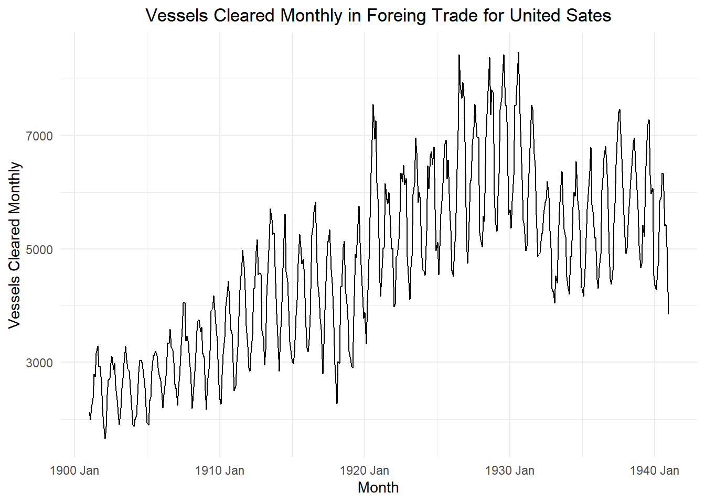
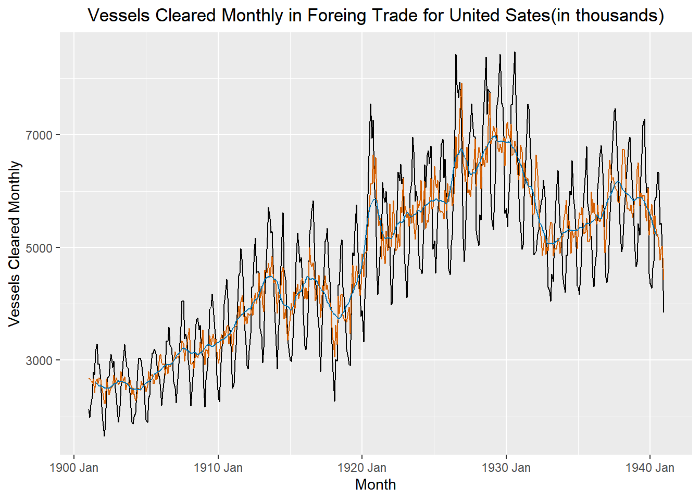
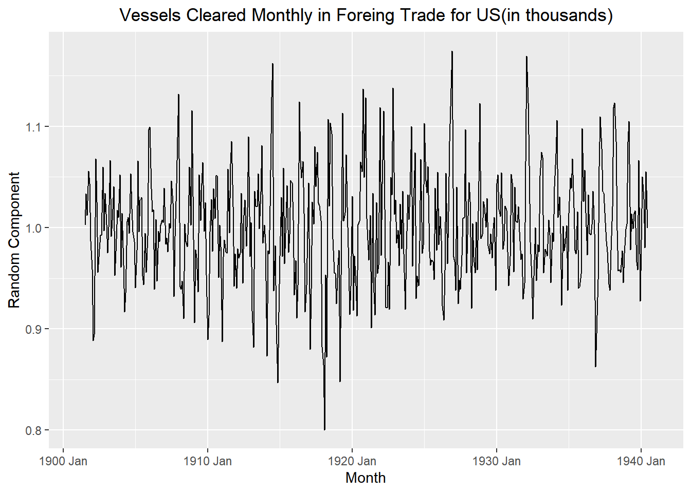
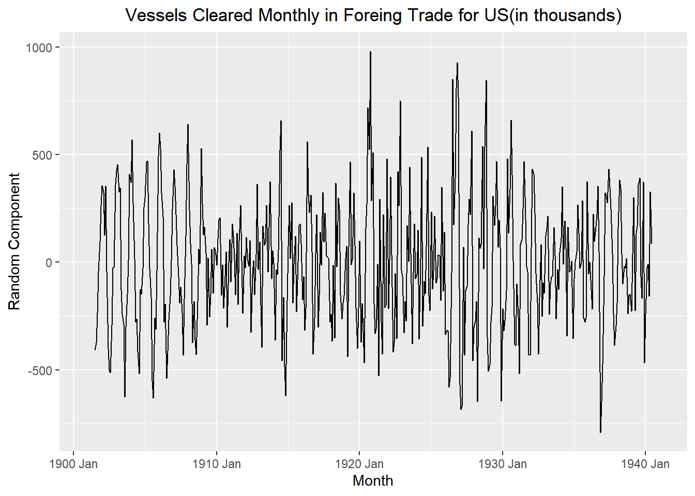

::: {.cell}

:::


## Data


::: {.cell}

```{.r .cell-code}
vessels <- rio::import("https://byuistats.github.io/timeseries/data/Vessels_Trade_US.csv")
```
:::


## Questions

### Question 1: Context and Measurement (10 points)

The first part of any time series analysis is context. You cannot properly analyze data without knowing what the data is measuring. Without context, the most simple features of data can be obscure and inscrutable. This homework assignment will center around the series below.

Please research the time series. In the spaces below, give the data collection process, unit of analysis, and meaning of each observation for the series.

#### a) **Vessels Cleared in Foreign Trade for United States**

<https://fred.stlouisfed.org/series/M03022USM583NNBR>

::: {.callout-note title="Answer" icon="false"}
The Vessels data gives the monthly number of vessels (in thousands) cleared in Foreign Trade for the United States. The plot below plots every month from January 1901 to September 1940. Base on the plot we can observe the number of vessels cleared each month was increasing over time. We can see that the number of vessels cleared monthly hit a decline in growth during certain years, but the time series is in general increasing over time.


::: {.cell}

```{.r .cell-code  code-fold="true" code-summary="Show the code"}
vessels_ts <- rio::import("https://byuistats.github.io/timeseries/data/Vessels_Trade_US.csv") |> # ts1
  mutate(
    dates = dmy(date),
    year = lubridate::year(date),
    months = lubridate::month(date),
    value = vessels
  ) |> # ts2
  dplyr::select(dates, year, months, value)  |> # ts3
  arrange(dates) |> # ts4
  mutate(index = tsibble::yearmonth(dates)) |> # ts5
  as_tsibble(index = index) |> # ts6
  dplyr::select(index, dates, year, months, value) |> # ts7
  rename(Vessels = value) # rename value to emphasize data context
vessels_ts |> #ts8
  autoplot(.vars = Vessels) +
  labs(
    x = "Month",
    y = "Vessels Cleared Monthly",
    title = "Vessels Cleared Monthly in Foreing Trade for United Sates"
  ) +
  theme_minimal() +
  theme(plot.title = element_text(hjust = 0.5))
```

::: {.cell-output-display}
{width=672}
:::
:::


:::

### Question 2: Seasonally Adjusted Series - Calculation and Plot (10 points)

#### a) Decompose the Vessels Cleared in Foreign Trade series using the multiplicative decomposition model. Show the first 10 rows of results from the decomposition like shown in the Time Series Notebook.

::: {.callout-note title="Answer" icon="false"}


::: {.cell}

```{.r .cell-code  code-fold="true" code-summary="Show the code"}
vessels_decompose <- vessels_ts |> # Ts
  model(feasts::classical_decomposition(Vessels,
          type = "mult"))  |> # make sure to update x value
  components()

# something wrong with the display_table. has to do w/ common libraries
# vessels_decompose |>
#   head(10) |>
#   display_table()

# so this code takes the prepare data and does the classical_decomposition
```
:::


:::

#### b) Illustrate the original, trend, and the seasonally adjusted series in the same plot. Use the appropriate axis labels, units, and captions.

Color code: Original = black, Trend = blue, and seasonally adjusted series = orange.

::: {.callout-note title="Answer" icon="false"}


::: {.cell}

```{.r .cell-code  code-fold="true" code-summary="Show the code"}
vessels_decompose |>
  ggplot() +
  geom_line(data = vessels_decompose, aes(x = index, y = Vessels), color = "black") +
  geom_line(data = vessels_decompose, aes(x = index, y = season_adjust), color = "#D55E00") +
  geom_line(data = vessels_decompose, aes(x = index, y = trend), color = "#0072B2") +
  labs(
    x = "Month",
    y = "Vessels Cleared Monthly",
    title = "Vessels Cleared Monthly in Foreing Trade for United Sates(in thousands)"
  ) +
  theme(plot.title = element_text(hjust = 0.5))
```

::: {.cell-output-display}
{width=672}
:::
:::


:::

### Question 3: Seasonally Adjusted Series - Analysis (30 points)

#### a) Plot the random component of the multiplicative decomposition from Q2a.

::: {.callout-note title="Answer" icon="false"}


::: {.cell}

```{.r .cell-code  code-fold="true" code-summary="Show the code"}
vessels_decompose |>
  ggplot() +
  geom_line(data = vessels_decompose, aes(x = index, y = random), color = "black")  +
  labs(
    x = "Month",
    y = "Random Component",
    title = "Vessels Cleared Monthly in Foreing Trade for US(in thousands)"
  ) +
  theme(plot.title = element_text(hjust = 0.5))
```

::: {.cell-output-display}
{width=672}
:::
:::


:::

#### b) Use the additive decomposition method to decompose the Vessels Cleared in Foreign Trade series. Plot the random component.

::: {.callout-note title="Answer" icon="false"}


::: {.cell}

```{.r .cell-code  code-fold="true" code-summary="Show the code"}
vessels_decompose_additive <- vessels_ts |> # Ts
  model(feasts::classical_decomposition(Vessels,
          type = "add"))  |> # make sure to update x value
  components()

vessels_decompose_additive |>
  ggplot() +
  geom_line(data = vessels_decompose_additive, aes(x = index, y = random), color = "black")  +
  labs(
    x = "Month",
    y = "Random Component",
    title = "Vessels Cleared Monthly in Foreing Trade for US(in thousands)"
  ) +
  theme(plot.title = element_text(hjust = 0.5))
```

::: {.cell-output-display}
{width=672}
:::

```{.r .cell-code  code-fold="true" code-summary="Show the code"}
# The random component in the multiplicative decomposition model supports insights giving by the seasonal and trend assumptions. We can research maritime events that could have impacted certain certain years of the vessel data, and reasoning that research using the multiplicative model will make the most sense. 

# The random component is taken by subtracting the trend and seasonally adjusted mean from any giving month in the index. By doing this, the random component takes into account seasons where vessel numbers could have been trending twice as much as they were the year before. Other events in the data that happen every year would be captured by the seasonally adjusted mean. For example we can argue that before the Christmas season, the number of vessels cleared would be higher then December and the first few months of the year. By doing this the random component tells us how random any giving month in the index is compared to the rest of the data. We can see in the plot of the multiplicative random component that the randomness is not much, and only stays between 0.8 and 1.2. 

# The additive random component plot shows the random component raging anywhere from -780 to 1000. We have months as low as 1659 vessels cleared with the highest month being 8475 vessels cleared. This is like trying to predict the number of vessels for next January will be 2000 (+-800). +-800 is a big difference. In contrast using the multiplicative model, the prediction can be 2000 (+-1). 
```
:::


:::

#### c) Please describe the differences between the random component series and use it as part of your justification for why we use the multiplicative decomposition model instead of the additive model to seasonally adjust the series.

::: {.callout-note title="Answer" icon="false"}
The multiplicative decomposition model's random component supports insights given by the seasonal and trend assumptions. We can research maritime events that could have impacted certain years of the vessel data, and reasoning that research using the multiplicative model will make the most sense.\
\
The random component is taken by subtracting the trend and seasonally adjusted mean from any given month in the index. By doing this, the random component considers seasons where vessel numbers could have been trending twice as much as they were the year before. The seasonally adjusted mean would capture other events in the data that happen every year. For example, we can argue that before the Christmas season, the number of vessels cleared would be higher than in December and the first few months of the year. Subtracting the trend (m_hat) and seasonally adjusted mean from any month in the index will result in the random component being a great metric to determined how random any given month in the index is compared to the rest of the data. We can see in the plot of the multiplicative random component that the randomness is not much and only stays between 0.8 and 1.2.\
\
The additive random component plot shows the random component ranging anywhere from -780 to 1000. We have months as low as 1659 vessels cleared with the highest month being 8475 vessels cleared. This is like trying to predict the number of vessels for next January will be 2000 (+-800). +-800 is a big difference. In contrast, using the multiplicative model, the prediction can be 2000 (+-1).
:::

## Rubric

|                                                       |                                                                                                                                                                                                                                                          |                                                                                                                                                                                         |
|-------------------------------------------------------|----------------------------------------------------------------------------------------------------------------------------------------------------------------------------------------------------------------------------------------------------------|-----------------------------------------------------------------------------------------------------------------------------------------------------------------------------------------|
| **Criteria**                                          | **Mastery (10)**                                                                                                                                                                                                                                         | **Incomplete (0)**                                                                                                                                                                      |
| **Question 1: Context and Measurement**               | The student provides a clear and detailed explanation of the data collection process, unit of analysis, and meaning of each observation for the series                                                                                                   | The student provides a basic explanation of the data context, but some details are missing or unclear.                                                                                  |
|                                                       | **Mastery (5)**                                                                                                                                                                                                                                          | **Incomplete (0)**                                                                                                                                                                      |
| **Question 2a: Multiplicative Decomposition**         | Correctly applies the multiplicative decomposition model. Displays the first ten rows of decomposition results (trend, seasonal, and random components) in a clear, organized format with appropriate labeling.                                          | Incorrectly applies the decomposition model, produces inaccurate results, or fails to present the first ten rows correctly, or the presentation needs to be clearer and more organized. |
|                                                       | **Mastery (5)**                                                                                                                                                                                                                                          | **Incomplete (0)**                                                                                                                                                                      |
| **Question 2b: Plot**                                 | Accurately illustrates all three series in a single, clear plot where each series is distinguishable. Clearly labels the axes with appropriate units and includes informative captions. All elements are well-presented and properly formatted.          | Attempts to create a plot, but with significant inaccuracies or lack of clarity. The plot may not effectively communicate the results due to labeling or presentation issues.           |
|                                                       | **Mastery (5)**                                                                                                                                                                                                                                          | **Incomplete (0)**                                                                                                                                                                      |
| **Question 3a: Multiplicative Random Component Plot** | Plots the random component of the multiplicative decomposition with clear axis labels, appropriate units, and proper formatting for readability.                                                                                                         | Lacks proper labeling (e.g., missing axis labels, incorrect units), or presents a poorly formatted and unclear plot.                                                                    |
|                                                       | **Mastery (5)**                                                                                                                                                                                                                                          | **Incomplete (0)**                                                                                                                                                                      |
| **Question 3b: Additive Random Component Plot**       | Correctly applies the additive decomposition method to decompose the series and accurately plots the random component with clear axis labels, units, and proper formatting.                                                                              | Fails to correctly apply the decomposition method, inaccurately plots the random component, or provides a plot that lacks proper labeling, units, or formatting.                        |
|                                                       | **Mastery (20)**                                                                                                                                                                                                                                         | **Incomplete (0)**                                                                                                                                                                      |
| **Question 3c: Random Component Analysis**            | Clearly describes the differences between the random components derived from the multiplicative and additive decomposition models, and provides a logical and well-reasoned justification for using the multiplicative model based on these differences. | The description of the differences between the random components or provides an unclear, unsupported, or incorrect justification for using the multiplicative model.                    |
| **Total Points**                                      | **50**                                                                                                                                                                                                                                                   |                                                                                                                                                                                         |
