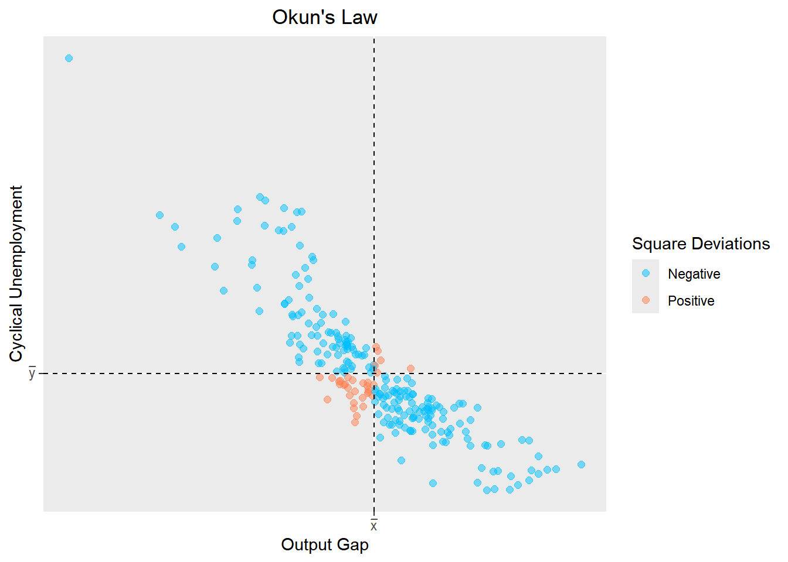
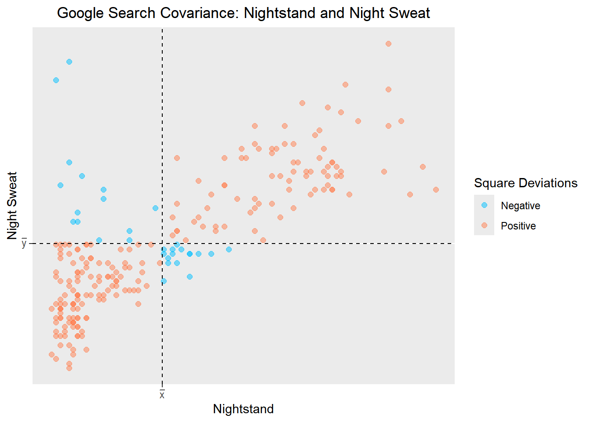

::: {.cell}

:::


## Data


::: {.cell}

```{.r .cell-code}
okuns <- rio::import("https://byuistats.github.io/timeseries/data/outputgap_and_cyclical_unemp.xlsx") # okuns1

gs_night <- rio::import("https://byuistats.github.io/timeseries/data/nightstand-sweat.csv") # night1
```
:::


## Questions

Doing example for Investment Society

### Question 1 - Context and Measurement (10 points)

The first part of any time series analysis is context. You cannot properly analyze data without knowing what the data is measuring. Without context, the most simple features of data can be obscure and inscrutable. This homework assignment will center around the series below.

Please research the time series. In the spaces below, give the data collection process, unit of analysis, and meaning of each observation for the series.

#### a) **Output Gap**

<https://chat.openai.com/share/122aaad9-2be6-43ec-b58a-e1858305b401>

::: {.callout-note title="Answer" icon="false"}
The output gap is the difference between actual GDP and potential GDP, measured as a percentage of potential GDP. Potential GDP is the level of output that an economy can sustain over the long term without generating inflationary pressures. Data on the output gap is often collected by government institutions like central banks (the Federal Reserve or IMF), and each observation reflects how far an economy's production deviates from its long-term sustainable level.
:::

#### b) **Cyclical Unemployment**

<https://chat.openai.com/share/7d6bf187-41d0-42c3-98bc-d02ea1bd5b80>

::: {.callout-note title="Answer" icon="false"}
Cyclical unemployment refers to unemployment that results from economic downturns or recessions, where demand for goods and services decreases, leading to job losses. Data on cyclical unemployment is usually derived by subtracting the natural rate of unemployment (which accounts for frictional and structural unemployment) from the total unemployment rate. Each observation represents the proportion of the labor force that is unemployed due to fluctuations in the business cycle.
:::

### Question 2 - Covariance and Correlation: Okun's Law (30) points)

Okun's Law is an empirical relationship defined as a negative correlation between the Output Gap and Cyclical Unemployment. If the economy is expanding, businesses are producing more, and unemployment tends to decrease. Conversely, during economic contractions or recessions, output shrinks, leading to an increase in unemployment.

Please use the data ***okuns*** to test whether Okun's Law applies to the US from 1960 to 2021.

##### a) Please create a scatter plot of the Output Gap in the x-axis and Cyclical Unemployment in the y-axis.

::: {.callout-note title="Answer" icon="false"}


::: {.cell}

```{.r .cell-code}
# Convert 'Date' column to yearquarter format
okuns$Date <- lubridate::ymd(okuns$Date) # okuns2
okuns$Date <- yearquarter(okuns$Date) # okuns3

# Convert the data frame to a tsibble
okuns_tsbl <- as_tsibble(okuns, key = NULL, index = Date, regular = TRUE) # okuns4


# okus1 raw data file
# okuns2 convert into a standardized date format (Year-Month-Day).
# okuns3 yearquarter(okuns7$Date) is converting the 'Date' into year-quarter format. This function changes the Date object into a format that groups the data by year and quarter (e.g., "2023 Q1"). easier to analyze data at a quarterly level.
# okuns4 as_tsibble function is converting okuns df into a "tsibble" (time series tibble). It uses the Date column as the time index, sets no key (key = NULL), and specifies that the data is expected to be equally spaced in time (regular = TRUE).
# okuns5 & 6 gets rid of spaces in column for better manipulation

# okuns7 The formula used in the code corresponds to the calculation of the COVARIANCE between two variables, output_gap and cycl_unemp. The code calculates the deviation of each value from the mean for both output_gap and cycl_unemp, multiplies these deviations, and assigns this result to the sq_dev column. 
# The formula for each row is:(x_bar - x_i)(y_bar - Y_i)

# the book formula has the output gap minus the mean of the output gap, but this has the mean of the outputgap minus the outputgap! same for cycli. Ask Bro. Moncayo

# okuns 8 
# interval(okuns8_tsbl) is checking the time interval or frequency of the time series data, ensuring the observations are recorded at regular intervals (e.g., quarterly, yearly).
# has_gaps(okuns8_tsbl) checks if there are any missing time periods in the okuns8_tsbl time series object, ensuring that there are no gaps in the sequence of dates.


# Rename columns to avoid spaces and for consistency
okuns_tsbl <- okuns_tsbl |>
  rename(output_gap = `Output Gap`) |> # okuns5
  rename(cycl_unemp = `Cyclical Unemployment`) # okuns6

# Create a new column 'sq_dev' with calculated square deviations
okuns_tsbl <- okuns_tsbl |> 
  mutate(
    sq_dev = (mean(output_gap) - output_gap) * (mean(cycl_unemp) - cycl_unemp)
  ) # okuns7
# (mean(output_gap) - output_gap) * (mean(cycl_unemp) - cycl_unemp)
# (output_gap - mean(output_gap)) * (cycl_unemp - mean(cycl_unemp)) correct way?
# they both seem to produce the same thing, why? 


## Troubleshooting - Check the time interval and gaps in the tsibble
interval(okuns_tsbl)
```

::: {.cell-output .cell-output-stdout}

```
<interval[1]>
[1] 1Q
```


:::

```{.r .cell-code}
has_gaps(okuns_tsbl) # okuns8
```

::: {.cell-output .cell-output-stdout}

```
# A tibble: 1 × 1
  .gaps
  <lgl>
1 FALSE
```


:::

```{.r .cell-code}
# Create ggplot with color based on the sign of 'sq_dev'
ggplot(
  data = okuns_tsbl,                   # Data source (tsibble)
  aes(x = output_gap, y = cycl_unemp,  # Mapping aesthetics: x-axis, y-axis
      color = factor(sign(sq_dev)))    # Color based on the sign of 'sq_dev'
) +
  geom_point(alpha = 0.5, size = 2) +   # Add points with specified transparency and size
  scale_color_manual(
    values = c("deepskyblue", "coral"),  # Manual color scale for 'Negative' and 'Positive'
    labels = c("Negative", "Positive")   # Labels for the color legend
  ) +
  labs(
    x = "Output Gap",                    # x-axis label
    y = "Cyclical Unemployment",         # y-axis label
    title = "Okun's Law",                # Plot title
    color = 'Square Deviations'          # Color legend title
  ) +
  theme(plot.title = element_text(hjust = 0.5)) +  # Center the plot title
  geom_hline(yintercept = mean(okuns_tsbl$cycl_unemp),  # Add horizontal dashed line at mean(cycl_unemp)
             linetype = "dashed", color = "black") +
  geom_vline(xintercept = mean(okuns_tsbl$output_gap),  # Add vertical dashed line at mean(output_gap)
             linetype = "dashed", color = "black") +
  scale_x_continuous(
    breaks = c(mean(okuns_tsbl$output_gap)),  # Specify x-axis tick positions
    labels = expression(bar(x))               # Latex x-axis tick label
  ) +
  scale_y_continuous(
    breaks = c(mean(okuns_tsbl$cycl_unemp)),  # Specify y-axis tick positions
    labels = expression(bar(y))               # Latex x-axis tick label
  )
```

::: {.cell-output-display}
{width=672}
:::
:::


:::

##### b) Please calculate the covariance and correlation coefficient between the Output Gap and Cyclical Unemployment.

::: {.callout-note title="Answer" icon="false"}


::: {.cell}

```{.r .cell-code}
# Calculate the covariance and correlation
covariance <- cov(okuns_tsbl$output_gap, okuns_tsbl$cycl_unemp)
correlation <- cor(okuns_tsbl$output_gap, okuns_tsbl$cycl_unemp) # okunsb

# okunsb 
# covariance <- cov(okuns8_tsbl$output_gap, okuns8_tsbl$cycl_unemp): calculates the covariance between the "output_gap" and "cycl_unemp" in the okuns_tsbl time series tibble, which measures how much these two variables change together.

# correlation <- cor(okuns8_tsbl$output_gap, okuns8_tsbl$cycl_unemp): calculates the correlation between the same two columns, which normalizes the covariance to provide a standardized measure of the strength and direction of the linear relationship between the two variables, ranging from -1 to 1.


# Create a table
result_table_1 <- data.frame(
  Statistic = c("Covariance", "Correlation"),
  Value = c(covariance, correlation)
)

# Display the table
result_table_1 %>%
  kable("html") %>%
  kable_styling(full_width = FALSE)
```

::: {.cell-output-display}

`````{=html}
<table class="table" style="width: auto !important; margin-left: auto; margin-right: auto;">
 <thead>
  <tr>
   <th style="text-align:left;"> Statistic </th>
   <th style="text-align:right;"> Value </th>
  </tr>
 </thead>
<tbody>
  <tr>
   <td style="text-align:left;"> Covariance </td>
   <td style="text-align:right;"> -3.5311717 </td>
  </tr>
  <tr>
   <td style="text-align:left;"> Correlation </td>
   <td style="text-align:right;"> -0.8861978 </td>
  </tr>
</tbody>
</table>

`````

:::
:::


:::

##### c) Evaluate Okun's law. Is there sufficient evidence to suggest an empirical relationship between the Output Gap and Cyclical Unemployment?

::: {.callout-note title="Answer" icon="false"}
Okun's Law suggests a negative relationship between the output gap and cyclical unemployment. Based on the covariance of -3.5311717 and the strong negative correlation of -0.8861978, there is sufficient evidence to support an empirical relationship between these variables. This indicates that as the output gap decreases (reflecting slower economic growth), cyclical unemployment tends to rise, consistent with Okun's Law.
:::

### Question 3 - Correlation vs Causation: Spurious Searches (30 points)

::: quote
*"Every single person who confuses correlation and causation ends up dying."*

Hannah Fry
:::

Please use the data ***gs_night*** to evaluate the empirical relationship between the Google search terms for *night sweats* and *nightstand.*

##### a) Please create a scatter plot of the night sweat search index in the x-axis and nightstand search index in the y-axis.

::: {.callout-note title="Answer" icon="false"}


::: {.cell}

```{.r .cell-code}
gs_night$date <- lubridate::ym(gs_night$date) #night2
gs_night$date <- yearmonth(gs_night$date) #night3

gs_night_tsbl <- as_tsibble(gs_night, key = NULL, index = date, regular = TRUE) # night4 

gs_night_tsbl <- gs_night_tsbl |>
  rename(night_sweat= `night sweat`) # night5

gs_night_tsbl <- gs_night_tsbl |> 
  mutate(sq_dev= (mean(nightstand)-nightstand)*(mean(night_sweat)-night_sweat)) # night6

# night1 raw df
# night2: Convert the 'date' column into a Year-Month (ym) format using the lubridate package.
# night3: Further transform the 'date' into a year-month object, making it suitable for time series analysis.

# night4: Convert the dataframe into a tsibble (time series tibble) with 'date' as the index, ensuring the data is evenly spaced (regular = TRUE).

# night5: Rename the 'night sweat' column to 'night_sweat' for easier manipulation.

# night6: Create a new column 'sq_dev' by calculating the product of the deviations from the mean for both 'nightstand' and 'night_sweat'.


ggplot(
  gs_night_tsbl,
  aes(x = nightstand, y = night_sweat, color = factor(sign(sq_dev)))
) +
  geom_point(alpha = 0.5, size = 2) +
  scale_color_manual(
    values = c("deepskyblue", "coral"),  # Adjust colors as needed
    labels = c("Negative", "Positive")
  )+
  labs(
    x = "Nightstand",
    y = "Night Sweat",
    title = "Google Search Covariance: Nightstand and Night Sweat",
    color = 'Square Deviations'
  )+
  theme(
    plot.title = element_text(hjust = 0.5)
  )+
  geom_hline(yintercept = mean(gs_night_tsbl$night_sweat), linetype = "dashed", color = "black")+
  geom_vline(xintercept = mean(gs_night_tsbl$nightstand), linetype = "dashed", color = "black")+
  scale_x_continuous(
    breaks = c(mean(gs_night_tsbl$nightstand)),
    labels = expression(bar(x))
  )+
  scale_y_continuous(
    breaks = c(mean(gs_night_tsbl$night_sweat)),
    labels = expression(bar(y))
  ) # night7
```

::: {.cell-output-display}
{width=672}
:::
:::


:::

##### b) Please calculate the covariance and correlation between the night sweat search index and the nightstand search index.

::: {.callout-note title="Answer" icon="false"}


::: {.cell}

```{.r .cell-code}
covariance <- cov(gs_night_tsbl$nightstand, gs_night_tsbl$night_sweat)
correlation <- cor(gs_night_tsbl$nightstand, gs_night_tsbl$night_sweat) # night8

# night8 
# covariance - calculates the covariance between "nightstand" and "night_sweat" in the gs_night_tsbl time series tibble, which quantifies how much these two variables vary together.

# correlation <- cor(gs_night_tsbl$nightstand, gs_night_tsbl$night_sweat): computes the correlation between the same two columns, providing a normalized measure of the strength and direction of their linear relationship. The result ranges from -1 (perfect negative relationship) to 1 (perfect positive relationship).


# Create a table
result_table_2 <- data.frame(
  Statistic = c("Covariance", "Correlation"),
  Value = c(covariance, correlation)
)

# Display the table
result_table_2 %>%
  kable("html") %>%
  kable_styling(full_width = FALSE)
```

::: {.cell-output-display}

`````{=html}
<table class="table" style="width: auto !important; margin-left: auto; margin-right: auto;">
 <thead>
  <tr>
   <th style="text-align:left;"> Statistic </th>
   <th style="text-align:right;"> Value </th>
  </tr>
 </thead>
<tbody>
  <tr>
   <td style="text-align:left;"> Covariance </td>
   <td style="text-align:right;"> 271.0499827 </td>
  </tr>
  <tr>
   <td style="text-align:left;"> Correlation </td>
   <td style="text-align:right;"> 0.7871518 </td>
  </tr>
</tbody>
</table>

`````

:::
:::


:::

##### c) Please suggest a scenario where an increase in the frequency of searches for nightstand will cause higher searches for the term night sweats?

::: {.callout-note title="Answer" icon="false"}
Scenario where an increase in the frequency of searches for nightstands causes higher searches for the term night sweats. A popular furniture brand releases a new line of nightstands with integrated cooling features to help with heat management at night. As people search for these nightstands, they become more aware of night sweats as a symptom related to nighttime overheating, prompting an increase in searches for night sweats to understand more about this condition.
:::

##### d) Please suggest a scenario where an increase in the frequency of searches for night sweats will cause higher searches for the term nightstand?

::: {.callout-note title="Answer" icon="false"}
Scenario where an increase in the frequency of searches for night sweats causes higher searches for the term nightstand. A health campaign about the symptoms of sleep disorders increases awareness about night sweats. As people search for remedies, they may come across suggestions for keeping items like water or cooling devices on a nightstand, leading them to search for "nightstand" to explore better furniture options for addressing nighttime comfort.
:::

##### e) Please suggest an event or reason that would result in the correlation between searches for night sweats and searches for the term nightstand?

::: {.callout-note title="Answer" icon="false"}
Event or reason that could correlate searches for night sweats and nightstand. A sudden rise in summer temperatures leads to a widespread increase in discomfort at night, causing people to search both for night sweats (as they experience symptoms) and for nightstand (as they seek solutions like placing fans, water, or cooling gadgets near their beds).
:::

##### f) Are any of your suggestions plausible? What does that teach you about the difference between correlation and causation? Please elaborate.

::: {.callout-note title="Answer" icon="false"}
The calculated covariance is 271.0499827 and the correlation coefficient is 0.7871518​. This indicates a moderately strong positive correlation between searches for night sweats and nightstand. However, correlation does not equal causation.

Nightstand releases with cooling features causing more searches for night sweats. This scenario is possible but unlikely. The idea that a new product could make people more aware of night sweats, leading to increased searches, seems forced. While a cooling nightstand could theoretically help with heat at night, it’s not reasonable to assume that most users would link this directly to night sweats unless it is specifically marketed as such. Therefore, the correlation between the two search terms may be coincidental.

Health campaigns on night sweats driving searches for nightstands. This scenario is also possible but less plausible than it might initially seem. While people might seek out nightstands for convenience or comfort after learning about night sweats, it’s a stretch to assume that most individuals suffering from night sweats would search for furniture to solve the issue directly.

Correlation vs. Causation:

Correlation simply means that two variables tend to move together—either increasing or decreasing simultaneously—but it doesn’t tell us why this happens. Causation, on the other hand, implies that changes in one variable directly cause changes in another.

In this case, while the data shows a strong correlation between searches for night sweats and nightstand, this does not mean that one causes the other. As seen in the evaluation of the scenarios, plausible explanations for the correlation often involve a third external factor (e.g., weather) influencing both search terms. This highlights the importance of not assuming causality just because two variables are correlated. In reality, correlation can often result from unrelated factors, coincidences, or underlying variables that drive both outcomes.
:::

### Rubric

|  |  |
|:----------------------------------:|------------------------------------|
| **Criteria** | **Ratings** |
|  | **Complete (10)** |
| **Question 1: Context and Measurement** | The student demonstrates a clear understanding of the context for each data series. The explanation includes details about the data collection process, unit of analysis, and the meaning of each observation. |
|  | **Complete (5)** |
| **Question 2a: Scatter Plot** | The scatter plot is appropriately titled, and all elements, including the plot itself, axis labels, and title, are clearly labeled. The scatter plot matches or exceeds the quality of the scatter plots shown in lecture. |
|  | **Complete (5)** |
| **Question 2b: Covariance and Correlation Calculation** | The student effectively utilizes R to correctly calculate covariance and correlation. |
|  | **Complete (10)** |
| **Question 2c:Interpretation and Evaluation** | The student provides a clear and accurate interpretation of the correlation between the variables. The response demostrates understanding of how the correlation coefficient quantifies the strength and direction of the relationship between the variables. |
|  | **Complete (10)** |
| **Question 2c: Okun's Law** | The discussion of Okun's law makes clear the student understands how to use statistical evidence to evaluate scientific claims in the context of an academic field. |
|  | **Complete (5)** |
| **Question 3a: Scatter Plot** | The scatter plot is appropriately titled, and all elements, including the plot itself, axis labels, and title, are clearly labeled. The scatter plot matches or exceeds the quality of the scatter plots shown in lecture. |
|  | **Complete (5)** |
| **Question 3b: Covariance and Correlation Calculation** | The student effectively utilizes R to correctly calculate covariance and correlation. |
|  | **Complete (10)** |
| **Question 3(c,d,e):Scenarios** | The scenarios suggested are clear and concise. The responses show an honest attempt at thinking of a connection between the variables according to the prompt. |
|  | **Complete (10)** |
| **Question 3: Plausiblity** | The student provides a critical evaluation is provided regarding the plausibility of the suggested scenarios and events. The evaluation includes a clear and comprehensive explanation on the difference between correlation and causation. |
| **Total Points** | **70** |
