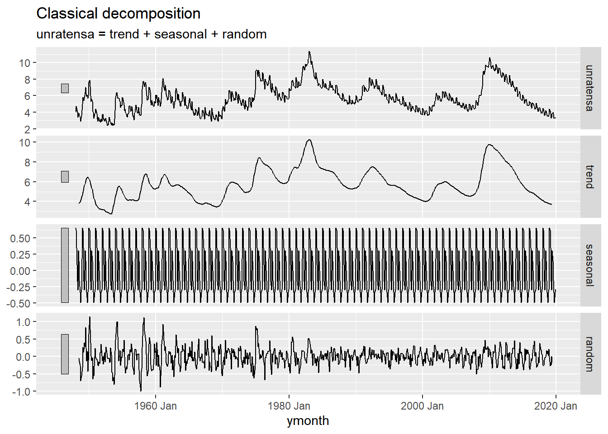
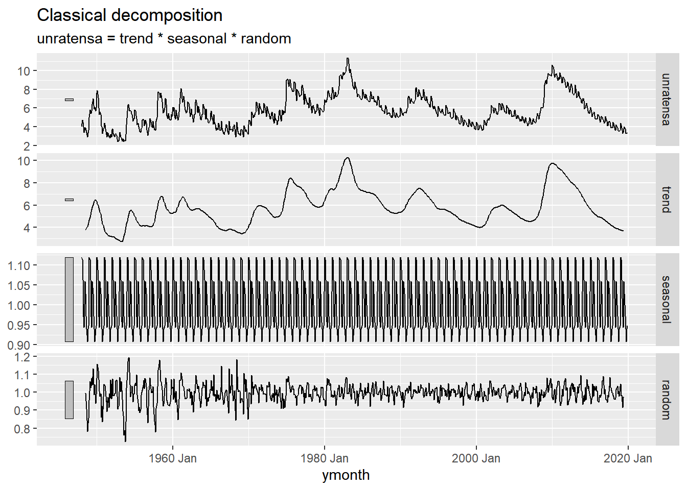
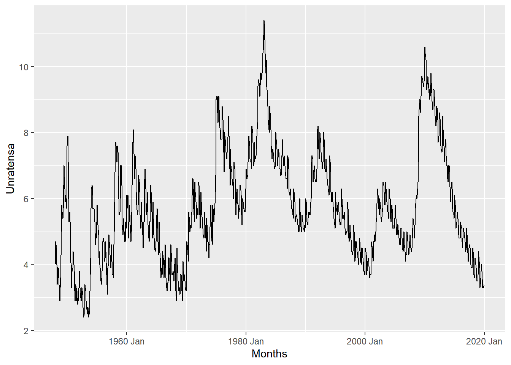
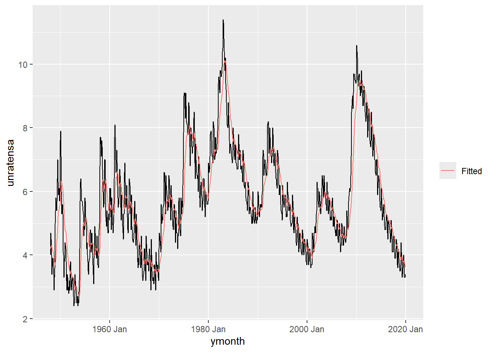

I did not evaluate the last two code chunks for faster transferring since the forecast models take a bit to load. 


::: {.cell}

:::


## Data


::: {.cell}

```{.r .cell-code}
df <- rio::import("https://byuistats.github.io/timeseries/data/UNRATENSA.csv")
```
:::


## Questions

### Question 1 - US Unemployment Rate: Additive Holt-Winters Forecasting (30 points)

We have used a measure of US unemployment rates before. This series imported above has not been seasonally adjusted.

##### a) Please use the Holt-Winters smoothing method to the series.

::: {.callout-note title="Answer" icon="false"}


::: {.cell}

```{.r .cell-code}
df0 <- rio::import("https://byuistats.github.io/timeseries/data/UNRATENSA.csv") |>
    mutate(ymonth = yearmonth(lubridate::mdy(date)))
df <- as_tsibble(df0, index = ymonth)
# interval(df)
# has_gaps(df)


ts_add <- df |>
  model(feasts::classical_decomposition(unratensa,
          type = "add"))  |>
  components()
autoplot(ts_add)
```

::: {.cell-output .cell-output-stderr}

```
Warning: Removed 6 rows containing missing values or values outside the scale range
(`geom_line()`).
```


:::

::: {.cell-output-display}
{width=672}
:::

```{.r .cell-code}
ts_mult <- df |>
  model(feasts::classical_decomposition(unratensa,
          type = "mult"))  |>
  components()
autoplot(ts_mult)
```

::: {.cell-output .cell-output-stderr}

```
Warning: Removed 6 rows containing missing values or values outside the scale range
(`geom_line()`).
```


:::

::: {.cell-output-display}
{width=672}
:::

```{.r .cell-code}
autoplot(df) +
    labs(x = "Months", y = "Unratensa")
```

::: {.cell-output .cell-output-stderr}

```
Plot variable not specified, automatically selected `.vars = unratensa`
```


:::

::: {.cell-output-display}
{width=672}
:::

```{.r .cell-code}
df1 <- df |>
    model(Additive = ETS(unratensa ~
        trend("A", alpha = 0.1429622, beta = 0) +
        error("A") +
        season("N"),
        opt_crit = "amse", nmse = 1))
sum(components(df1)$remainder^2, na.rm = T)
```

::: {.cell-output .cell-output-stdout}

```
[1] 487.4117
```


:::

```{.r .cell-code}
augment(df1) |>
    ggplot(aes(x = ymonth, y = unratensa)) +
    geom_line() +
    geom_line(aes(y = .fitted, color = "Fitted")) +
    labs(color = "")
```

::: {.cell-output-display}
{width=672}
:::

```{.r .cell-code}
df2 <- df |>
    model(Additive = ETS(unratensa ~
        trend("A", alpha = 0.2, beta = 0) +
        error("A") +
        season("N"),
        opt_crit = "amse", nmse = 1))
sum(components(df2)$remainder^2, na.rm = T)
```

::: {.cell-output .cell-output-stdout}

```
[1] 386.0684
```


:::
:::


:::

##### b) What parameters values did you choose for $\alpha$, $\beta$, and $\gamma$. Justify your choice.

::: {.callout-note title="Answer" icon="false"}
The parameters chosen were alpha = 0.1429622 and alpha = 0.2 in two models, with beta = 0 and no seasonality (gamma) excluded, to balance trend sensitivity without overreacting to short-term changes. The moderate alpha values capture recent trends in unemployment while maintaining stability, and beta = 0 prevents fluctuating trend updates. Optimized by minimizing short-term forecast error (average mean squared error), these settings are well-suited for smoothing non-seasonal economic data like unemployment rates.
:::

##### c) Please plot the Holt-Winters forecast of the series for the next 24 months superimposed against the original series. Please see [Figure 7](https://byuistats.github.io/timeseries/chapter_3_lesson_3.html#fig-crime-hw-forecast) in Chapter 3: Lesson 3

::: {.callout-note title="Answer" icon="false"}
Overview of the data

I wonder if the trend is multiplicative because of how different in can be, and seem to have a increasing or decreasing trend.

When doing the classical add & mult models, this data doesn't really fit any of the models. I can see how the random component handles the random events a little better the the additive which will make sense since the data can have a downward or upward trend for certain time periods. (which one is the model that we talk about in class that adjust to take into account changes in the season


::: {.cell}

```{.r .cell-code}
df4 <- rio::import("https://byuistats.github.io/timeseries/data/UNRATENSA.csv") |>
    mutate(ymonth = yearmonth(lubridate::mdy(date)))
df5 <- as_tsibble(df4, index = ymonth)

df6 <-  df5 |>
    model(Multiplicative = ETS(unratensa ~
        trend("M") +
        error("A") +
        season("M"),
        opt_crit = "amse", nmse = 1))
augment(df6) |>
    ggplot(aes(x = ymonth, y = unratensa)) +
    geom_line() +
    geom_line(aes(y = .fitted, color = "Fitted")) +
    labs(color = "")
df6 |>
  forecast(h = "2 years") |> 
  autoplot(df5 |> filter(ymonth >= yearmonth("2016 Jan") & ymonth <= yearmonth("2019 Dec")), level = 95) + 
  geom_line(aes(y = .fitted, color = "Fitted"),
    data = augment(df6) |> filter(ymonth >= yearmonth("2016 Jan") & ymonth <= yearmonth("2019 Dec"))) +
  scale_color_discrete(name = "")
```
:::


doing additive


::: {.cell}

```{.r .cell-code}
df4 <- rio::import("https://byuistats.github.io/timeseries/data/UNRATENSA.csv") |>
    mutate(ymonth = yearmonth(lubridate::mdy(date)))
df5 <- as_tsibble(df4, index = ymonth)

df6 <- df5 |>
    model(Additive = ETS(unratensa ~
        trend("A") +
        error("A") +
        season("A"),
        opt_crit = "amse", nmse = 1))

augment(df6) |>
    ggplot(aes(x = ymonth, y = unratensa)) +
    geom_line() +
    geom_line(aes(y = .fitted, color = "Fitted")) +
    labs(color = "")
df6 |>
  forecast(h = "2 years") |> 
  autoplot(df5 |> filter(ymonth >= yearmonth("1948 Jan") & ymonth <= yearmonth("2019 Dec")), level = 95) + 
  geom_line(aes(y = .fitted, color = "Fitted"),
    data = augment(df6) |> filter(ymonth >= yearmonth("2016 Jan") & ymonth <= yearmonth("2019 Dec"))) +
  scale_color_discrete(name = "")
```
:::


:::

### Question 2 - Additive Holt-Winters Forecasting: Evaluation (20 points)

##### a) The Unemployment Rate data stops at the end of 2019. Please access the latest data [HERE](https://fred.stlouisfed.org/series/UNRATENSA). Please don't look at it until you have reached this point in the homework. Compare your forecasting work with with the actual realization of the series. What lessons about forecasting can you learn from the occurrence of [Gray Rhino](https://chatgpt.com/share/6712c9e5-4f58-8005-888d-acae9895bd05) events like a pandemic?

::: {.callout-note title="Answer" icon="false"}
Comparing the forecasted unemployment rates with the actual post-2019 data highlights that the Holt-Winters model could not anticipate the sharp rise in unemployment due to the COVID-19 pandemic, a Gray Rhino event. This underscores that traditional forecasting models, which rely on historical trends, are limited in predicting sudden, large disruptions. Such events emphasize the need for adaptive models that account for potential shocks in economic data.
:::

### Rubric

|  |  |  |
|------------------------|------------------------|------------------------|
| **Criteria** | **Mastery (10)** | **Incomplete (0)** |
| **Question 1a: HW Smoothing** | Demonstrate the implementation of the Holt-Winters smoothing method in R, providing well-commented code that clearly explains each step of the algorithm. They correctly specify the necessary parameters, including trend and seasonality components. | Students encounter difficulties in accurately implementing the Holt-Winters smoothing method in R. Their code may lack sufficient comments or clarity, making it challenging to understand the implementation process. Additionally, they may overlook important parameters or make errors in the application of the method, leading to inaccuracies in the results. |
|  | **Mastery (10)** | **Incomplete (0)** |
| **Question 1b: Parameter Choice** | Responses not only specify the chosen parameter values for \$\\alpha\$, \$\\beta\$, and \$\\gamma\$ in the context of the Holt-Winters smoothing method but also correctly identify the purpose of each parameter in their explanation. They provide a thorough justification for each parameter choice, considering factors such as the data characteristics, seasonality patterns, and the desired level of smoothing | Student struggles to clearly specify the chosen parameter values for \$\\alpha\$, \$\\beta\$, and \$\\gamma\$. It's no clear that they understand the purpose of each parameter in their explanation. They may provide limited or vague justification for each parameter choice, lacking consideration of important factors such as data characteristics or seasonality patterns. |
|  | **Mastery (10)** | **Incomplete (0)** |
| **Question 1c: Forecast Plot** | Responses effectively create a plot of the Holt-Winters forecast for the next 24 months superimposed against the original series in R. The forecasted values align with the original series and display relevant trends and seasonality patterns. Additionally, they appropriately label the axes, title the plot, and provide a clear legend to distinguish between the original series and the forecast. The plot closely resembles Figure 7 in the Time Series Notebook | Student encounter challenges in creating a plot of the Holt-Winters forecast. They may struggle with accurately implementing the plotting code, resulting in inaccuracies or inconsistencies in the plotted forecast. Additionally, their plot may lack proper labeling of the axes, a title, or a legend, making it difficult to interpret the information presented. Furthermore, their plot may deviate significantly from Figure 7 in the Time Series Notebook. |
|  | **Mastery (20)** | **Incomplete (0)** |
| **Question 1a: Gray Rhinos** | Students provide a comparison between their forecasting results and the actual realization of the series, highlighting areas of accuracy and any discrepancies observed. They demonstrate an understanding of the impact of Gray Rhino event on forecasting. Responses are clear, coherent, and well-structured, ensuring that the evaluation and lessons learned are effectively communicated | Submissions provide a limited or superficial comparison between their forecasting results and the actual realization of the series, lacking depth in their analysis or failing to identify key discrepancies.Responses demonstrate a lack of understanding of the impact of Gray Rhino events on forecasting. Explanations may lack clarity, coherence, or structure, making it difficult to understand the evaluation and lessons learned effectively. |
| **Total Points** | **50** |  |
