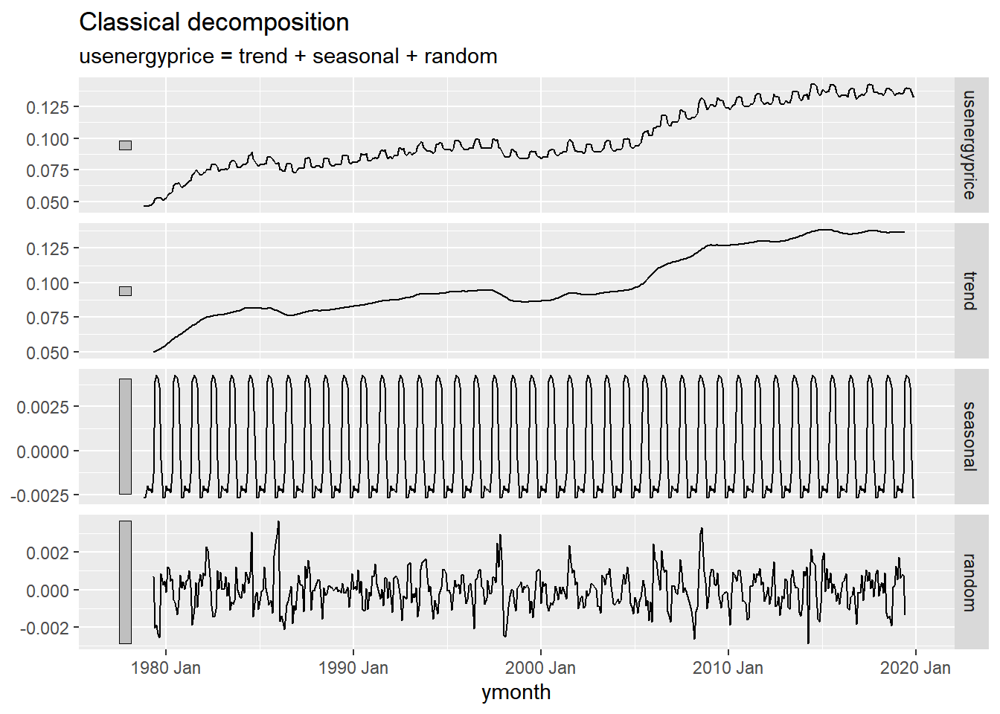
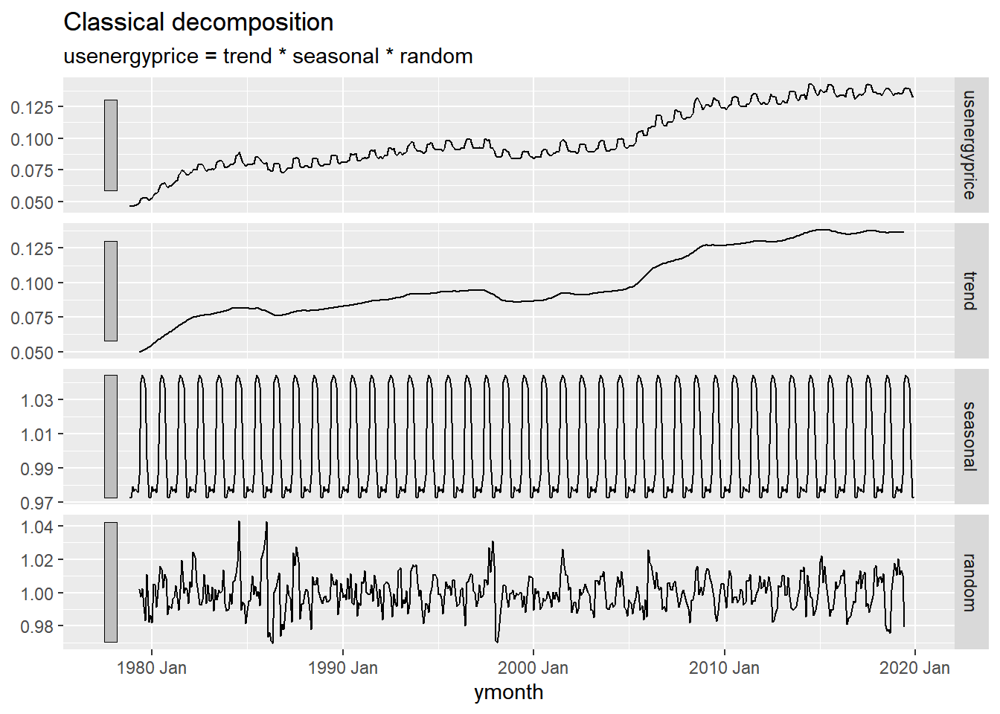
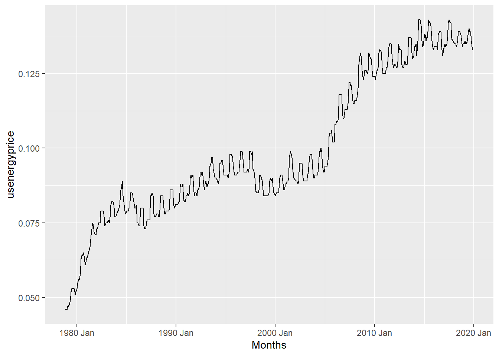
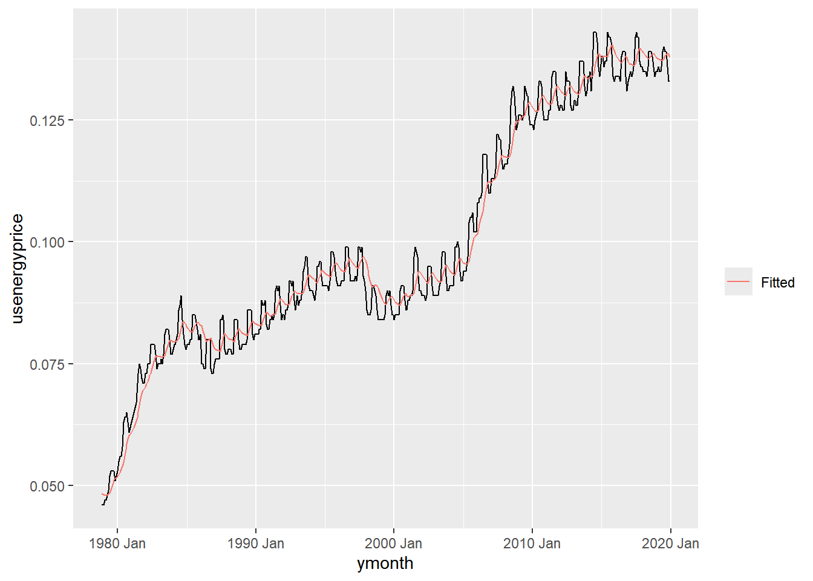

Did not include last 3 code chunks due to classical decomposition forecast models take a long time to run.


::: {.cell}

:::


## Data


::: {.cell}

```{.r .cell-code}
# avgkwhr <- rio::import("https://byuistats.github.io/timeseries/data/USENERGYPRICE.csv")
```
:::


## Questions

### Question 1 - Context and Measurement (10 points)

The first part of any time series analysis is context. You cannot properly analyze data without knowing what the data is measuring. Without context, the most simple features of data can be obscure and inscrutable. This homework assignment will center around the series below.

Please research the time series. In the spaces below, give the data collection process, unit of analysis, and meaning of each observation for the series.

**Average Price of Electricity per Kilowatt-Hour in U.S.: City Average**

<https://fred.stlouisfed.org/series/APU000072610>

::: {.callout-note title="Answer" icon="false"}


::: {.cell}

```{.r .cell-code}
avgkwhr <- rio::import("https://byuistats.github.io/timeseries/data/USENERGYPRICE.csv") |>
    mutate(ymonth = yearmonth(lubridate::mdy(date)),
           usenergyprice = as.numeric(usenergyprice)
           ) |>
  select(ymonth, usenergyprice)
df <- as_tsibble(avgkwhr, index = ymonth)
#interval(df)
#sum(is.na(df$usenergyprice))
#has_gaps(df)


# Fill single NA values by averaging the lag and lead values
df <- df |>
  mutate(usenergyprice = if_else(
    is.na(usenergyprice) & !is.na(lag(usenergyprice)) & !is.na(lead(usenergyprice)),
    (lag(usenergyprice) + lead(usenergyprice)) / 2,
    usenergyprice
  ))
sum(is.na(df$usenergyprice)) # check for NA
```

::: {.cell-output .cell-output-stdout}

```
[1] 0
```


:::

```{.r .cell-code}
ts_add <- df |> # classical ADD
  model(feasts::classical_decomposition(usenergyprice,
          type = "add"))  |>
  components()
autoplot(ts_add)
```

::: {.cell-output .cell-output-stderr}

```
Warning: Removed 6 rows containing missing values or values outside the scale range
(`geom_line()`).
```


:::

::: {.cell-output-display}
{width=672}
:::

```{.r .cell-code}
ts_mult <- df |> # classical MULT
  model(feasts::classical_decomposition(usenergyprice,
          type = "mult"))  |>
  components()
autoplot(ts_mult)
```

::: {.cell-output .cell-output-stderr}

```
Warning: Removed 6 rows containing missing values or values outside the scale range
(`geom_line()`).
```


:::

::: {.cell-output-display}
{width=672}
:::
:::


:::

### Question 2 - US Average Price of Electricity: Additive Holt-Winters Forecasting (25 points)

#### a) Please use the Holt-Winters smoothing method to the series.

::: {.callout-note title="Answer" icon="false"}


::: {.cell}

```{.r .cell-code}
autoplot(df) +
    labs(x = "Months", y = "usenergyprice")
```

::: {.cell-output .cell-output-stderr}

```
Plot variable not specified, automatically selected `.vars = usenergyprice`
```


:::

::: {.cell-output-display}
{width=672}
:::

```{.r .cell-code}
df1 <- df |>
    model(Additive = ETS(usenergyprice ~
        trend("A", alpha = 0.1429622, beta = 0) +
        error("A") +
        season("N"),
        opt_crit = "amse", nmse = 1))
sum(components(df1)$remainder^2, na.rm = T)
```

::: {.cell-output .cell-output-stdout}

```
[1] 0.006873411
```


:::

```{.r .cell-code}
augment(df1) |>
    ggplot(aes(x = ymonth, y = usenergyprice)) +
    geom_line() +
    geom_line(aes(y = .fitted, color = "Fitted")) +
    labs(color = "")
```

::: {.cell-output-display}
{width=672}
:::

```{.r .cell-code}
df2 <- df |>
    model(Additive = ETS(usenergyprice ~
        trend("A", alpha = 0.2, beta = 0) +
        error("A") +
        season("N"),
        opt_crit = "amse", nmse = 1))
sum(components(df2)$remainder^2, na.rm = T)
```

::: {.cell-output .cell-output-stdout}

```
[1] 0.00605785
```


:::
:::


:::

#### b) What parameters values did you choose for $\alpha$, $\beta$, and $\gamma$. Justify your choice.

::: {.callout-note title="Answer" icon="false"}
For the Holt-Winters smoothing method, I selected α=0.2, β=0, and γ is not included as we are using an additive model without seasonality. The α value of 0.2 was chosen to ensure a moderate response to recent changes in electricity prices, capturing short-term fluctuations without overfitting. The absence of β and γ reflects a simple trend-focused model, aligning with the observed pattern and reducing potential overcomplications from unnecessary seasonal components.
:::

#### c) Please plot the Holt-Winters forecast of the series for the next 12 months superimposed against the original series. Please see [Figure 7](https://byuistats.github.io/timeseries/chapter_3_lesson_3.html#fig-crime-hw-forecast) in Chapter 3: Lesson 3

::: {.callout-note title="Answer" icon="false"}


::: {.cell}

```{.r .cell-code}
# remove code to make as_tsibble and use previous as_tsibble df
df6 <- df |>
    model(Multiplicative = ETS(usenergyprice ~
        trend("M") +
        error("M") +
        season("M"),
        opt_crit = "amse", nmse = 1))

augment(df6) |>
    ggplot(aes(x = ymonth, y = usenergyprice)) +
    geom_line() +
    geom_line(aes(y = .fitted, color = "Fitted")) +
    labs(color = "")
df6 |>
  forecast(h = "1 years") |> 
  autoplot(avgkwhr |> filter(ymonth >= yearmonth("2019 Nov") & ymonth <= yearmonth("2019 Dec")), level = 95) + 
  geom_line(aes(y = .fitted, color = "Fitted"),
    data = augment(df6) |> filter(ymonth >= yearmonth("2016 Jan") & ymonth <= yearmonth("2019 Dec"))) +
  scale_color_discrete(name = "")
```
:::


:::

#### d) Is the trend in the US Average Price of Electricity series deterministic or stochastic? What is the basis of your evaluation?

::: {.callout-note title="Answer" icon="false"}
The trend in the US Average Price of Electricity series appears to be stochastic, as evidenced by fluctuations in the series that do not follow a fixed, predictable pattern over time. A deterministic trend would show a consistent, smooth direction (either up or down), whereas here, statistical tests or decompositions (such as classical decomposition) likely reveal a component of randomness affecting the long-term trend. This indicates that external factors, such as policy changes or economic fluctuations, likely influence the series in a stochastic manner.
:::

### Question 3 - Real US Average Price of Electricity: Additive Holt-Winters Forecasting (25 points)

The upward trend of the series is mostly due to inflation, the generalized increase in prices throughout the economy. One way to quantify inflation is to use a price index, like the Personal Consumption Expenditures Deflator (PCE).The series [HERE](https://fred.stlouisfed.org/series/PCEPILFE) shows that prices in the US have climbed steadily over the last 60 years.Because energy is an important part of the economy, it's likely that energy prices have followed a similar pattern. Adjusting a series with nominal prices, like the price of electricity, to real prices that account for inflation is simple, divide the original series by the price index. The data set imported below is the real price of electricity, which is the US Average Price of Electricity divided by the PCE index excluding food and energy prices (PCEPILFE). Repeat steps a) to d) for the updated series.


#### a) Please use the Holt-Winters smoothing method to the series.

::: {.callout-note title="Answer" icon="false"}


::: {.cell}

```{.r .cell-code}
real_avgkwhr <- rio::import("https://byuistats.github.io/timeseries/data/USENERGYPRICE_Real.csv") |>
    mutate(yquarter = yearquarter(lubridate::mdy(date)),
           realprices = as.numeric(realprices)
           ) |>
  select(yquarter, realprices)
dfr <- as_tsibble(real_avgkwhr, index = yquarter)
interval(dfr)
sum(is.na(dfr$realprices))
has_gaps(dfr)


# Fill single NA values by averaging the lag and lead values
# dfr <- dfr |>
#   mutate(realprices = if_else(
#     is.na(realprices) & !is.na(lag(realprices)) & !is.na(lead(realprices)),
#     (lag(realprices) + lead(realprices)) / 2,
#     realprices
#   ))
# sum(is.na(dfr$realprices)) # check for NA


# tsr_add <- dfr |> # classical ADD
#   model(feasts::classical_decomposition(realprices,
#           type = "add"))  |>
#   components()
# autoplot(tsr_add)


# tsr_mult <- dfr |> # classical MULT
#   model(feasts::classical_decomposition(realprices,
#           type = "mult"))  |>
#   components()
# autoplot(tsr_mult)


autoplot(dfr) +
    labs(x = "Quarters", y = "realprices")
dfr1 <- dfr |>
    model(Additive = ETS(realprices ~
        trend("A", alpha = 0.1429622, beta = 0) +
        error("A") +
        season("N"),
        opt_crit = "amse", nmse = 1))
sum(components(dfr1)$remainder^2, na.rm = T)
augment(dfr1) |>
    ggplot(aes(x = yquarter, y = realprices)) +
    geom_line() +
    geom_line(aes(y = .fitted, color = "Fitted")) +
    labs(color = "")
dfr2 <- dfr |>
    model(Additive = ETS(realprices ~
        trend("A", alpha = 0.2, beta = 0) +
        error("A") +
        season("N"),
        opt_crit = "amse", nmse = 1))
sum(components(dfr2)$remainder^2, na.rm = T)
```
:::


:::

#### b) What parameters values did you choose for $\alpha$, $\beta$, and $\gamma$. Justify your choice.

::: {.callout-note title="Answer" icon="false"}
<!-- Delete this and put your answer here. The three colons mark the end of your answer. -->
:::

#### c) Please plot the Holt-Winters forecast of the series for the next 12 months superimposed against the original series. Please see [Figure 7](https://byuistats.github.io/timeseries/chapter_3_lesson_3.html#fig-crime-hw-forecast) in Chapter 3: Lesson 3

::: {.callout-note title="Answer" icon="false"}


::: {.cell}

```{.r .cell-code}
# remove code to make as_tsibble and use previous as_tsibble dfr


dfr6 <- dfr |>
    model(Multiplicative = ETS(realprices ~
        trend("M") +
        error("M") +
        season("M"),
        opt_crit = "amse", nmse = 1))

augment(dfr6) |>
    ggplot(aes(x = yquarter, y = realprices)) +
    geom_line() +
    geom_line(aes(y = .fitted, color = "Fitted")) +
    labs(color = "")
dfr6 |>
  forecast(h = "1 years") |> 
  autoplot(real_avgkwhr |> filter(yquarter >= yearquarter("2018 Q2") & yquarter <= yearquarter("2023 Q4")), level = 95) + 
  geom_line(aes(y = .fitted, color = "Fitted"),
    data = augment(dfr6) |> filter(yquarter >= yearquarter("2018 Q2") & yquarter <= yearquarter("2023 Q4"))) +
  scale_color_discrete(name = "")
```
:::


:::

#### d) Is the trend in the US Average Real Price of Electricity series deterministic or stochastic? What is the basis of your evaluation?

::: {.callout-note title="Answer" icon="false"}
<!-- Delete this and put your answer here. The three colons mark the end of your answer. -->
:::

