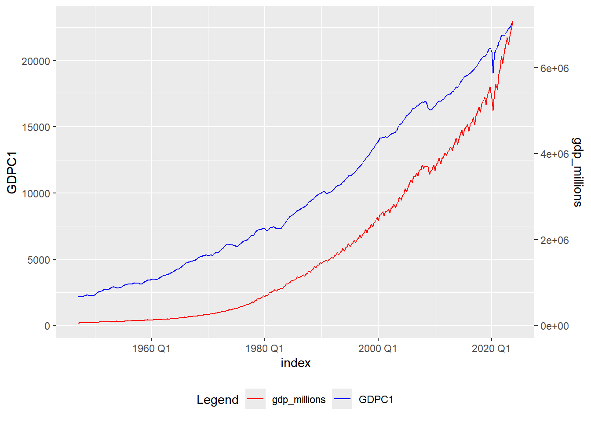
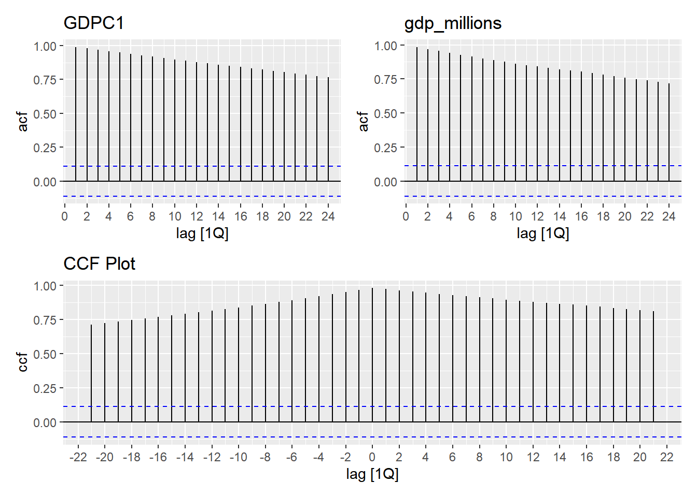
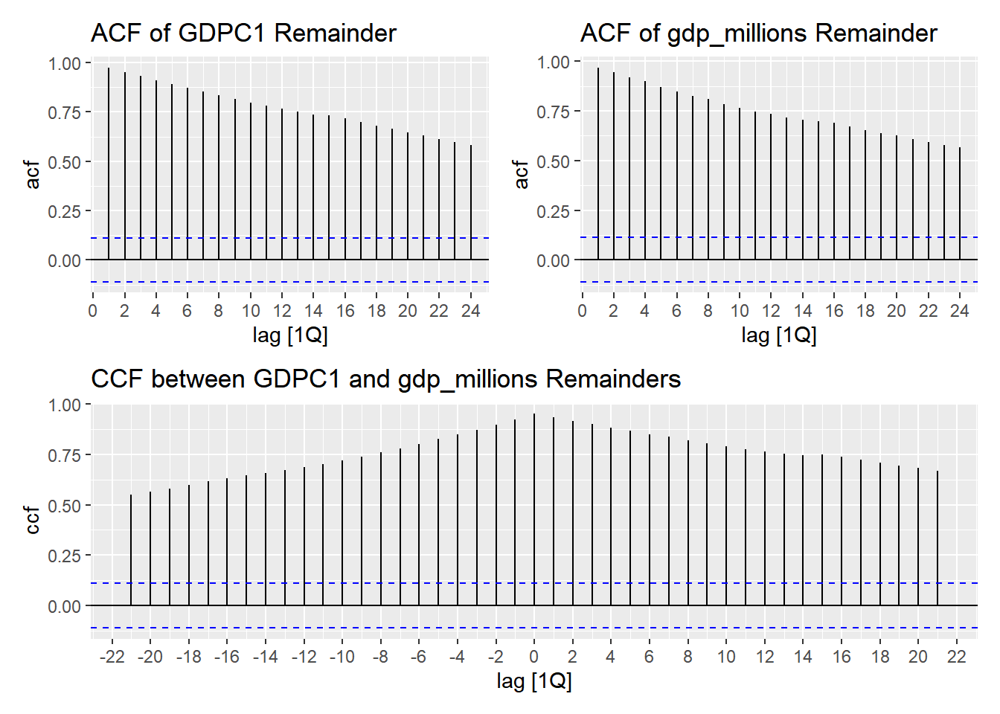

::: {.cell}

:::


## Data


::: {.cell}

```{.r .cell-code}
ngdp <- rio::import("https://byuistats.github.io/timeseries/data/gdp_fred.csv") |>
  mutate(yquarter = yearquarter(lubridate::mdy(quarter)))
ngdp1 <- as_tsibble(ngdp, index = yquarter)
# interval(ngdp1)
# has_gaps(ngdp1)


rgdp <- rio::import("https://byuistats.github.io/timeseries/data/GDPC1.csv") |>
  mutate(yq = yearquarter(lubridate::ymd(DATE)))
rgdp1 <- as_tsibble(rgdp, index = yq)
# interval(rgdp1)
# has_gaps(rgdp1)
```
:::


## Questions

### Question 1 - Context and Measurement (10 points)

The first part of any time series analysis is context. You cannot properly analyze data without knowing what the data is measuring. Without context, the most simple features of data can be obscure and inscrutable. This homework assignment will center around the series below.

Please research the time series. In the spaces below, give the data collection process, unit of analysis, and meaning of each observation for the series.

**Nominal Gross Domestic Product - United States**

<https://fred.stlouisfed.org/series/NA000334Q>

::: {.callout-note title="Answer" icon="false"}


::: {.cell}

```{.r .cell-code}
df <- left_join(ngdp1, rgdp1, by = c("yquarter" = "yq")) |> # joined df
  select(yquarter, gdp_millions, GDPC1)

df <- df |>
    rename(
        index = yquarter  # rename `yquarter` to `index`
    ) |>
    mutate(
        GDPC1 = as.numeric(GDPC1),
        gdp_millions = as.numeric(gdp_millions)
    ) |>
    as_tsibble(index = index)  # set `index` as the tsibble index

max_GDPC1 <- max(df$GDPC1, na.rm = TRUE)
max_gdp_millions <- max(df$gdp_millions, na.rm = TRUE)
df <- df %>%
    mutate(scaled_gdp_millions = gdp_millions / max_gdp_millions * max_GDPC1)

# Plot with dual y-axes
ggplot(df, aes(x = index)) +
    geom_line(aes(y = GDPC1, color = "GDPC1")) +
    geom_line(aes(y = scaled_gdp_millions, color = "gdp_millions")) +  # Use scaled gdp_millions for plotting
    scale_y_continuous(
        name = "GDPC1",
        sec.axis = sec_axis(~ . * max_gdp_millions / max_GDPC1, name = "gdp_millions")  # Secondary axis transformation
    ) +
    scale_color_manual(values = c("GDPC1" = "blue", "gdp_millions" = "red")) +
    theme(legend.position = "bottom") +
    labs(color = "Legend")
```

::: {.cell-output-display}
{width=672}
:::

```{.r .cell-code}
acf_appr <- ACF(df, y = GDPC1) |> autoplot() + # rename df
    labs(title = "GDPC1")
acf_act <- ACF(df, y = gdp_millions) |> autoplot() +
    labs(title = "gdp_millions")
joint_ccf_plot <- df |>
  CCF(y = GDPC1, x = gdp_millions) |> autoplot() +
  labs(title = "CCF Plot")
(acf_appr + acf_act) / joint_ccf_plot
```

::: {.cell-output-display}
{width=672}
:::

```{.r .cell-code}
CCF(df, GDPC1, gdp_millions)
```

::: {.cell-output .cell-output-stdout}

```
# A tsibble: 43 x 2 [1Q]
        lag   ccf
   <cf_lag> <dbl>
 1     -21Q 0.711
 2     -20Q 0.722
 3     -19Q 0.733
 4     -18Q 0.745
 5     -17Q 0.757
 6     -16Q 0.769
 7     -15Q 0.780
 8     -14Q 0.790
 9     -13Q 0.801
10     -12Q 0.813
# ℹ 33 more rows
```


:::

```{.r .cell-code}
# Fit trend models to the data
# Fit trend models to the data
app_model <- df %>%
    model(trend_model = TSLM(GDPC1 ~ trend()))

act_model <- df %>%
    model(trend_model = TSLM(gdp_millions ~ trend()))

# Extract the fitted values and residuals using augment()
app_decompose <- app_model %>%
    augment() %>%
    select(index, GDPC1, trend = .fitted, remainder = .resid)

act_decompose <- act_model %>%
    augment() %>%
    select(index, gdp_millions, trend = .fitted, remainder = .resid)

# Plot the ACF of the remainder components
app_random <- ACF(app_decompose, remainder) %>% autoplot() +
    labs(title = "ACF of GDPC1 Remainder")

act_random <- ACF(act_decompose, remainder) %>% autoplot() +
    labs(title = "ACF of gdp_millions Remainder")

# Merge the remainder components for cross-correlation analysis
random_decompose <- app_decompose %>%
    select(index, random_app = remainder) %>%
    left_join(
        act_decompose %>% select(index, random_act = remainder),
        by = "index"
    )

# Plot the cross-correlation function between the remainder components
joint_ccf_random <- random_decompose %>%
    CCF(y = random_app, x = random_act) %>%
    autoplot() +
    labs(title = "CCF between GDPC1 and gdp_millions Remainders")

# Display the plots
library(patchwork)
(app_random + act_random) / joint_ccf_random
```

::: {.cell-output-display}
{width=672}
:::
:::


:::

**Real Gross Domestic Product - United States**

<https://fred.stlouisfed.org/series/GDPC1>

::: {.callout-note title="Answer" icon="false"}
<!-- Delete this and put your answer here. The three colons mark the end of your answer. -->
:::

### Question 2 - US Nominal GDP (25 points)

#### a) Please use the Holt-Winters smoothing method to the US Nominal GDP series. Justify your model choice.

::: {.callout-note title="Answer" icon="false"}


::: {.cell}

:::


<!-- Delete this and put your answer here. The three colons mark the end of your answer. -->
:::

#### b) What parameters values did you choose for $\alpha$, $\beta$, and $\gamma$. Justify your choice.

::: {.callout-note title="Answer" icon="false"}
<!-- Delete this and put your answer here. The three colons mark the end of your answer. -->
:::

#### c) Please plot the Holt-Winters forecast of the series for the next 12 months superimposed against the original series. Please see [Figure 7](https://byuistats.github.io/timeseries/chapter_3_lesson_3.html#fig-crime-hw-forecast) in Chapter 3: Lesson 3.

::: {.callout-note title="Answer" icon="false"}


::: {.cell}

:::


:::

#### d) How confident are you in your forecast? Please explain.

### Question 3 - US Real GDP (25 points)

Nominal GDP measures the market value of US output. Because market prices change over time, inflation affects the series. Real GDP is an output measure that keeps prices constant at a point in time, which eliminates the effect of inflation.

In homework 2.1 you learned about the output gap, which is a measure of business cycles. In order to estimate the output gap we need some measure of potential GDP, that is, a series that smoothes-out the cycles in the real GDP series. We can do that by choosing the smoothing parameters of the H-W algorithm to capture only the long run path of the economy. The US Congressional Budget Office calculates a series for [US Real Potential GDP](https://fred.stlouisfed.org/series/GDPPOT), please refer to it for the questions that follow.

#### a) Please use H-W to smooth the US Real GDP series to obtain an estimate of US Potential GDP.

::: {.callout-note title="Answer" icon="false"}


::: {.cell}

:::


<!-- Delete this and put your answer here. The three colons mark the end of your answer. -->
:::

#### b) What parameters values did you choose for $\alpha$, $\beta$, and $\gamma$. Justify your choice.

::: {.callout-note title="Answer" icon="false"}
<!-- Delete this and put your answer here. The three colons mark the end of your answer. -->
:::

### Rubric

|  |  |  |
|------------------------|------------------------|------------------------|
| **Criteria** | **Mastery (10)** | **Incomplete (0)** |
| **Question 1: Context and Measurement** | The student thoroughly researches the data collection process, unit of analysis, and meaning of each observation for both the requested time series. Clear and comprehensive explanations are provided. | The student does not adequately research or provide information on the data collection process, unit of analysis, and meaning of each observation for the specified series. |
|  | **Mastery (5)** | **Incomplete (0)** |
| **Question 2a: HW Smoothing** | Demonstrate the implementation of the Holt-Winters smoothing method in R, providing well-commented code that clearly explains each step of the algorithm. They correctly specify the necessary parameters, including trend and seasonality components. | Students encounter difficulties in accurately implementing the Holt-Winters smoothing method in R. Their code may lack sufficient comments or clarity, making it challenging to understand the implementation process. Additionally, they may overlook important parameters or make errors in the application of the method, leading to inaccuracies in the results. |
|  | **Mastery (10)** | **Incomplete (0)** |
| **Question 2b: Parameter Choice** | Responses not only specify the chosen parameter values for \$\\alpha\$, \$\\beta\$, and \$\\gamma\$ in the context of the Holt-Winters smoothing method but also correctly identify the purpose of each parameter in their explanation. They provide a thorough justification for each parameter choice, considering factors such as the data characteristics, seasonality patterns, and the desired level of smoothing | Student struggles to clearly specify the chosen parameter values for \$\\alpha\$, \$\\beta\$, and \$\\gamma\$. It's no clear that they understand the purpose of each parameter in their explanation. They may provide limited or vague justification for each parameter choice, lacking consideration of important factors such as data characteristics or seasonality patterns. |
|  | **Mastery (5)** | **Incomplete (0)** |
| **Question 2c: Forecast Plot** | Responses effectively create a plot of the Holt-Winters forecast for the next 24 months superimposed against the original series in R. The forecasted values align with the original series and display relevant trends and seasonality patterns. Additionally, they appropriately label the axes, title the plot, and provide a clear legend to distinguish between the original series and the forecast. The plot closely resembles Figure 7 in the Time Series Notebook | Student encounter challenges in creating a plot of the Holt-Winters forecast. They may struggle with accurately implementing the plotting code, resulting in inaccuracies or inconsistencies in the plotted forecast. Additionally, their plot may lack proper labeling of the axes, a title, or a legend, making it difficult to interpret the information presented. Furthermore, their plot may deviate significantly from Figure 7 in the Time Series Notebook. |
|  | **Mastery (10)** | **Incomplete (0)** |
| **Question 3a: HW Smoothing** | Demonstrate the implementation of the Holt-Winters smoothing method in R, providing well-commented code that clearly explains each step of the algorithm. They correctly specify the necessary parameters, including trend and seasonality components. | Students encounter difficulties in accurately implementing the Holt-Winters smoothing method in R. The students chose the incorrect model. Additionally, they may overlook important parameters or make errors in the application of the method, leading to inaccuracies in the results. |
|  | **Mastery (10)** | **Incomplete (0)** |
| **Question 3b: Parameter Choice** | Responses not only specify the chosen parameter values for \$\\alpha\$, \$\\beta\$, and \$\\gamma\$ in the context of the Holt-Winters smoothing method but also correctly identify the purpose of each parameter in their explanation. It's clear the student compared the US Real Potential GDP series to their estimate and chose the parameters to match the characteristics of the example | Student struggles to clearly specify the chosen parameter values for \$\\alpha\$, \$\\beta\$, and \$\\gamma\$. It's no clear that they understand the purpose of each parameter in their explanation. They may provide limited or vague justification for each parameter choice, lacking consideration of important factors such as matching the example time series, data characteristics or seasonality patterns. |
| **Total Points** | **55** |  |
