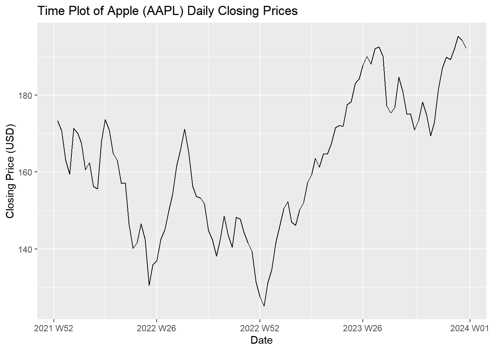
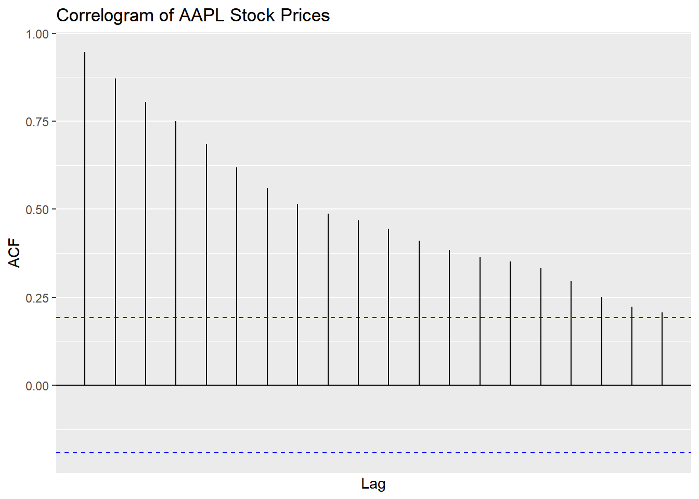
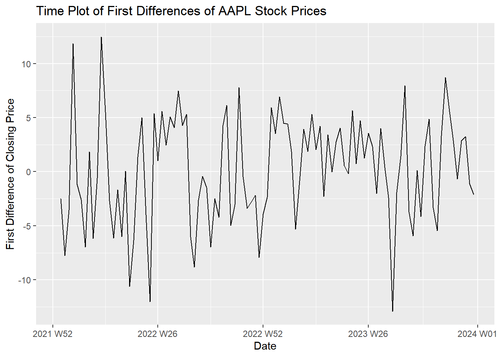
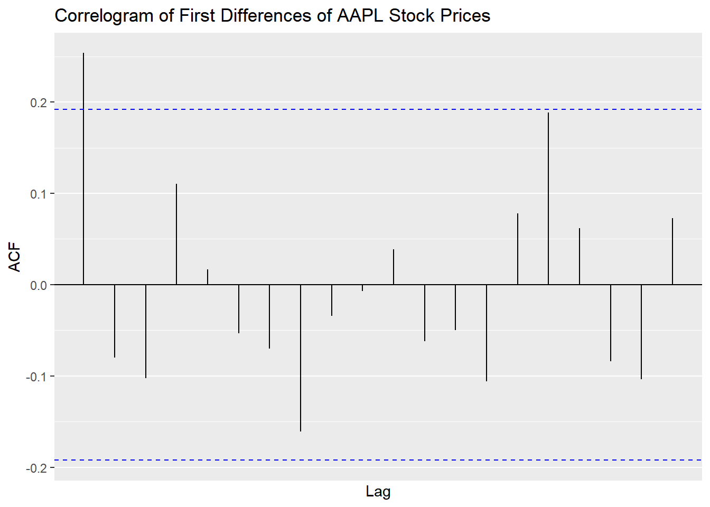
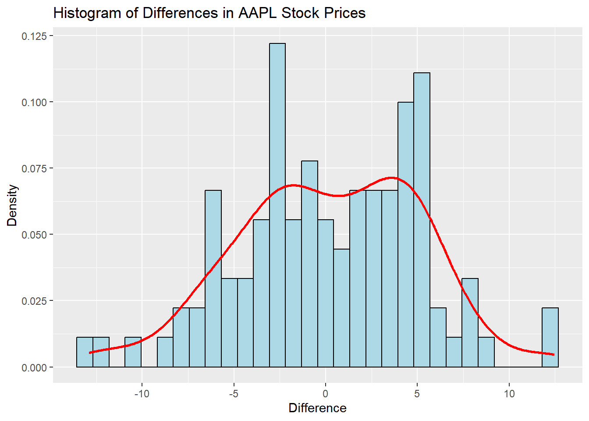

::: {.cell}

:::


## Questions

### Question 1 - Random Walks: Stocks (30 points)

Modify the [code used to get the prices of McDonald's stock](https://byuistats.github.io/timeseries/chapter_4_lesson_2.html#differencing) to download closing stock prices for a different publicly-traded company over a time period of your choice.

#### a) Create a time plot of the daily closing stock prices.

::: {.callout-note title="Answer" icon="false"}


::: {.cell}

```{.r .cell-code}
# Set symbol and date range for Apple
symbol <- "AAPL"
date_start <- "2022-01-01"
date_end <- "2024-01-01"

# Download the stock data
stock_df <- tq_get(symbol, from = date_start, to = date_end, get = "stock.prices")

# Convert to a tsibble
stock_ts <- stock_df |>
  mutate(dates = lubridate::ymd(date), value = adjusted) |>
  mutate(year_week = yearweek(dates)) |>
  group_by(year_week) |>
  summarise(value = mean(value)) |>
  ungroup() |>
  as_tsibble(index = year_week)

# Time plot of the daily closing prices
autoplot(stock_ts, value) +
  labs(title = "Time Plot of Apple (AAPL) Daily Closing Prices",
       x = "Date", y = "Closing Price (USD)")
```

::: {.cell-output-display}
{width=672}
:::
:::


:::

#### b) Create a correlogram of the daily closing stock prices. Is there evidence that daily closing stock prices follows a random walk? Please explain.

::: {.callout-note title="Answer" icon="false"}


::: {.cell}

```{.r .cell-code}
# Correlogram of the stock prices
ACF(stock_ts, value) |>
  autoplot() +
  labs(title = "Correlogram of AAPL Stock Prices",
       x = "Lag", y = "ACF")
```

::: {.cell-output-display}
{width=672}
:::
:::


Yes, there is evidence that daily closing stock prices follows a random walk. We can see how the correlogram starts at 1 and slowly decreases as k increases. This shows that there is no significant autocorrelation in the differenced values. This what to expect from a random walk.

.

Some thoughts: Interestingly I can see how under some circumstances the closing price for Apple can be an increasing trend and just using the basic classical decomposition we will determine the time series for AAPL's closing prices is a deterministic trend. Now if we apply some linear model with seasonal variables, and somehow manage to add an inflation variable. We can probably make a longer time series for AAPL not seem like an increasing trend as their price matches inflation increase overtime. This can give a more fitted model to determine AAPL time series and provide more accurate forecast model. Obviously AAPL is a successful company so their price will still see some sort of increasing trend.
:::

#### c) Take the first difference of your daily closing stock prices and plot the resulting time series.

::: {.callout-note title="Answer" icon="false"}


::: {.cell}

```{.r .cell-code}
# Calculate the first difference
stock_ts <- stock_ts %>%
  mutate(diff = value - lag(value))

# Time plot of the first differences
autoplot(stock_ts, diff, na.rm = TRUE) +
  labs(title = "Time Plot of First Differences of AAPL Stock Prices",
       x = "Date", y = "First Difference of Closing Price")
```

::: {.cell-output-display}
{width=672}
:::
:::


:::

#### d) Create two charts, the first is a correlogram of the first-difference of daily closing stock prices. The second is a histogram of the difference in the stock prices and superimpose the corresponding normal density.


::: {.callout-note title="Answer" icon="false"}


::: {.cell}

```{.r .cell-code}
# Correlogram of the differenced series 
# Part d: Correlogram of the first differences
ACF(stock_ts, diff, na.rm = TRUE) %>%
  autoplot() +
  labs(title = "Correlogram of First Differences of AAPL Stock Prices",
       x = "Lag", y = "ACF")
```

::: {.cell-output-display}
{width=672}
:::

```{.r .cell-code}
# Histogram of the differences
stock_ts %>%
  ggplot(aes(x = diff)) +
  geom_histogram(aes(y = after_stat(density)), bins = 30, color = "black", fill = "lightblue") +
  geom_density(color = "red", linewidth = 1) +
  labs(title = "Histogram of Differences in AAPL Stock Prices",
       x = "Difference", y = "Density")
```

::: {.cell-output-display}
{width=672}
:::

```{.r .cell-code}
# Variance of the differences
variance_diff <- var(stock_ts$diff, na.rm = TRUE)
variance_diff
```

::: {.cell-output .cell-output-stdout}

```
[1] 24.42079
```


:::
:::


:::

#### e) Using your results from parts c and d, is there evidence that the first difference of daily closing stock prices follows a white noise process? Please explain.

::: {.callout-note title="Answer" icon="false"}
The first differences of the AAPL stock prices show no significant auto correlations in the correlogram, and the histogram resembles a normal distribution with a density curve. This indicates that the first-differences series may follow a white noise process, as there are no patterns or significant lags in the correlogram.
:::

### Question 2 - Random Walks with drift and exponentially weighted slopes: Stocks (20 points)

Using the daily closing stock prices series of the previous question. Can you find evidence that there is drift in the series.

#### a) Please calculate the mean and standard deviation of the first-difference daily closing stock prices series of the previous question.

::: {.callout-note title="Answer" icon="false"}


::: {.cell}

```{.r .cell-code}
# Part a: Calculate mean and standard deviation
mean_diff <- mean(stock_ts$diff, na.rm = TRUE)
sd_diff <- sd(stock_ts$diff, na.rm = TRUE)

# Print the results
mean_diff
```

::: {.cell-output .cell-output-stdout}

```
[1] 0.1826733
```


:::

```{.r .cell-code}
sd_diff
```

::: {.cell-output .cell-output-stdout}

```
[1] 4.94174
```


:::
:::


:::

#### b) Please provide statistical evidence for the need to include a drift component in our random walk model.

::: {.callout-note title="Answer" icon="false"}


::: {.cell}

```{.r .cell-code}
# Part b: Conduct a t-test to see if the mean is significantly different from zero
t_test_result <- t.test(stock_ts$diff, mu = 0, na.rm = TRUE)

# Display the results of the t-test
t_test_result
```

::: {.cell-output .cell-output-stdout}

```

	One Sample t-test

data:  stock_ts$diff
t = 0.37516, df = 102, p-value = 0.7083
alternative hypothesis: true mean is not equal to 0
95 percent confidence interval:
 -0.7831384  1.1484849
sample estimates:
mean of x 
0.1826733 
```


:::
:::


:::

#### d) Based on the results, is there a justification to adding an exponentially weighted slope vs adding a drift parameter? Please explain.

::: {.callout-note title="Answer" icon="false"}
The mean difference is 0.18 and this is the estimate of the drift paramenter of the drift parameter. The standard deviation of the 102 differences is 4.94. An approximate 95% confidence interval for the drift parameter is \[-0.78, 1.15\] which includes 0. This means that the drift parameter is not significantly different from 0. This means that there is no justification to adding an exponentially weighted slope vs adding a drift parameter.
:::

### Rubric

|  |  |  |
|------------------------|------------------------|------------------------|
| **Criteria** | **Mastery (5)** | **Incomplete (0)** |
| **Question 1a: Series Plot** | Responses create a time plot of the daily closing stock prices, effectively representing the data over time. The plot is well-constructed, with clear labeling of the axes, a title, and appropriate formatting to enhance readability. Proficient submissions ensure that the time plot accurately reflects the temporal trends and patterns present in the daily closing stock prices, providing a clear visual representation of the data. | The plot may lack clarity or proper presentation, making it difficult to interpret the trends or patterns in the data. Additionally, they may fail to include necessary elements such as axis labels, a title, or appropriate formatting, hindering the readability of the plot. Overall, their representation of the data may be incomplete or insufficient, indicating a need for improvement in data visualization skills. |
|  | **Mastery (10)** | **Incomplete (0)** |
| **Question 1b: Series Correlation Analysis** | Responses demonstrate a clear understanding of the concept of a random walk and its implications for autocorrelation patterns.They provide clear explanations supported by statistical evidence from the correlogram, discussing how the observed autocorrelation patterns align with the characteristics of a random walk. | Students demonstrate a limited understanding of the concept of a random walk or fail to connect the observed autocorrelation patterns to its implications. Their analysis may lack depth or coherence, providing vague or incorrect explanations for the presence or absence of evidence supporting a random walk. Additionally, they may overlook key features or patterns in the correlogram, hindering their ability to draw meaningful conclusions about the nature of the time series data. |
|  | **Mastery (5)** | **Incomplete (0)** |
| **Question 1c: First Difference Plot** | Responses create a time plot of the first-differences daily closing stock prices, effectively representing the data over time. The plot is well-constructed, with clear labeling of the axes, a title, and appropriate formatting to enhance readability. Proficient submissions ensure that the time plot accurately reflects the temporal trends and patterns present in the daily closing stock prices, providing a clear visual representation of the data. | The plot may lack clarity or proper presentation, making it difficult to interpret the trends or patterns in the data. Additionally, they may fail to include necessary elements such as axis labels, a title, or appropriate formatting, hindering the readability of the plot. Overall, their representation of the data may be incomplete or insufficient, indicating a need for improvement in data visualization skills. |
|  | **Mastery (5)** | **Incomplete (0)** |
| **Question 1d: First Difference Properties** | Students create two charts as specified: a correlogram of the first-difference of daily closing stock prices and a histogram of the difference in stock prices with the corresponding normal density superimposed. The correlogram effectively examines the autocorrelation structure of the differenced series, providing insights into the stationarity and serial dependence of the data. The histogram and superimposed normal density accurately represent the distribution of the differences in stock prices, allowing for visual comparison between the empirical distribution and the theoretical normal distribution. | Students encounter difficulties in understanding the concept of differencing or density estimation, leading to inaccuracies in the visual representation of the data. Their analysis of the correlogram and histogram may lack depth or coherence, providing vague or incorrect interpretations of the autocorrelation structure or distribution of the differences in stock prices. Additionally, they may fail to effectively superimpose the normal density on the histogram or overlook key features or patterns in the visualizations. |
|  | **Mastery (10)** | **Incomplete (0)** |
| **Question 1e: Model Identification** | Student interpret the autocorrelation patterns in the correlogram, focusing on the presence or absence of significant autocorrelation at lag 1 and higher lags. They interpret the shape and centering of the histogram, considering whether it resembles a normal distribution, discussing how the observed patterns align with the expectations for a random walk process. | Students provide incomplete or superficial interpretations of the autocorrelation patterns or histogram shape, failing to connect them to the characteristics of a random walk process. They overlook key features or patterns in the visualizations, indicating a limited understanding of the underlying concepts. |
|  | **Mastery (0)** | **Incomplete (0)** |
| **Question 2a: Summary Statistics** | Students accurately calculate the mean and standard deviation of the first-difference daily closing stock prices series, with well-commented code. | Submission have calculation errors or lack sufficient comments in the code, making it hard to follow. They might struggle to provide accurate values or clear explanations, indicating a need for improvement in both mathematical and coding skills. |
|  | **Mastery (10)** | **Incomplete (0)** |
| **Question 2b: Evidence of Drift** | Students offer statistical evidence supporting the necessity of including a drift component in the random walk model. They conduct a hypothesis test correctly | The hypothesis test is built incorrectly, or the evidence collecter is not sufficient to make a statistical statement. |
|  | **Mastery (10)** | **Incomplete (0)** |
| **Question 2c: Interpretation** | Students interpret the hypothesis test correctly and use the correct language to describe their results | Responses lack clear statistical evidence or fail to effectively justify the inclusion of a drift component in the random walk model. They might offer vague or unsupported assertions about the presence of a trend in the data without conducting appropriate statistical analysis. The interpretation of the confidence interval is incorrect |
| **Total Points** | **50** |  |
